# Railroad Diagram — `chain_expression` (lexicon: {{ PHI_ID }})

Rendered from `grammar/templates/grammar.diagram.template.md` by
`grammar/render_grammar.py`. It mirrors Phase 1's `3dom_syntax_diagram.md`
node-for-node: **stadium nodes = terminal tokens**, **rectangles = nonterminal
rules**, the **back-edge from the junction = the `operation_call*` loop** (the
unbounded chaining), and the junction's direct path to *end* = the
zero-operations case (a bare query, D5).

Only the stadium LABELS differ from the 3DOM diagram. The node set, the edge
set, the loop and the optional-argument bypass are identical, because the
operator skeleton is frozen (I3) and only Σ moves.

```mermaid
flowchart LR
    start((" ")):::rail

    subgraph SC["selector_call"]
        direction LR
        d(["{{T_SELECTOR_ENTRY}}"]):::term --> lp1(["("]):::term --> qs["quoted_selector"]:::rule --> rp1([")"]):::term
    end

    subgraph OP["operation_call  (repeats → unbounded chain)"]
        direction LR
        dot(["{{T_CHAIN_OP}}"]):::term --> v["verb"]:::rule --> lp2(["("]):::term
        lp2 --> args["argument_list"]:::rule --> rp2([")"]):::term
        lp2 -. "? (no args)" .-> rp2
    end

    start --> SC
    rp1 --> J(("&#9679;")):::joint
    J -- "another op" --> OP
    OP --> J
    J -- "done" --> stop((" ")):::rail

    classDef term fill:#e8f0ff,stroke:#3b6fb0,stroke-width:1px,rx:14,ry:14,color:#12325a;
    classDef rule fill:#fff,stroke:#666,stroke-width:1px,color:#222;
    classDef joint fill:#3b6fb0,stroke:#3b6fb0,color:#fff;
    classDef rail fill:#111,stroke:#111,color:#fff;
```

Control enters at the left rail, runs once through the **`selector_call`** box
(`{{T_SELECTOR_ENTRY}} ( quoted_selector )` — mandatory, exactly one), and arrives at the
junction `●`. From the junction it may loop through the **`operation_call`** box
any number of times — the "another op" back-edge is the visual proof of
*unbounded* chaining — or take the "done" edge straight to the end rail, which is
the zero-operation case (`{{T_SELECTOR_ENTRY}}('{{T_CLASS_SIGIL}}wheel');` with no verbs). Inside
`operation_call`, the dotted bypass around `argument_list` renders the `?`
optionality, so `{{T_CHAIN_OP}}{{T_VERB_DELETE}}()` and `{{T_CHAIN_OP}}{{T_VERB_RECOLOR}}('#f00')` are both covered by
one box.

## Selector sub-diagram (level 2 — whitespace is significant)

```mermaid
flowchart LR
    s((" ")):::rail --> CS["compound_selector"]:::rule
    CS --> K(("&#9679;")):::joint
    K -- "descendant: WS" --> CS
    K -- "child: WS? {{T_CHILD}} WS?" --> CS
    K -- "done" --> e((" ")):::rail

    classDef rule fill:#fff,stroke:#666,stroke-width:1px,color:#222;
    classDef joint fill:#3b6fb0,stroke:#3b6fb0,color:#fff;
    classDef rail fill:#111,stroke:#111,color:#fff;
```

The two edges out of `●` are the **k = 2** decision point (clause P1): on a
selector-internal space the parser cannot choose between them until it sees the
next token. That space is `WS`, which is FROZEN across every lexicon (I9), so
this diagram is byte-identical in all four languages — which is the point.
