# 3DOM Railroad Diagram — `chain_expression`

Rendered as a left-to-right flowchart approximating a railroad: **stadium nodes = terminal tokens**, **rectangles = nonterminal rules**, the **back-edge from the junction = the `operation_call*` loop** (the unbounded chaining), and the junction's direct path to *end* = the zero-operations case (a bare query).

```mermaid
flowchart LR
    start((" ")):::rail

    subgraph SC["selector_call"]
        direction LR
        d(["$S"]):::term --> lp1(["("]):::term --> qs["quoted_selector"]:::rule --> rp1([")"]):::term
    end

    subgraph OP["operation_call  (repeats → unbounded chain)"]
        direction LR
        dot(["."]):::term --> v["verb"]:::rule --> lp2(["("]):::term
        lp2 --> args["argument_list"]:::rule --> rp2([")"]):::term
        lp2 -. "? (no args)" .-> rp2
    end

    start --> SC
    rp1 --> J(("&#9679;")):::joint
    J -- "another op" --> OP
    OP --> J
    J -- "done" --> stop((" ")):::rail

    classDef term fill:#e8f0ff,stroke:#3b6fb0,stroke-width:1px,rx:14,ry:14,color:#12325a;
    classDef rule fill:#fff,stroke:#666,stroke-width:1px,color:#222;
    classDef joint fill:#3b6fb0,stroke:#3b6fb0,color:#fff;
    classDef rail fill:#111,stroke:#111,color:#fff;
```

How to read it for the methodology section: control enters at the left rail, runs once through the **`selector_call`** box (`$S ( quoted_selector )` — mandatory, exactly one), and arrives at the junction `●`. From the junction it may loop through the **`operation_call`** box any number of times — the "another op" back-edge is the visual proof of *unbounded* chaining — or take the "done" edge straight to the end rail, which is the zero-operation case (`$S('.wheel');` with no verbs). Inside `operation_call`, the dotted bypass around `argument_list` renders the `?` optionality, so `.delete()` and `.recolor('#f00')` are both covered by one box.
