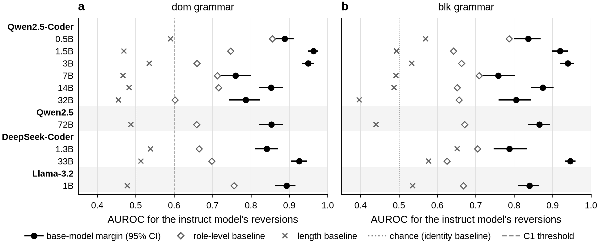
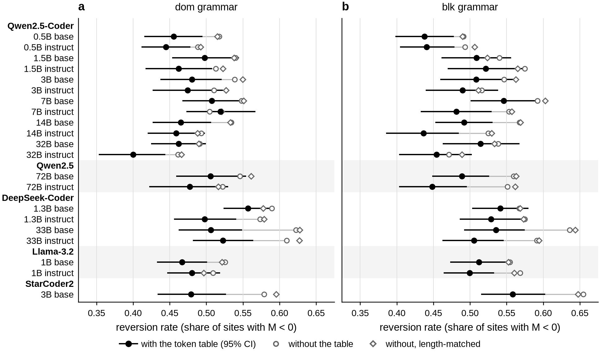
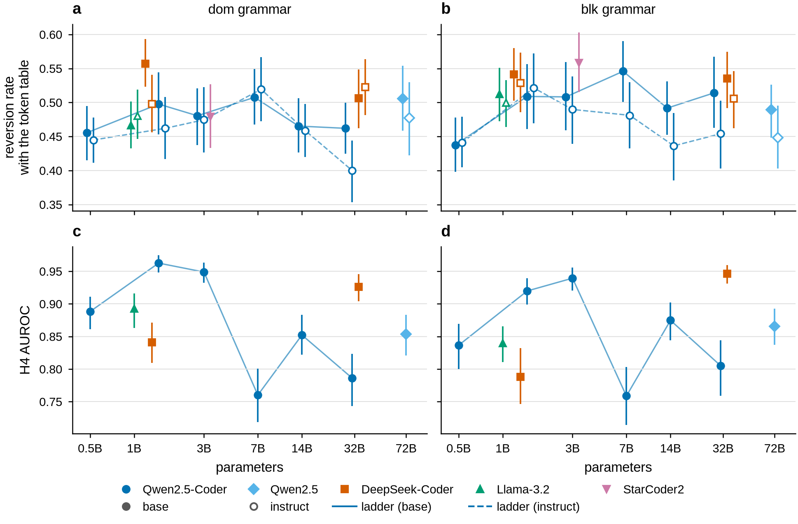
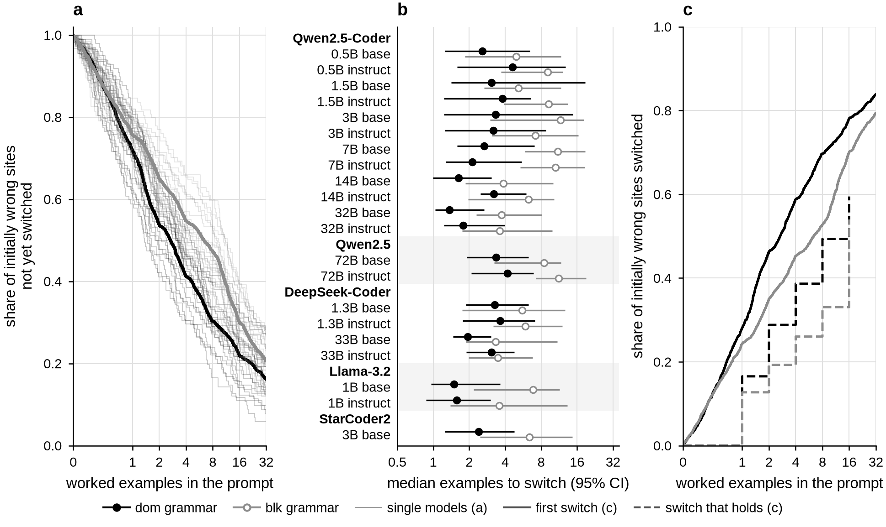
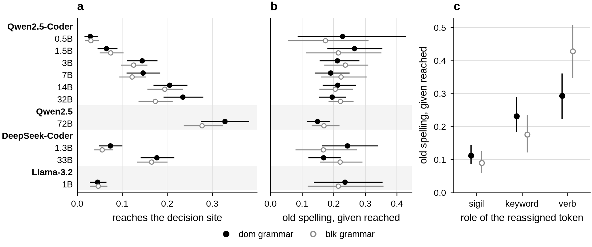
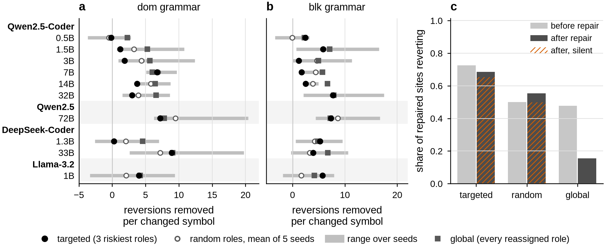
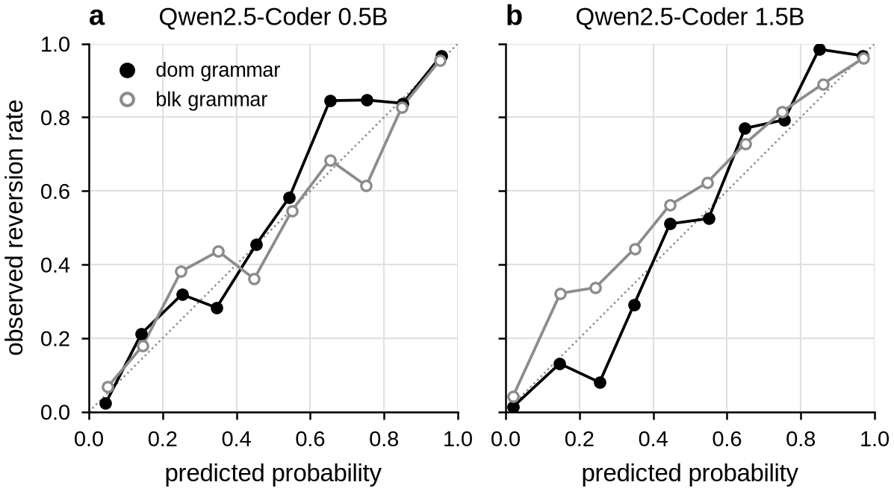
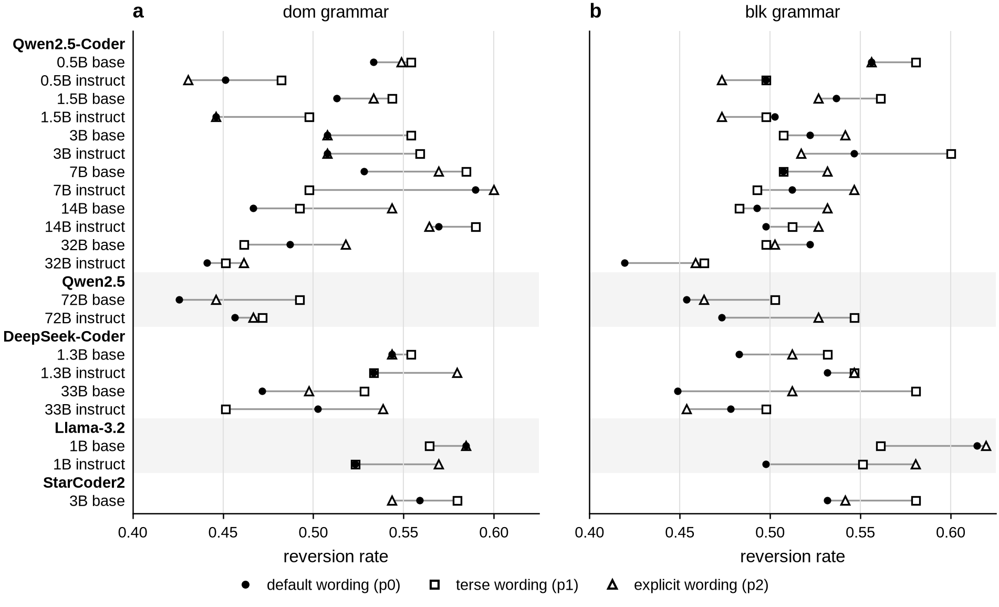
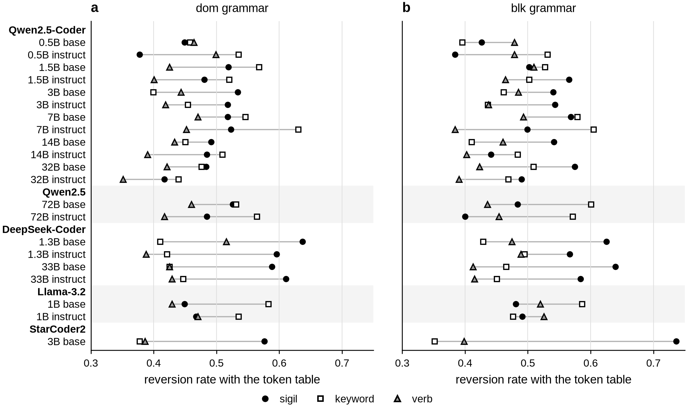
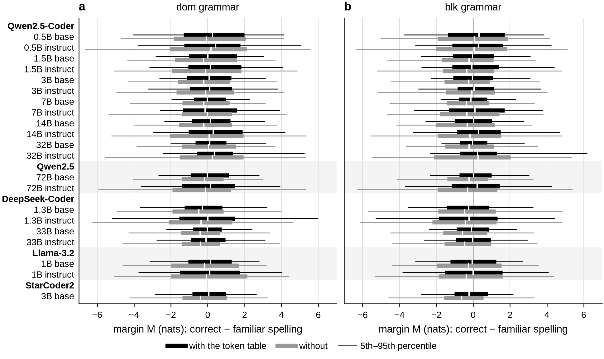

# Paper figures — `heldout-20261007a`

Draft captions. The figures carry no text beyond axes, legends and panel letters; everything a reader needs to decode them is here, and every number is in `tables/`. Figure 1 of the paper outline is a diagram of the testbed, not a data figure.

Each figure is saved as PDF (vector, for LaTeX), SVG and PNG (300 dpi), 6.5 in wide (full text width), with 7–8 pt type. `ALL_FIGURES.pdf` holds all of them, one per page, for review.

## `fig2_h4`

**H4: the base model's margin predicts where its instruct twin reverts.** Rows are base/instruct pairs on held-out mappings; (a) dom, (b) blk grammar. Filled circles: AUROC of the risk score, −M(base, rule), for the instruct model's reversions (M < 0), with 95% template-cluster bootstrap intervals (B = 2000). Open diamonds: role-level baseline (cross-fitted per-role reversion rate). Crosses: length baseline. Dotted line: chance, which is also the identity baseline; dashed line: the C1 threshold (identity + 0.10). AUROC 0.76–0.96; C1 is met in 20 and C2 in 20 of the 20 pair × grammar groups (Table 2).

## `fig3_reversion`

**Reversion persists with the token table.** Reversion rate (share of decision sites where the margin M, the log-probability of the correct spelling minus that of the familiar one scored from the first token where they differ, is negative) for every checkpoint, pooled over the five held-out lexicons; (a) dom, (b) blk. Filled: with the full token table (95% template-cluster bootstrap interval); open circle: without it; open diamond: without it, padded to the same prompt length. Reversion is 0.400–0.558 with the table and 0.461–0.655 without; the table lowers it for 41 of 42 checkpoint × grammar combinations. On the margin scale, the table raises the mean margin for every checkpoint and grammar, against both controls (0.16–0.62 nats); Tables C1 and C2.

## `fig4_scale`

**Scale does not reduce reversion; in dom, the H4 AUROC declines across the ladder, non-monotonically.** (a, b) Reversion rate with the token table and (c, d) H4 AUROC against parameters (log axis), with 95% template-cluster bootstrap intervals. Filled: base; open: instruct (pairs in c, d). Lines join the Qwen2.5-Coder ladder (0.5–32B), the only series the pre-specified scale analysis (D10/D11) uses; the other families are shown for context. Markers within ~20% in size are spread horizontally. Ladder slopes per tenfold size: reversion, 0 of 4 series significant after Holm correction; AUROC −0.081 in dom (Holm p < 0.003); −0.037 in blk (Holm p = 0.055) (Table C4). Sizes are not randomized: these are associations.

## `fig5_adaptation`

**Worked examples switch most initially wrong sites, but the first switch often does not last.** Sites wrong with zero examples (M < 0), given 0–32 leak-free worked examples in the target lexicon. (a) Kaplan–Meier share not yet switched (first upward crossing of M = 0, interpolated between rungs; censored at 32): thick lines pool all models, thin lines are single models. (b) Kaplan–Meier median per checkpoint with 95% template-cluster bootstrap intervals (frozen export): dom 1.36–4.60, blk 3.33–11.64 examples. (c) Share switched by k examples, pooled over models: first switch (solid) against the rung from which the margin stays non-negative through 32 examples (dashed, shown to 16: a switch first seen at 32 cannot be checked). Among sites that switch, the median first switch is 2.06 examples; among sites whose switch holds, it holds from a median of 8. 18% of initially wrong sites never switch within 32 examples (Table 3).

## `fig6_generation`

**In free generation, models rarely reach the decision sites, and revert at a fifth of those they reach.** Greedy generation by the instruct models from a natural-language request, with the token table and four worked examples in the prompt. (a) Share of decision sites the program reaches (the generated text equals the target up to the site, after whitespace normalization). (b) Share of reached sites where the model writes the familiar spelling. (c) Reversion given reached, by the role of the reassigned token, pooled over models. 95% template-cluster bootstrap intervals; the two rates are reported separately and never multiplied. Overall: reach 4104/30300 (13.5%); reversion given reach 812/4104 (19.8%); correct programs 747/7800 (9.6%) (Table C3).

## `fig7_repair`

**Respelling the riskiest roles is no better than respelling random ones (H5 not supported).** (a, b) The registered H5 metric per instruct model, the mean over the five lexicon cells: reversions removed per changed symbol after respelling, from the β alphabet, the three roles the base model rated riskiest (filled), three random roles (open: mean of five seeds; bar: range of the seed means) or every reassigned role (squares). Targeted beats the random mean in 43 of 100 cells. The registered metric counts every site of a cell, repaired or not. (c) Pooled over models and cells: the share of repaired sites that revert before and after repair, and the part of that after repair which is silent (the old spelling is still a valid program, so no parser flags it). Reverting repaired sites, before → after (silent after): targeted 2,963 → 2,804 (2,672); random 13,195 → 14,649 (13,158); global 14,459 → 4,696 (0) (Tables 4 and 4b).

## `figA1_calibration`

**Calibration of the two pairs with frozen parameters, on held-out mappings.** Reliability diagrams: the Platt mapping fitted on the development run (frozen) applied to held-out sites; ten equal-width bins, bins with fewer than 10 sites omitted; dotted line: perfect calibration. Expected calibration error 0.036–0.052. The other eight pairs had no frozen parameters, so their calibration figures in the frozen export are in-sample (deviation D12) and are not shown (Table A1).

## `figA2_paraphrase`

**Sensitivity to the wording of the rule prompt.** Reversion rate on the extinction subset (195–205 sites per checkpoint and grammar) under three framings of the same token table: the registered default (p0, filled), a terse one (p1) and a verbose one that names the conflict with CSS/JavaScript (p2). Under every wording reversion stays within 0.420–0.620; the range across wordings per checkpoint is 0.010–0.132 (Table A2).

## `figA3_roles`

**Reversion by the role of the reassigned token (exploratory).** Reversion rate with the token table, per checkpoint, by the role whose spelling was reassigned: sigils (selector punctuation), keywords and verbs (method names); (a) dom, (b) blk. Medians across checkpoints: dom sigil 0.52, keyword 0.48, verb 0.43; blk sigil 0.54, keyword 0.48, verb 0.46. Roles differ in length and frequency, so this is not a causal comparison (Table A3, with intervals).

## `figA4_margins`

**Margins are spread widely on both sides of zero.** Distribution of the margin M = log P(correct spelling) − log P(familiar spelling), scored from the first token where the two differ, over all decision sites, per checkpoint; M < 0 is a reversion. Thick bar: interquartile range, white tick: median, thin line: 5th–95th percentile; black: with the token table, grey: without; (a) dom, (b) blk (Table A4).

## What replaces each frozen diagnostic plot

The frozen plots in `plots/` stay unchanged as registered outputs.

| paper figure | frozen plot it replaces |
|---|---|
| fig2_h4 | `h4_roc_pr_calibration` (ROC and PR curves) |
| fig3_reversion | `rule_effect_forest` |
| fig4_scale | `model_size_tokenizer` |
| fig5_adaptation | `extinction_trajectories_km` |
| fig6_generation | `armb_hurdle_outcomes` |
| fig7_repair | `h5_benefit_per_symbol` |
| figA1_calibration | `h4_roc_pr_calibration` (calibration panel; frozen pairs only) |
| figA2_paraphrase | `paraphrase_sensitivity` |
| figA3_roles | `family_mapping_model_stratum` |
| figA4_margins | `margin_reversion_distributions` |
| table A5 | `fertility_tokenization` (a null check, so a table) |
| — | `h2_three_scale` (H2 not testable, D1) and `power_curves` (development planning): omitted |

## Tables

| file | content |
|---|---|
| [`A1_calibration`](tables/A1_calibration.md) | Table A1. Calibration transfer for the two pairs with frozen parameters |
| [`A2_paraphrase`](tables/A2_paraphrase.md) | Table A2. Reversion rate under three wordings of the rule prompt (extinction subset) |
| [`A3_roles`](tables/A3_roles.md) | Table A3. Reversion rate with the token table, by the role of the reassigned token (exploratory) |
| [`A4_margins`](tables/A4_margins.md) | Table A4. Distribution of the margin M (nats) over all decision sites |
| [`A5_tokenization`](tables/A5_tokenization.md) | Table A5. Tokenization of the remapped programs relative to the standard spellings |
| [`C1_reversion`](tables/C1_reversion.md) | Table C1. Reversion rate (share of sites with M < 0), pooled over the five held-out lexicons |
| [`C2_rule_effect`](tables/C2_rule_effect.md) | Table C2. Rule effect: mean of M(with table) − M(control), nats, averaged over the five lexicons |
| [`C3_generation`](tables/C3_generation.md) | Table C3. Arm B: free generation by the instruct models |
| [`C3b_generation_by_role`](tables/C3b_generation_by_role.md) | Table C3b. Arm B: old spelling given reached, by the role of the reassigned token (all instruct models) |
| [`C4_scale_D11`](tables/C4_scale_D11.md) | Table C4. Scale (D10, specified by D11): OLS slopes across the Qwen2.5-Coder ladder, 0.5B–32B |
| [`T1_models`](tables/T1_models.md) | Table 1. Checkpoints scored on the held-out mappings |
| [`T2_h4`](tables/T2_h4.md) | Table 2. H4 (confirmatory): base-model margins predict instruct-model reversions |
| [`T3_adaptation`](tables/T3_adaptation.md) | Table 3. Worked examples needed to switch (Kaplan–Meier median of k*, sites wrong at 0 examples) |
| [`T3b_first_vs_lasting_switch`](tables/T3b_first_vs_lasting_switch.md) | Table 3b. First switch against a switch that holds (initially wrong sites, all models) |
| [`T4_repair`](tables/T4_repair.md) | Table 4. H5: reversions removed per changed symbol (mean over the five lexicon cells) |
| [`T4b_repaired_sites`](tables/T4b_repaired_sites.md) | Table 4b. What happens at the repaired sites, pooled over models, lexicons and (random) seeds |
