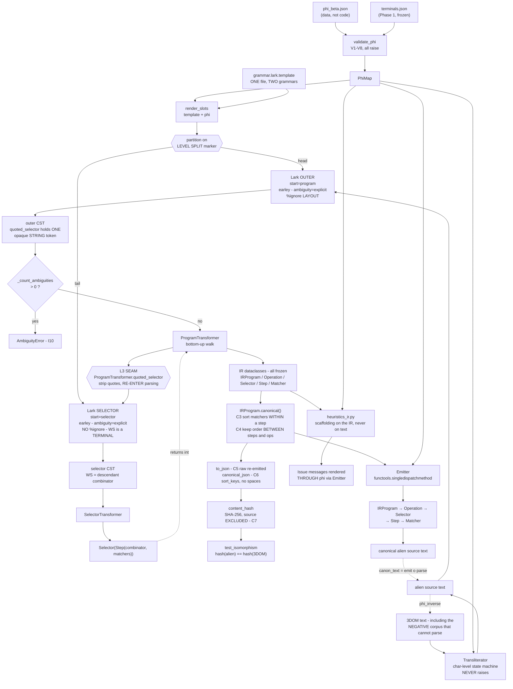

# Phase 2 — A Masterclass in the Alien-Syntax Transpiler

> **Subject:** `alien_syntax/` — a φ-parameterised, two-level, bidirectional
> transpiler between an alien surface lexicon and a shared JSON Operation IR,
> plus the IR-level port of the 3D scene scaffolding heuristics.
>
> **Grammar version:** `3dom-grammar/1.1.0` · **Python:** 3.12.3 · **lark:** 1.3.1
>
> **Verification status:** every claim in this document was checked against the
> running code on this machine. `tests/test_isomorphism.py` → **4/4 PASS**.
> Where I ran an experiment, the actual output is quoted.

---

## Reading this document

This is written the way *Fluent Python* teaches: not "here is what the code
does" but "here is the language feature, here is the naive alternative, here is
why the naive alternative is **wrong** — not merely uglier."

Three conventions:

- **⚑ VERIFIED** marks a claim I executed rather than inferred. The output is shown.
- **⚠ HAZARD** marks a latent bug the current code avoids, sometimes by accident.
- **📖 FP** names a *Fluent Python* concept precisely enough to look up. Where I
  am confident of the 2nd-edition chapter I give it; otherwise I name the part of
  the book, because a wrong chapter number costs you more than no chapter number.

---
---

# 1. EXTERNAL LIBRARIES & IMPORTS

The dependency graph of this codebase is deliberately **stratified by
requirement**. Three tiers, and the tiering is itself an architectural decision:

| Tier | Modules | Dependencies | Why the tier exists |
|---|---|---|---|
| **0 — pure stdlib** | `phi.py`, `canonicalize.py` | `json` `os` `re` `hashlib` `dataclasses` `typing` | Validation and canonicalisation must run **anywhere**, including CI on a machine with no models and no parser generator. `phi.py` says so in its docstring: *"deliberately dependency-free (no lark, no transformers) so that validation runs anywhere."* |
| **1 — parsing** | `transpiler.py` | `lark` (imported **lazily**) | The hand-written `Lexer` and `Transliterator` work with zero third-party code; only the Lark front end needs `lark`, and it is imported inside functions so the DFA metrics run without it. |
| **2 — models** | `measure/fertility.py`, `measure/prior_strength.py` | `transformers`, `torch` | Anything that touches a tokenizer or a checkpoint. Both modules degrade gracefully when the tier is absent. |

**⚑ VERIFIED** — `transformers` is *not installed* on this machine, and
`tests/test_isomorphism.py` still passes 4/4. That is the stratification working
exactly as designed: the correctness proof does not depend on the measurement rig.

---

## 1.1 `from __future__ import annotations` — 14 occurrences, and one real trap

**What it is.** PEP 563. Every annotation in the module becomes a *string* at
runtime instead of being evaluated at function-definition time.

**The "Why" here.** Three distinct payoffs:

1. **Forward references without quotes.** `Step.canonical()` returns a `Step`
   before the class exists:
   ```python
   def canonical(self) -> "Step":
   ```
   With the future import you could drop the quotes entirely; the code keeps them
   in some places and not others, which is stylistic drift, not a bug.
2. **PEP 604 unions on any Python.** `int | float`, `str | None`,
   `TerminalTable | None` appear throughout. Under postponed evaluation these
   never execute, so they cost nothing.
3. **Zero import-time cost.** `typing` generics are not constructed.

**⚠ HAZARD — the interaction nobody expects.** `Emitter` registers its
`singledispatchmethod` overloads *by annotation*:

```python
@emit.register
def _(self, node: Matcher) -> str: ...
```

With `from __future__ import annotations` active, `node`'s annotation is the
**string** `"Matcher"`, not the class. `functools.singledispatch` must therefore
resolve that string back to a type. It does — via `typing.get_type_hints` —
**but only since Python 3.10**. On 3.7–3.9 this exact file raises
`TypeError: Invalid first argument to register()`. The code runs on 3.12, so it
works; but this is a **hard floor on the Python version** that no
`requires-python` field in the repo records, and it is invisible until you try
to run the paper's artefact on an older box.

> 📖 **FP:** *Type Hints in Functions* covers annotations as runtime objects.
> The `register`-by-annotation mechanism is in the **Single Dispatch Generic
> Functions** section of the decorators/closures chapter (2nd ed., Ch. 9).

---

## 1.2 `dataclasses` — `dataclass`, `field`

**What it is.** A code generator. `@dataclass` reads the class's annotated
attributes and synthesises `__init__`, `__repr__`, `__eq__`, and — under
`frozen=True` — `__setattr__`/`__delattr__` that raise, plus `__hash__`.

**The "Why".** This codebase has **eleven** dataclasses and every one of them is
`frozen=True`. That is not stylistic. An IR node is a **value**, and the entire
paper rests on comparing values across two languages. A mutable IR node would
let a heuristic in `heuristics_ir.py` mutate the object it was handed, and the
scorer would then compare a mutated IR against a gold IR.

**Key components pulled in:**

| Import | Used for |
|---|---|
| `dataclass(frozen=True)` | `Terminal`, `TerminalTable`, `PhiMap`, `Lexicon`, `Matcher`, `Step`, `Selector`, `Operation`, `IRProgram`, `Issue`, `Heuristic`, `Dropped` |
| `dataclass(frozen=True, order=False)` | `Matcher` **only** — see §3.7, this is load-bearing |
| `field(default_factory=dict)` | `Operation.args` — the mutable-default guard |
| `field(repr=False, default=...)` | `Heuristic.fn` — keeps a function object out of `__repr__` |

**Why dataclasses and not the obvious alternatives:**

- **vs. `NamedTuple`.** A `NamedTuple` is a tuple, so `Matcher("class","a") ==
  ("class","a")` would be `True` — an IR node would compare equal to a raw tuple
  that wandered in from the CST. `Matcher` needs *nominal* identity.
  `NamedTuple` also cannot run `__post_init__`-style validation.
- **vs. `attrs`.** No third-party dependency in tier 0. That is the whole point
  of tier 0.
- **vs. `pydantic`.** Pydantic would *coerce* (`"1.5"` → `1.5`), and coercion is
  exactly the silent normalisation this design forbids: canonicalisation must be
  explicit, versioned (C0–C8), and auditable in one file.

**⚠ HAZARD — `frozen=True` does not mean hashable.**

```
⚑ VERIFIED
  IRProgram fields          : ['ops', 'source', 'grammar_version']
  hash(Operation)           : TypeError: unhashable type: 'dict'
```

`Operation` is frozen, so `@dataclass` synthesised a `__hash__` that hashes the
tuple of its fields — and one of those fields is a `dict`. The class is frozen
and *still* unhashable. The codebase knows this in two places and works around
it in two different ways:

1. `transpiler.py` cannot use `functools.lru_cache` on `PhiMap` (same reason —
   it holds dicts), so it hand-rolls memoisation on a derived string key:
   ```python
   # PhiMap holds dicts, so it is not hashable; cache on a derived string key.
   _LEXICON_CACHE: dict[str, Lexicon] = {}
   ```
2. `h_chain_not_repeat` in `heuristics_ir.py` needs a set of selectors, cannot
   put `Operation` in a set, and so keys a dict on `content_hash(...)` instead.

> 📖 **FP:** Ch. 5, *Data Class Builders* (the `frozen`/`eq`/`order` parameter
> matrix); the `__hash__`/`__eq__` contract is in *A Pythonic Object* (Ch. 11).

---

## 1.3 `functools` — `singledispatchmethod`

**What it is.** `functools.singledispatch` turns a function into a generic
function that dispatches on the **runtime type of the first argument**.
`singledispatchmethod` is the descriptor version that skips `self` and
dispatches on the *second* positional argument.

**The "Why".** The `Emitter` walks a heterogeneous tree: `IRProgram` contains
`Operation` contains `Selector` contains `Step` contains `Matcher`. The naive
implementation is a growing `isinstance` ladder:

```python
def emit(self, node):
    if isinstance(node, Matcher):   ...
    elif isinstance(node, Step):    ...
    elif isinstance(node, Selector):...
    else: return str(node)          # ← the bug lives here
```

Three things go wrong with the ladder, and `singledispatchmethod` fixes all three:

1. **The `else` branch is a silent-corruption engine.** Add a new IR node type
   and it falls through to `str(node)`, which happily produces
   `"Matcher(kind='class', name='a')"` inside your emitted source text. The
   dispatch version's base implementation instead does:
   ```python
   raise TypeError(f"no emitter for {type(node).__name__}")
   ```
   Adding a node type without an emitter is now a **loud failure at the first
   call**, not a corrupted corpus discovered three weeks later.
2. **Open–closed.** A new node type is a new `@emit.register` method, not a new
   branch in a function that everything already depends on.
3. **Dispatch order stops being a source-order artefact.** In an
   `isinstance` ladder, if `Selector` were ever made a subclass of something,
   branch order would silently decide behaviour. `singledispatch` resolves by
   MRO, deterministically.

> 📖 **FP:** *Single Dispatch Generic Functions*, in the decorators & closures
> chapter (2nd ed., Ch. 9). The book's motivating example — `htmlize` over
> heterogeneous types — is structurally the same problem as this emitter.
> The design-pattern framing (dispatch replacing a conditional chain) is in
> *Design Patterns with First-Class Functions*.

---

## 1.4 `json`

**What it is.** Stdlib JSON encode/decode.

**The "Why" — two completely different jobs in this codebase:**

1. **Input, in `phi.py`:** `json.load` reads `terminals.json` and
   `candidates/phi_*.json`. The φ-map is *data*, not code, which is what makes
   a new alien language a new JSON file rather than a new parser.
2. **Output, in `canonicalize.py`:** `json.dumps` produces the **canonical
   serialisation** (rule C6) whose bytes are the input to the content hash.

The C6 call is the one to study:

```python
json.dumps(ir.canonical().to_json(include_source=False),
           sort_keys=True, separators=(",", ":"), ensure_ascii=False)
```

Every keyword argument is load-bearing:

| Argument | Default | Why it must be overridden |
|---|---|---|
| `sort_keys=True` | `False` | Without it, key order is **dict insertion order**. `Operation.to_json` builds `out["args"] = dict(self.args)`, and `args` insertion order comes from `build_args`, i.e. signature order — but `_positional` bags and future edits could reorder it. Insertion order would leak into the hash. |
| `separators=(",", ":")` | `(", ", ": ")` | Default emits a space after every separator. Harmless for equality *if consistent*, but it inflates the hashed byte count and makes the canonical form depend on a stdlib default rather than on C6. |
| `ensure_ascii=False` | `True` | γ's glyphs (`⍤ ⟠ ◈ ⏦ ⊳`) would otherwise become `\uXXXX` escape sequences. Since the result is immediately `.encode("utf-8")`-ed, `False` gives a stable, human-readable, byte-defined form. |

**Why `json` and not `pickle`, `msgpack`, or `repr()`:**
`ir_schema.json` is a **JSON Schema** with `additionalProperties: false`, and the
IR must validate against Phase 1's schema — the format is fixed by the contract,
not chosen. `pickle` is not cross-language, not stable across Python versions,
and not human-diffable when a test fails. `repr()` is not specified.

---

## 1.5 `hashlib` — `sha256`

**What it is.** OpenSSL-backed cryptographic hashes.

**The "Why".** Rule C7: the identity of an IR is the SHA-256 of its C6 bytes.
Section 3.12 is devoted to *why the test compares hashes rather than objects*, so
here I will only justify the **algorithm choice**:

- **Why not `hash()`?** Python's builtin `hash()` is randomised per process by
  `PYTHONHASHSEED` for `str`. Two runs of the same test would produce different
  numbers. A hash that changes between runs cannot go in a results table.
- **Why not `md5`?** It works, but a research artefact that will be audited
  should not have to explain why it used a broken hash. SHA-256 costs nothing at
  this scale.
- **Why not `zlib.crc32`?** 32 bits over thousands of IR objects has a real
  birthday-collision probability. Two genuinely different programs colliding
  would make the isomorphism test report a **false PASS** — the worst possible
  failure direction for this paper.
- **Failure direction matters.** With SHA-256, a collision is the only way to get
  a false pass, and it is not achievable by accident. Every *other* discrepancy
  produces a false fail, which is the safe direction: you investigate it.

---

## 1.6 `lark` — `Lark`, `Transformer`, `v_args`, `LarkError`

**What it is.** A parsing toolkit that accepts a grammar **as a string at
runtime** and builds Earley, LALR(1), or CYK parsers from it.

**The "Why" — and this is the single most consequential library choice in the
project.** Four properties are required, and `lark` is the only mainstream
Python option with all four:

**(a) The grammar must be a runtime string.**
`grammar/templates/grammar.lark.template` contains `{{T_VERB_RECOLOR}}`-style
slots. `phi.render_slots` fills them from a φ-map, and `parsers_for(phi)` builds
a parser from the resulting text:

```python
Lark(outer_src, start="program", parser="earley",
     ambiguity="explicit", lexer="dynamic")
```

ANTLR and PLY both want a **build step** (codegen / table generation at import).
A per-lexicon codegen step would mean three checked-in generated parsers, and
"the two languages are recognised by the same grammar" would become a claim
about three generated files staying in sync — exactly the claim the design is
trying to eliminate.

**(b) Earley, because the grammar is not LL(1).** The template says so:

```
// PARSER = EARLEY (clause P1). The combinator rule is k = 2, not LL(1), so an
// LALR front end would report a conflict
```

Look at the inner grammar to see why:
```
combinator            : child_combinator | descendant_combinator
descendant_combinator : WS
child_combinator      : WS? CHILD WS?
```
On seeing `WS`, the parser cannot decide between "this is the descendant
combinator" and "this is the optional whitespace before a child combinator"
until it looks at the *next* token. That is k = 2. `.a .b` and `.a > .b` diverge
one token late.

**(c) `ambiguity="explicit"` makes ambiguity into countable data.**
This is the crown jewel and the reason this cannot be a hand-written parser.
Instead of picking a derivation and moving on, Lark inserts an `_ambig` node into
the tree wherever multiple derivations exist. The code then *counts* them:

```python
def _count_ambiguities(tree) -> int:
    return sum(1 for node in tree.iter_subtrees() if node.data == "_ambig")
```

Invariant **I10** ("the grammar is unambiguous") therefore stops being a claim in
a paper and becomes a **regression test that runs on every program in every
lexicon**. An LALR generator would report a shift/reduce conflict at table-build
time and then silently resolve it in favour of shift; you would never learn that
a *specific alien program* had two parses.

**(d) `lexer="dynamic"`.** With the standard contextual lexer, terminals are
tokenised before parsing, and a φ that assigns a spelling colliding with another
terminal's prefix would mis-tokenise. Under the dynamic lexer, Earley matches
terminals *against the parse state*, so the front end tolerates the lexical
hazards that `measure/collisions.py` is separately measuring — it does not
silently mask them, but it does not crash before the measurement runs either.

**Key components:**

| Symbol | Role |
|---|---|
| `Lark` | The parser factory. Two instances per φ: outer and selector. |
| `Transformer` | Base class for bottom-up CST rewriting. `SelectorTransformer` and `ProgramTransformer` subclass it. |
| `v_args` | Imported by `_import_transformer()` but **not actually used** in the current transformer bodies — the code reads `kids` as a positional list throughout. Dead import; harmless, but worth knowing it is not doing anything. |
| `LarkError` | The base exception, caught in `parse()` and re-raised as this project's own `ParseError`, with `raise … from exc` preserving `__cause__`. |
| `exc.orig_exc` | Lark wraps exceptions raised *inside* a Transformer callback. `parse()` unwraps it so an `AmbiguityError` from the inner selector parse is not misreported as a syntax error. |

**Why the imports are lazy.** `_import_transformer()` and the `from lark import
Lark` inside `parsers_for` mean `import transpiler` succeeds with no `lark`
installed. `lex()`, `num_parses()`, `dfa_accepts()`, `longest_valid_prefix()`
and the whole `Transliterator` then still work, because they run on the
hand-written lexer and Phase 1's `refgrammar`. This is what lets the DFA metrics
be an **independent** cross-check of Lark rather than a second opinion from the
same engine.

---

## 1.7 `transformers.AutoTokenizer` — and why not `tiktoken`

**What it is.** A **factory with a registry**. `AutoTokenizer.from_pretrained(repo)`
fetches `tokenizer_config.json` from the Hugging Face Hub, reads the
`tokenizer_class` field, and returns an instance of the correct concrete class —
`Qwen2TokenizerFast`, `LlamaTokenizerFast`, whatever the checkpoint declares.

**The "Why" — fertility is the paper's most dangerous confound.** The module
docstring states the stakes plainly:

> *A glyph like ◬ (U+25EC) is three UTF-8 bytes, absent from code pretraining,
> and fragments into byte-fallback pieces. […] The resulting "familiarity gap"
> would then be partly a LENGTH effect — the single most likely reason this
> paper gets rejected.*

If alien programs are longer *in tokens*, then more sampling steps, tighter
context, and more chances to derail all follow — and a reviewer can attribute
your entire effect to length. So fertility is measured, per tokenizer, over the
full parallel corpus, and it **gates candidate selection** (CONSTRAINT 1).

**Why `AutoTokenizer` and not `tiktoken` — four independent reasons:**

1. **Coverage.** The docstring gives the decisive one:
   > *transformers.AutoTokenizer, NOT tiktoken: tiktoken does not cover the
   > Qwen2.5-Coder family, which is the primary model line for this study.*

   `tiktoken` ships OpenAI's BPE rank files (`cl100k_base`, `o200k_base`). It is
   not a general tokenizer loader. Qwen2.5-Coder's vocabulary simply is not in it.
2. **Commensurability with `prior_strength.py`.** The NLL measurement tokenises
   with the *model's own* tokenizer. If fertility used a different tokenizer,
   "ΔNLL per token" and "tokens per program" would be measured in different
   units and could not be combined — and the per-token/per-char decomposition
   (the thing that separates *genuine prior distance* from *mere fragmentation*)
   would be meaningless.
3. **Polymorphism across tokenizer families.** `DEFAULT_TOKENIZERS` mixes
   Qwen (byte-level BPE) with `deepseek-ai/DeepSeek-V3` (SentencePiece-lineage
   with byte fallback). `AutoTokenizer` gives one interface over both, so
   `tokenizer_row` is written once:
   ```python
   ids = tok(text, add_special_tokens=False).input_ids
   frag += sum(1 for i in ids if "�" in tok.decode([i]))
   ```
4. **Per-id `decode`, which is the fragmentation instrument.** The "fragmented %"
   metric decodes **each token id individually** and looks for U+FFFD (the
   replacement character). A token id that carries only *part* of a multi-byte
   UTF-8 character cannot decode to a valid character on its own, so it comes
   back as U+FFFD. This is a direct, tokenizer-agnostic detector for byte
   fallback — and it needs an API that decodes a single id.

**⚑ The detail that would silently corrupt the numbers:** `add_special_tokens=False`.
Without it, every `tok(text)` call prepends BOS (and possibly appends EOS). For
`tokens/program` that is a constant +1 or +2 — annoying but uniform. For
`tokens/selector` and `tokens/operation`, which measure fragments as short as
`~flertum('#111111')`, a constant +1 on a 6-token fragment is a **17 % inflation**
applied identically to both arms, which *compresses the measured ratio toward
1.0* and would make a real fertility gap look smaller than it is.

---

## 1.8 The remaining stdlib imports

| Import | What it is | The "Why" here |
|---|---|---|
| `os`, `sys` | Path and interpreter services | Locating the Phase 1 artefact directory (`phase1_dir()`, overridable via `$PHASE1_DIR`) and `sys.path.insert` so `refgrammar` and `tasks` import as top-level modules. This is a **hard-linked dependency on Phase 1** and is deliberate: the DFA, the production-coverage feature ids, and the argument signatures must be the *same objects*, not copies. |
| `re` | Regular expressions | Exactly one job: `SLOT_RE = re.compile(r"\{\{([A-Z0-9_]+)\}\}")`, the template slot syntax. Note it is used with a **callback** `sub(match)` rather than a replacement string, so the substitution function can *collect errors* (unknown ids, frozen-terminal slots) while it walks. |
| `typing` | `Any`, `Iterable`, `Iterator`, `Mapping`, `Sequence` | Note `Mapping` for `Operation.args` (read-only intent) versus `dict` for `PhiMap.substitutions`. `Sequence` on `Lexer._match`'s table parameter accepts both the `tuple` it gets and a `list`. Structural typing at the boundary, concrete types inside. |
| `argparse` | CLI parsing | Only in `measure/*` and the `__main__` blocks. Note `--structural` and `--tokenizers`, which encode the tier-2 degradation path. |
| `math`, `random` | — | `prior_strength.py` only: log-likelihood arithmetic and the bootstrap resampler, seeded `SEED = 20260910` ("the CHI deadline; fixed so resamples are reproducible"). |
| `hashlib` | see §1.5 | |
| `jsonschema` | Optional third-party | `test_isomorphism.py` imports it in a `try`, prints *"(jsonschema not installed — structural check only)"* on failure, and still runs the `set(obj) <= {...}` structural assertion. Graceful degradation without silently weakening the test to nothing. |
| `torch` | Optional tier 2 | Lazily imported in `prior_strength.py`. |

---
---

# 2. HIGH-LEVEL ARCHITECTURE & DATA FLOW

## 2.1 The one-sentence version

> **3DOM is not a separate language. 3DOM is the φ = identity member of a family
> of languages, and there is exactly one code path for the whole family.**

This is the architectural keystone, stated in the `transpiler.py` docstring:

> *ONE code path serves every lexicon. 3DOM is the φ = identity member of the
> family (see `phi.identity_phi`), so `ir(parse(x, identity))` and
> `ir(parse(φ(x), φ))` are produced by the same functions with different data.
> That is what makes the isomorphism test a statement about the languages rather
> than about two hand-written parsers agreeing.*

Absorb the consequence. If you wrote a 3DOM parser and an alien parser
separately, `test_isomorphism` would prove **"my two parsers agree"** — a claim
about your diligence. Because every component takes a `PhiMap` argument and
`identity_phi()` is just another φ-map, the test proves **"these two languages
have the same IR"** — a claim about the languages. Everything else in the design
is downstream of refusing to write the code twice.

---

## 2.2 The Big Picture, step by step — FORWARD (alien text → IR)

### Step 0 — φ is loaded and validated *before any text is touched*

`phi.load_candidate("beta")` → `load_phi` → `json.load` → `validate_phi`.
Eight validators (V1–V8) run and **every one raises**; there is no warning path.
If φ is malformed, no parser is ever built. This ordering matters: a bad φ that
produced a *working but subtly wrong* parser would poison the corpus silently.

### Step 1 — the grammar is rendered from a template

`_lark_sources(phi)` reads `grammar/templates/grammar.lark.template`, replaces
`{{ PHI_ID }}`, and calls `phi.render_slots` to fill every `{{T_TERMINAL_ID}}`
slot with `phi.spelling(tid)`. It then splits the file on the marker line:

```python
LEVEL_SPLIT = "// ══════ LEVEL SPLIT ══════"
head, sep, tail = text.partition(LEVEL_SPLIT)
```

**One template file becomes two grammars.** This is the two-level boundary made
physical: it is a line in a file.

### Step 2 — two Lark parsers are constructed and cached

```python
Lark(outer_src, start="program",  parser="earley", ambiguity="explicit", lexer="dynamic")
Lark(inner_src, start="selector", parser="earley", ambiguity="explicit", lexer="dynamic")
```

Cached in `_PARSER_CACHE` under `_phi_key(phi)`, because building an Earley
parser is expensive and `PhiMap` is unhashable (§1.2).

### Step 3 — OUTER parse: the selector is one opaque token

`outer.parse(src)` produces a CST. The critical production is:

```
selector_call    : ENTRY "(" quoted_selector ")"
quoted_selector  : STRING
STRING           : /'[^'\n]*'/ | /"[^"\n]*"/
%ignore LAYOUT
```

At this level `'.car > .wheel.front'` is a **single `STRING` terminal**. The
outer grammar has no idea what a combinator is. Layout is discarded wholesale.

### Step 4 — ambiguity is counted, before anything is transformed

```python
ambiguities = _count_ambiguities(tree)
if ambiguities:
    raise AmbiguityError(f"{ambiguities} ambiguous node(s) …(I10)")
```

### Step 5 — `ProgramTransformer` walks the CST bottom-up

Lark's `Transformer` calls the method named after each rule, **children first**.
So by the time `chain_expression` runs, its children are already IR objects, not
`Tree` nodes. This is why the transformer reads as a set of small, independent
functions instead of one recursive descent.

### Step 6 — **the L3 seam fires inside the transformer**

```python
def quoted_selector(self, kids):
    body = str(kids[0])[1:-1]          # strip the bound quotes (D2)
    tree = self._sel_parser.parse(body)
    if _count_ambiguities(tree):
        raise AmbiguityError(f"ambiguous selector {body!r}")
    return self._sel_tf.transform(tree)
```

Read this three times. A method on the **outer** transformer invokes the
**inner** parser. Parsing is re-entered from inside a tree walk. That is the
whole two-level architecture in five lines.

### Step 7 — INNER parse: whitespace becomes a grammar symbol

```
// There is deliberately no %ignore below this line: WS is the descendant
// combinator (I9), not layout.
descendant_combinator : WS
child_combinator      : WS? CHILD WS?
WS                    : / +/
```

### Step 8 — `SelectorTransformer` builds `Matcher` / `Step` / `Selector`

### Step 9 — back up the outer tree: `Operation`, then `IRProgram`

`operation_call` → `(verb, values)` → `chain_expression` → a list of
`Operation`s → `iife` → a tuple → `program` → `IRProgram`.

### Step 10 — canonicalisation, then serialisation, then the hash

```
IRProgram.canonical()  →  to_json()  →  canonical_json()  →  content_hash()
     C3 sort, C4 order      C5 raw       C6 stable bytes      C7 SHA-256, no source
```

---

## 2.3 The Big Picture — REVERSE (IR → alien text)

There is no second grammar and no code generator. There is one class:

```python
class Emitter:
    @functools.singledispatchmethod
    def emit(self, node) -> str:
        raise TypeError(f"no emitter for {type(node).__name__}")
```

`Emitter.__init__` precomputes **six φ lookup tables** (sigils, wildcard, child,
chain, entry, func, plus type/pseudo/verb spelling dicts), then `emit` recurses
by type: `IRProgram` → `Operation` → `Selector` → `Step` → `Matcher`. Each level
concatenates its children's strings and splices in the φ spellings.

The reverse path **re-canonicalises on entry** — `emit()` calls
`ir.canonical()` before dispatching — so the emitter can never be handed an
uncanonicalised IR, and the emitted text is therefore the *canonical* rendering
by construction, not by convention.

`canon_text(src, phi) = emit ∘ parse` is the round-trip function, and
**⚑ VERIFIED** it is idempotent on every selector shape I tested (§5.4).

---

## 2.4 THE TWO-LEVEL BOUNDARY — exactly where it sits

The question "which component treats the quoted selector as opaque, and which
parses its contents with whitespace significant?" has **three answers**, because
this codebase implements the seam three times, at three different lenience
levels, on purpose. Getting these straight is most of understanding the system.

### Seam #1 — the Lark front end (the *reference* recognizer)

| | Component | Sees the selector as | Whitespace |
|---|---|---|---|
| **Opaque side** | `Lark(outer_src, start="program")` | one `STRING` terminal via `quoted_selector : STRING` | `%ignore LAYOUT` — discarded |
| **The seam** | `ProgramTransformer.quoted_selector` | strips quotes, re-enters parsing | — |
| **Significant side** | `Lark(inner_src, start="selector")` | a grammar over sigils and combinators | **no `%ignore` at all**; `WS : / +/` is a terminal reachable only through `descendant_combinator` and `child_combinator` |

**Consequence, ⚑ VERIFIED:** an error inside the selector surfaces during the
**transform**, not during the parse. The code says so:

> *The level-2 descent happens INSIDE the transformer (the L3 seam), so a
> malformed selector surfaces here rather than at the outer parse — an empty
> selector `$S('')` is the canonical case.*

```
'.a .b'      raw='.a .b'   h=1535611a   idempotent=True
' .a'        REJECTED: ParseError: selector: UnexpectedCharacters
''           REJECTED: ParseError: selector: UnexpectedEOF
```

`$S('')` is a perfectly well-formed *program* at level 1 and not a selector at
all at level 2. Hence the defensive re-raise in `parse()`, which unwraps
`exc.orig_exc` so a level-2 ambiguity is not misreported as a level-1 syntax
error.

### Seam #2 — the hand-written `Lexer` (the *independent* recognizer)

Used for the DFA metrics, nLVP, and as a cross-check on Lark (Phase 1's gate G6).
Here the seam is a **token-history test** inside `_lex_string`:

```python
is_selpos = (len(toks) >= 2 and toks[-1][0] == "LP"
                            and toks[-2][0] == "DOLLAR")
if is_selpos:
    toks.append(("QUOTE", q, i))
    toks.extend(self.lex_selector_body(body, i + 1))   # descend
    toks.append(("QUOTE", q, j))
else:
    toks.append(("STRING", body, i))                   # stay opaque
```

- **Opaque side:** `Lexer.lex` — `if c in " \t\r\n": i += 1; continue`. Layout skipped.
- **Significant side:** `Lexer.lex_selector_body` — a run of spaces becomes a
  `WS` token, and `\t\r\n` is a **hard error**:
  ```python
  raise LexError(f"illegal whitespace char inside selector at {base + i}")
  ```

This seam is **strict**: the selector is descended into only after exactly
`DOLLAR LP`.

### Seam #3 — the `Transliterator` (φ on *raw text*, including malformed text)

The negative corpus does not parse by construction, so it cannot be mapped
through a parser. It is mapped by a character-level state machine, whose seam is
deliberately **lenient**:

```python
selpos = (len(prev) >= 2 and prev[-1] == "LP"
          and prev[-2] in ("ENTRY", "WORD", "OTHER"))
```

The code explains itself:

> *The second clause is deliberately lenient so a MISSPELLED entry (`$D` instead
> of `$S`) still has its selector transliterated — otherwise a one-defect
> negative would arrive in the alien corpus carrying two defects.*

**This is the sharpest idea in the file.** A near-miss corpus is calibrated: each
item is wrong in exactly one way. A strict seam would fail to recognise selector
position in a program whose entry token is already misspelled, leave the selector
in 3DOM spelling, and hand the alien arm an item with *two* defects — silently
making the alien condition harder and confounding the whole experiment.

### The three seams side by side

| | Trigger | Strictness | On malformed input | Purpose |
|---|---|---|---|---|
| Lark | `quoted_selector` rule fires | Grammar-exact | Raises | Reference recognizer |
| `Lexer` | `toks[-1]==LP and toks[-2]==DOLLAR` | Strict, token-typed | Raises `LexError` | Independent cross-check, DFA metrics |
| `Transliterator` | `prev[-1]=="LP" and prev[-2] in (ENTRY, WORD, OTHER)` | **Lenient by design** | Never raises | Corpus generation through φ |

---

## 2.5 Visual Map



**How to read the diagram.** The left spine is *configuration* (φ becomes a
grammar becomes two parsers). The centre is the **forward** path, with the L3
seam as the diamond that loops back out to the inner parser. The `Emitter` block
is the **reverse** path, and the dotted `canon_text` edge closes the round trip.
The `Transliterator` at the bottom is the **third** path — the one that does not
go through the IR at all, because the negative corpus cannot.

---

## 2.6 What flows on each edge

| Edge | Payload | Type |
|---|---|---|
| text → outer parser | source | `str` |
| outer parser → transformer | CST | `lark.Tree` / `lark.Token` (**note: `Token` subclasses `str`**) |
| transformer → seam | quoted body | `str`, quotes stripped |
| seam → inner parser | selector body | `str`, whitespace preserved |
| inner transformer → outer transformer | `Selector` | frozen dataclass |
| transformer → canonicaliser | `IRProgram` | frozen dataclass |
| canonicaliser → JSON | plain dicts/lists | `dict[str, Any]` |
| JSON → hash | canonical bytes | `bytes` (UTF-8) |
| IR → emitter | `IRProgram` | frozen dataclass |
| emitter → text | canonical source | `str` |

**The invariant the docstring states and the types enforce:**

> *No stringly-typed dicts cross a boundary: everything between the parser and
> the emitter is a dataclass.*

Loose dicts exist in exactly **two** places, both terminal: `to_json()` output
(on its way to `json.dumps`, never read back) and `Operation.args` (which is
schema-defined). Everywhere else, a wrong shape is a `TypeError` or a
`CanonicalisationError`, not a `KeyError` three layers away.

---
---

# 3. THE API CONTRACT — IN-DEPTH BREAKDOWNS

---

## 3.1 `phi.validate_phi` — THE φ LOADER

```python
def validate_phi(blob: Mapping[str, Any], table: TerminalTable) -> PhiMap
```

**The "Why".** One responsibility: **decide whether a candidate alien lexicon is
admissible at all**, and if it is not, say *every* reason at once. This is the
gate between "a JSON file someone wrote" and "a language this system will build
a parser for."

**INPUTS**

| Name | Type | Exact shape |
|---|---|---|
| `blob` | `Mapping[str, Any]` | The parsed φ-map JSON: `{"phi_id": str, "targets_grammar": str, "generated": str, "construct": str, "map": {terminal_id: {"from": str, "to": str}}, "overload_groups": [[terminal_id, …]], "frozen": [terminal_id], "notes": str}` |
| `table` | `TerminalTable` | Phase 1's `terminals.json`, loaded and version-pinned |

**OUTPUT** — a `PhiMap`, or `PhiValidationError` carrying **all** defects.

### Deep dive A — the error-accumulator pattern

```python
errors: list[str] = []
def bad(code: str, msg: str) -> None:
    errors.append(f"[{code}] {msg}")
...
if errors:
    raise PhiValidationError(
        f"φ-map {phi_id!r} is invalid ({len(errors)} defect(s)):\n  "
        + "\n  ".join(errors))
```

**Why not fail on the first error?** Because designing a lexicon is an
*iterative* activity. Fail-fast validation makes you re-run 29 times to find 29
mistakes. The accumulator reports the full defect set in one pass, each tagged
with its rule id.

Note the closure: `bad` captures `errors` as a **free variable**. It is not a
method and takes no `self`; it exists to give the accumulation a name.

> 📖 **FP:** *Decorators and Closures* — closures and free variables. Same
> mechanism as the book's `make_averager`, used for accumulation rather than
> memoisation.

Note also the mixed strategy: **structural** failures that make continuation
meaningless raise immediately —

```python
if not isinstance(raw_map, dict):
    raise PhiValidationError(f"φ-map {phi_id!r}: 'map' must be an object")
```

— while **semantic** failures accumulate. Getting that split right is the
difference between a helpful validator and one that emits 200 cascading errors.

### Deep dive B — V6, the bijectivity proof, as a `frozenset` comparison

This is the most elegant thing in `phi.py`.

```python
def spelling_partition(self) -> frozenset[frozenset[str]]:
    groups: dict[str, set[str]] = {}
    for t in self.terminals:
        if t.substitutable:
            groups.setdefault(t.spelling, set()).add(t.id)
    return frozenset(frozenset(v) for v in groups.values())
```

and in the validator:

```python
alien = frozenset(frozenset(v) for v in alien_partition.values())
source = table.spelling_partition()
if alien != source:
    only_alien = sorted(tuple(sorted(g)) for g in (alien - source))
    only_src   = sorted(tuple(sorted(g)) for g in (source - alien))
```

**What is being computed.** Group terminal *ids* by the *spelling* they share.
For 3DOM this is 28 singletons plus one pair, `{T_CHAIN_OP, T_CLASS_SIGIL}` —
because 3DOM spells both `.`. Do the same over the alien spellings. **Assert the
two partitions are the same set of sets.**

Read what that assertion means: *two roles share a spelling in the alien language
if and only if they share one in 3DOM.* That is precisely "φ is a bijection
modulo overloads," and it is checked with `==` on nested frozensets.

Why `frozenset` of `frozenset`, specifically:
- The outer collection must be a `set`, because the partition has no canonical
  group order and comparison must be order-independent.
- The inner collections must be `frozenset` because **`set` is unhashable** and
  cannot be an element of a set. `frozenset` is the only stdlib fix.
- `alien - source` is asymmetric set difference, which turns a boolean failure
  into a *diagnosis*: which groups appeared, which vanished.

> 📖 **FP:** Ch. 3, *Dictionaries and Sets* — set operations, and the hashability
> requirement that forces `frozenset`. `dict.setdefault` (used to build the
> groups) is in the same chapter's "Handling Missing Keys" material.

### Deep dive C — V8, and why there are two character checks

```python
if spell[0] in RESERVED_LEAD_CHARS:
    bad("V8", …)
if any(c in RESERVED_LEAD_CHARS for c in spell[1:]):
    offending = sorted({c for c in spell[1:] if c in RESERVED_LEAD_CHARS})
```

`RESERVED_LEAD_CHARS = frozenset("'\"(){};,+-0123456789 \t\r\n")` — the
characters the lexer claims *before it ever consults φ*.

Two checks, not one, because the failures differ. A reserved **lead** character
means the outer lexer's `if c in STRUCTURAL` branch fires before the φ table is
consulted at all — the terminal is unreachable. A reserved character **inside**
the spelling means maximal munch truncates it. The second check uses a **set
comprehension** to deduplicate offenders before sorting, so `"a++b"` reports
`['+']`, not `['+', '+']`.

> 📖 **FP:** Ch. 2/3 — comprehensions including set comprehensions; `frozenset`
> as a membership-test container in *Dictionaries and Sets*.

---

## 3.2 `PhiMap.invert` / `PhiMap.inverse_map` — THE φ INVERTER

```python
def invert(self) -> dict[str, frozenset[str]]
def inverse_map(self) -> "PhiMap"
```

**The "Why".** φ⁻¹ must be **derived**, never hand-maintained. A hand-written
inverse table is a second source of truth, and a second source of truth in a
paper about isomorphism is a defect waiting for a reviewer to find it.

**`invert` INPUT:** none (reads `self`).
**`invert` OUTPUT:** `dict[str, frozenset[str]]` — alien spelling → the *set* of
terminal ids that spelling denotes.

The return type is the design statement. It is **not** `dict[str, str]`, because
inversion is genuinely not a function on ids: in beta, `~` maps back to
`frozenset({"T_CHAIN_OP", "T_CLASS_SIGIL"})`. The signature refuses to pretend
the overload does not exist.

```python
out: dict[str, set[str]] = {}
for tid in self.table.by_id:
    out.setdefault(self.spelling(tid), set()).add(tid)
return {k: frozenset(v) for k, v in out.items()}
```

Build with mutable `set`, **freeze on the way out** via a dict comprehension.
The standard Python idiom for "mutable while building, immutable at the API
boundary" — and it is what makes the returned sets safe as dict keys downstream.

The docstring closes the loop with V6:

> *V6 guarantees this is well defined and that its partition is identical to
> 3DOM's, so inverting an alien token stream is exactly as context-dependent as
> lexing a 3DOM one — no more, no less.*

**`inverse_map` OUTPUT:** a `PhiMap` carrying the alien language *back* to 3DOM.
Note the swap:

```python
substitutions={t: self.source_spelling(t) for t in self.substitutions},
declared_from={t: self.spelling(t)        for t in self.substitutions},
```

`from` and `to` trade places. Because the result is a `PhiMap`, **every function
in the system accepts it** — `Lexer`, `parsers_for`, `Emitter`, `Transliterator`.
That is why `phi_inverse` is three lines:

```python
def phi_inverse(src: str, phi: PhiMap) -> str:
    return transliterate(src, phi, identity_phi(phi.table))
```

> 📖 **FP:** *A Pythonic Object* — the value-object pattern, where operations
> return new instances of the same type rather than mutating.

**⚠ HAZARD.** `inverse_map()` copies `overload_groups` and `frozen` **verbatim**
and never calls `validate_phi`. V6 guarantees the inverse is valid, so this is
safe — but safe *by theorem*, not by check, and the theorem lives in a docstring.

---

## 3.3 `phi.render_slots` — TEMPLATE + φ → ARTEFACT

```python
def render_slots(text: str, phi: PhiMap) -> str
```

**The "Why".** Turn a slotted template into a concrete artefact *while proving*
the template never asks φ to touch something frozen.

**INPUT:** `text` — any template containing `{{T_TERMINAL_ID}}` slots; `phi`.
**OUTPUT:** `str` with all slots filled, or `PhiValidationError`.

### Deep dive — `re.sub` with a *callback* that collects errors

```python
unknown: set[str] = set()
frozen_slots: set[str] = set()

def sub(match: "re.Match[str]") -> str:
    tid = match.group(1)
    term = phi.table.by_id.get(tid)
    if term is None:
        unknown.add(tid); return match.group(0)
    if not term.substitutable:
        frozen_slots.add(tid); return match.group(0)
    return phi.spelling(tid)

out = SLOT_RE.sub(sub, text)
```

The naive implementation is `text.replace("{{"+tid+"}}", spelling)` in a loop.
Compare:

| | `str.replace` loop | `re.sub` with callback |
|---|---|---|
| Unknown slot | **silently left in the output** — a grammar with a literal `{{T_TYPO}}` terminal | collected and raised |
| Frozen-terminal slot | substituted if it happens to be in the table | collected and raised as an I8/I9 violation |
| Passes over the text | one per terminal (30+) | one |
| Order sensitivity | a spelling containing `{{…}}` could be re-substituted | impossible; `sub` never rescans its own output |

That last row is the one that bites. A single `re.sub` pass **cannot** re-enter
text it just wrote. A `replace` loop can, and the resulting bug is
order-dependent and nearly unreproducible.

Note the callback returns `match.group(0)` — *the original slot text* — on
failure, so partial output stays inspectable while errors accumulate.

> 📖 **FP:** the text-processing material in *An Array of Sequences* and *Text
> versus Bytes*; the callback-as-strategy shape is *Design Patterns with
> First-Class Functions*.

---

## 3.4 `Lexicon.of` — φ → LEXER TABLES

```python
@staticmethod
def of(phi: PhiMap) -> "Lexicon"
```

**The "Why".** `PhiMap` is arranged the way a *validator* reads it (by terminal
id). A lexer needs it by **spelling**, split by **level**, split again by
**lexical class**. `Lexicon.of` is that adapter, run once per φ via
`_LEXICON_CACHE`.

**OUTPUT:** a frozen `Lexicon` with seven fields:

| Field | Type | Purpose |
|---|---|---|
| `outer_symbols` | `tuple[tuple[str,str], ...]` | non-identifier spellings at level 1, **longest first** |
| `outer_words` | `dict[str,str]` | identifier-charset spellings at level 1 |
| `inner_symbols` / `inner_words` | same | level 2 |
| `verb_of` | `dict[str,str]` | alien verb spelling → canonical 3DOM verb |
| `canonical_of_word` | `dict[str,str]` | alien spelling → 3DOM spelling |

### Deep dive A — the local closure `place`, and why the split is *computed*

```python
def place(tid: str, tok: str, *, inner: bool) -> None:
    spell = phi.spelling(tid)
    word_class = bool(spell) and all(c in IDENT_CHARS for c in spell)
    if word_class:
        (inner_word if inner else outer_word)[spell] = tok
    else:
        (inner_sym if inner else outer_sym).append((spell, tok))
    canon[spell] = table.by_id[tid].spelling
```

Six accumulators are being filled, and `place` closes over all of them. The
**conditional expression selecting a container** —
`(inner_word if inner else outer_word)[spell] = tok` — is the compact form of a
2×2 dispatch (inner/outer × word/symbol).

The important part is `word_class`: whether a spelling is a "word" is **computed
from the spelling**, not declared. beta's `mumvumfe` is a word; gamma's `⍤` is
not. The lexer must handle words with maximal munch plus a keyword-membership
test, and symbols with longest-match — and which discipline applies is a
*consequence* of φ, decided here, once.

`*, inner: bool` is a **keyword-only parameter**. `place("T_CHILD","GT",True)`
will not compile. With 20+ call sites where the flag is the only varying
argument, that is exactly where to spend a keyword.

> 📖 **FP:** *Functions as First-Class Objects* — keyword-only parameters;
> *Decorators and Closures* — the free variables of `place`.

### Deep dive B — sorting the symbol tables by **negative length**

```python
outer_symbols=tuple(sorted(outer_sym, key=lambda p: -len(p[0]))),
```

paired with a linear scan returning the **first** match:

```python
@staticmethod
def _match(table, src, i):
    for spell, tok in table:            # longest spelling first
        if src.startswith(spell, i):
            return spell, tok
    return None
```

**The order of the table *is* the maximal-munch rule.** There is no separate
longest-match algorithm; sorting descending by length and taking the first hit
*is* longest-match. If a φ mapped `T_CHILD → "^"` and `T_CHAIN_OP → "^^"`, an
unsorted table might match `^` first and mis-lex every `^^`.

`key=lambda p: -len(p[0])` rather than `reverse=True`: with `reverse=True`, ties
among equal-length spellings would be reversed too. With a negated key, `sorted`'s
**stability** preserves insertion order within a length class, so the table is
deterministic across runs — which matters, because the DFA metrics are compared
across runs.

> 📖 **FP:** Ch. 2, *An Array of Sequences* — `sorted` with `key`, and sort
> stability. The `reverse=True` vs. negated-key distinction is exactly the
> subtlety the book raises around multi-key sorting.

---

## 3.5 `Lexer` — THE TWO-LEVEL LEXER

**The "Why".** Two responsibilities Lark cannot serve:

1. **Independence.** It is a *second implementation* of the same language, so
   disagreement with Lark is a detectable bug (Phase 1's gate G6). A single
   parser cannot cross-check itself.
2. **Role-typed tokens.** The docstring:
   > *Token TYPES are role names, never spellings, so the stream produced from a
   > 3DOM program and from its φ-image are literally comparable — which is how
   > `measure/dfa_parity.py` can assert branching parity rather than estimate it.*

`Token = tuple[str, str, int]` — `(type, value, char offset)`.

### Deep dive A — the type alias, and why *not* `NamedTuple`

A `NamedTuple` would give `tok.type` instead of `tok[0]` at zero runtime cost,
and *Fluent Python* opens its data-class chapter recommending exactly that. The
code deliberately does not, and the reason is in `num_parses`:

```python
total, _memo = R.parse_counts(tokens)
```

`R` is Phase 1's `refgrammar`, imported unchanged. The token shape is an
**external contract with a module this project must not modify**. A `NamedTuple`
*would* still work (it is a tuple), but the plain alias documents that the shape
is not this module's to choose. Compatibility with a frozen artefact beats
ergonomics — and the alias at least gives the shape a name.

### Deep dive B — the `prev` state variable, and the sigil rule

```python
if prev in ("HASH", "CSIG"):
    tt = "IDENT"          # a name after a sigil is always literal
else:
    tt = self.lx.inner_words.get(run, "IDENT")
```

A single token of lookbehind turns the lexer into a two-state machine. **Why it
must exist:** `#mesh` is an *id selector for a node named "mesh"*, not an id
sigil followed by the `mesh` type keyword. Without the state, a name colliding
with a type keyword would silently change kind, and the IR would carry
`Matcher("type","mesh")` instead of `Matcher("id","mesh")`. The isomorphism test
would still pass — both arms would be wrong *identically* — and only the scorer
would notice, as a mysterious accuracy drop with no obvious cause.

`dict.get(run, "IDENT")` is the keyword-membership test: maximal-munch the
identifier run, *then* ask whether the whole run is a keyword. **Never** match
keywords character-by-character — that is the classic lexer bug where `meshy`
lexes as `TYPE_MESH` + `IDENT("y")`.

> 📖 **FP:** Ch. 3 — `dict.get` with a default as the idiomatic
> membership-plus-fallback; the state-machine-in-a-loop shape is in *Iterators,
> Generators, and Classic Coroutines*.

### Deep dive C — `BADWORD`, a token designed to be unparseable

```python
# An unknown bareword is emitted as a token no rule can consume,
# so the longest-valid-prefix metric (A3) fails exactly here.
toks.append((self.lx.outer_words.get(run, "BADWORD"), run, i))
```

The naive choice is to raise `LexError` on an unknown word. That would be
**wrong for the metric**. `longest_valid_prefix` returns `(0, 0, set())` when
lexing fails — "invalid from character zero." But a program like
`(function(){ $S('.a').flurb(); })();` is valid for eleven tokens and then fails.
Emitting `BADWORD` — a token type appearing in **no production** — lets the DFA
walk consume the valid prefix and stop *exactly* at the offending word, so nLVP
measures **how far the model got**, which is the entire point of the metric.

A deliberate choice to **defer** a failure so it can be *located* rather than
merely *detected*.

---

## 3.6 `Transliterator` — φ ON RAW TEXT

**The "Why".** The negative corpus is invalid by construction. It cannot go
through the parser. It must still go through φ, because generating the alien
negative corpus *by transliteration* is itself an isomorphism check:

> *a 3DOM near-miss must stay a near-miss.*

**INPUT:** `src: str` — any text, valid or not. **OUTPUT:** `str`. **Never raises.**

### Deep dive A — `_outer_ids` / `_inner_ids` as generator functions

```python
def _outer_ids(self) -> Iterator[str]:
    yield "T_SELECTOR_ENTRY"
    yield "T_FUNCTION"
    yield "T_CHAIN_OP"
    for t in self.src_phi.table.terminals:
        if t.role == "operation verb":
            yield t.id
```

**⚠ HAZARD — the refactor that would silently empty four tables.** Each of these
is consumed **twice** in `__init__` (once for symbols, once for words):

```python
self.outer_sym  = tuple(sorted(... for t in self._outer_ids() if not self._is_word(...)))
self.outer_word = {...              for t in self._outer_ids() if     self._is_word(...)}
```

This works because `self._outer_ids()` is **called again**, producing a fresh
generator. If someone "optimised" it to

```python
outer = self._outer_ids()        # ← a generator OBJECT, not a function
self.outer_sym  = tuple(... for t in outer ...)
self.outer_word = {...      for t in outer ...}   # ← exhausted; silently EMPTY
```

the second comprehension would iterate an exhausted generator, `outer_word` would
be `{}`, and **every word-class terminal would be left untransliterated**. No
exception. The alien corpus would silently contain 3DOM verbs. That is exactly
the class of bug that kills a paper at review.

> 📖 **FP:** Ch. 17, *Iterators, Generators, and Classic Coroutines* — the book
> is emphatic that generators are **single-pass iterators**, and the
> iterable-vs-iterator distinction is precisely this bug.

### Deep dive B — `del prev[:-2]`, a bounded history

```python
prev: list[str] = []
def push(kind: str) -> None:
    prev.append(kind)
    del prev[:-2]
```

Append, then **delete everything except the last two** with slice deletion on a
negative bound. The list never exceeds length 2, so "was I just after `$S(`?" is
O(1) in time and space regardless of program length.

The idiomatic alternative is `collections.deque(maxlen=2)`, which self-truncates
on append and is arguably clearer. The slice-delete form avoids an import. Both
are correct; know both.

> 📖 **FP:** Ch. 2, *An Array of Sequences* — slice assignment and deletion
> (`del seq[a:b]`), and the "Deques and Other Queues" section.

### Deep dive C — the unterminated-string decision

```python
if j >= n or src[j] != q:
    # UNTERMINATED (a D2 near-miss). Emit the opening quote and keep
    # reading in OUTER mode: any transliteration leaves it a near-miss on
    # the same production, and this reading renames the most structure.
    out.append(q)
    return i + 1
```

Three options existed; the comment justifies the choice:

1. **Raise.** Contradicts "never raises," and the negative corpus is full of these.
2. **Copy the rest verbatim.** Safe, but leaves the maximum amount of 3DOM
   spelling in the alien output, making the item trivially identifiable as "the
   3DOM-looking one."
3. **Emit the quote, resume in outer mode.** Everything after the stray quote
   still gets transliterated. The defect stays exactly one defect, on exactly the
   same production (D2, quote agreement), and the maximum amount of structure is
   renamed.

Option 3 is chosen, and *the rationale is in the source*. That is what a research
codebase should look like: every non-obvious branch carries the argument for why
the alternatives are worse.

---

## 3.7 `_build_transformers` — THE LARK TRANSFORMERS (CST → IR)

```python
def _build_transformers(phi: PhiMap) -> tuple[type, type]
```

**The "Why".** Convert a parse tree — which is *about syntax* — into IR objects,
which are *about meaning*. This is where the alien spelling is discarded forever
and the canonical 3DOM verb name takes its place.

### Deep dive A — a *class factory*, and why the classes are defined inside a function

```python
def _build_transformers(phi: PhiMap):
    Transformer, v_args = _import_transformer()
    table = phi.table

    verb_by_token = {
        "V_" + t.id[len("T_VERB_"):]: t.spelling
        for t in table.terminals if t.role == "operation verb"
    }
    type_by_token   = {"TYPE_"   + t.spelling.upper(): t.spelling for t in … }
    pseudo_by_token = {"PSEUDO_" + t.spelling.upper(): t.spelling for t in … }

    class SelectorTransformer(Transformer):  ...
    class ProgramTransformer(Transformer):   ...
    return ProgramTransformer, SelectorTransformer
```

Three dict comprehensions, then two class definitions **that close over them**.

**Why a factory rather than module-level classes taking tables in `__init__`?**
Because the mapping token-name → canonical-spelling is φ-dependent, and if it
lived on the instance, every method would read `self._verb_by_token[…]` — one
more attribute lookup, and one more thing that could be `None`. As closures, the
tables are *free variables of the class body*: they cannot be unset, cannot be
reassigned by a caller, and are shared by every instance the factory produces.

**Now look at the three dicts more carefully — this is the anchor of the whole
IR.** The keys are **Lark terminal names**; the values are **canonical 3DOM
spellings**:

```python
"V_" + t.id[len("T_VERB_"):]  →  t.spelling
```

`t.id` is `T_VERB_RECOLOR` → key `V_RECOLOR`; `t.spelling` is the *3DOM* spelling
`recolor` (because `Terminal.spelling` is read from `terminals.json`, never from
φ). So in **every** lexicon, `V_RECOLOR` maps to `"recolor"`.

That is the sentence the docstring makes:

> *Role-keyed, so it is the same table in every language: this is where the
> shared IR is anchored.*

`t.id[len("T_VERB_"):]` is a slice with a computed offset rather than a magic
`7`. `len("T_VERB_")` is constant-folded and self-documenting.

> 📖 **FP:** Ch. 3 — dict comprehensions; *Decorators and Closures* — free
> variables and the closure a nested class body captures.

### Deep dive B — `SelectorTransformer`, one method per production

Lark's `Transformer` walks **bottom-up** and calls the method named after each
rule with `kids` = the *already-transformed* children. This is the key to why
each method is two or three lines:

```python
def id_selector(self, kids):
    return Matcher("id", str(kids[1]))

def class_selector(self, kids):
    return Matcher("class", str(kids[1]))

def type_selector(self, kids):
    return Matcher("type", type_by_token[kids[0].type])

def wildcard(self, _kids):
    return Matcher("wildcard")
```

Study the asymmetry, because it encodes an invariant:

| Method | Reads | Because |
|---|---|---|
| `id_selector`, `class_selector` | `str(kids[1])` — the **value** | The name is a `T_IDENT`, `substitutable:false`, copied **verbatim** into the IR. Its text is language-independent already. |
| `type_selector` | `kids[0].type` — the **terminal name** | The type keyword is *substitutable*. Its text is `mesh` in 3DOM and something else in beta, so the surface text is useless. The **terminal name** is φ-invariant, and `type_by_token` translates it to the canonical spelling. |

**That single distinction — value versus terminal name — is the entire
alien-to-canonical translation.** Everything else is bookkeeping. It is worth
reading twice.

`str(kids[1])` is not decoration: `kids[1]` is a `lark.Token`, which **subclasses
`str`**. Without the `str()` call the IR would carry `Token` objects — they
compare `==` to plain strings and `json.dumps` serialises them as strings, so
nothing would break *visibly*, but the IR would hold objects with `.line`,
`.column`, and `.type` attributes pointing back at the surface text. That is a
surface-provenance leak into a structure whose entire purpose is to be
surface-blind. `str()` is a **defensive narrowing** to the exact type the schema
allows.

> 📖 **FP:** *Interfaces, Protocols, and ABCs* on subclass substitutability, and
> the "`str` subclass" hazard is the same shape as the book's discussion of
> subclassing built-in types.

### Deep dive C — `complex_selector` and the stride-slice `zip`

```python
def complex_selector(self, kids):
    steps: list[Step] = [Step(None, tuple(kids[0]))]
    rest = kids[1:]
    for combinator, compound in zip(rest[0::2], rest[1::2]):
        steps.append(Step(combinator, tuple(compound)))
    return Selector(tuple(steps))
```

The grammar is `compound_selector (combinator compound_selector)*`, so after the
transform `kids` is:

```
[compound, combinator, compound, combinator, compound, …]
 ^kids[0]  ^-------- rest, strictly alternating --------^
```

- `rest[0::2]` — every combinator (indices 0, 2, 4 …)
- `rest[1::2]` — every compound  (indices 1, 3, 5 …)
- `zip` pairs them positionally.

**Why this over `for i in range(0, len(rest), 2)`?** The index version needs
`rest[i]` and `rest[i+1]`, and `i+1` can run off the end if the grammar ever
produces an odd tail. `zip` **truncates at the shorter argument**, so a malformed
odd-length `rest` silently drops the orphan instead of raising `IndexError`.
Whether truncation is right here is a judgement call — the grammar guarantees
even length, so it never fires — but note the code *relies on a grammar
invariant* rather than asserting it.

Note the **first step gets `combinator=None`**. That is not a missing value; it
is the semantic statement "this step has no relationship to a predecessor,
because it has no predecessor." `Step.__post_init__` accepts exactly
`(None, "descendant", "child")` and rejects everything else, so the absence is
type-checked.

> 📖 **FP:** Ch. 2, *An Array of Sequences* — extended slicing with a stride, and
> `zip` (including the `strict=` parameter added in 3.10, which would turn the
> silent truncation above into a loud error).

### Deep dive D — `ProgramTransformer`, and the seam

```python
def __init__(self, selector_parser, selector_transformer):
    super().__init__()
    self._sel_parser = selector_parser
    self._sel_tf = selector_transformer
```

Two facts:

1. `super().__init__()` is **required**. `Transformer.__init__` sets up
   `__visit_tokens__` and internal state; omitting it produces a transformer that
   fails in a confusing way. This is the classic "forgot to call super in a
   subclass of a framework base" bug.
2. The inner parser and transformer are **injected**, not constructed. So the
   expensive Earley parser is built once in `parsers_for` and shared, and the
   seam is testable in isolation with a stub inner parser.

```python
def quoted_selector(self, kids):
    body = str(kids[0])[1:-1]                 # strip the bound quotes (D2)
    tree = self._sel_parser.parse(body)
    if _count_ambiguities(tree):
        raise AmbiguityError(f"ambiguous selector {body!r}")
    return self._sel_tf.transform(tree)
```

`[1:-1]` strips **exactly one character from each end**. It is safe *only*
because the `STRING` terminal `/'[^'\n]*'/ | /"[^"\n]*"/` binds the opening and
closing quote in **one alternative** — repair D2. If the grammar allowed
`'…"`, `[1:-1]` would strip mismatched delimiters and hand a corrupted body to
the inner parser. **The slice is correct because of a grammar property**, and
the comment says `(D2)` so you can find that property.

Note also `raise AmbiguityError` from inside a Lark callback: Lark wraps it in a
`VisitError`, which is why `parse()` must unwrap `exc.orig_exc` and re-raise the
original — otherwise an I10 ambiguity violation would be misreported as a syntax
error and the regression would silently stop counting.

### Deep dive E — `argument`, the only type decision in the transformer

```python
def argument(self, kids):
    kid = kids[0]
    if hasattr(kid, "type") and kid.type == "NUMBER":
        return canonical_number(str(kid))
    return kid
```

`hasattr(kid, "type")` is **duck typing used as a type test**: a `lark.Token` has
`.type`; a `str` returned by `quoted_string` does not. It distinguishes
"unconsumed terminal" from "already-transformed value" without importing `Token`.

Compare the alternatives: `isinstance(kid, Token)` would need the import (and
`transpiler.py` works hard to keep `lark` lazy); `try: kid.type / except
AttributeError` is EAFP but noisier here. `hasattr` is the right size.

The `and` short-circuits, so `kid.type` is never evaluated on a plain `str`.

**This one line is where C1 enters the system.** Every number in every IR passes
through `canonical_number` here and nowhere else. Which is exactly why §3.12's
hash comparison matters: if a number ever reached the IR by another route, the
hash is the only thing that would notice.

> 📖 **FP:** *Interfaces, Protocols, and ABCs* — duck typing versus `isinstance`,
> and the EAFP/LBYL discussion.

### Deep dive F — `iife`, and defensive filtering

```python
def iife(self, kids):
    # kids carries the FUNC keyword token plus zero or more statements;
    # only the statements (already lowered to op lists) are IR.
    ops: list[Operation] = []
    for stmt in kids:
        if isinstance(stmt, list):
            ops.extend(stmt)
    return tuple(ops)
```

`kids` is **heterogeneous**: the `FUNC` keyword `Token` sits alongside the
transformed statements, because the rule `iife : "(" FUNC "(" ")" "{" statement* "}" …`
keeps the named terminal in the tree (anonymous string literals are filtered by
Lark, named terminals are not).

`isinstance(stmt, list)` filters positively — keep what you recognise — rather
than negatively (`if not isinstance(stmt, Token)`). **Positive filtering is the
safer polarity**: if a future grammar edit adds another named terminal to the
rule, positive filtering ignores it, while negative filtering would try to
`extend` an `Operation` into `ops` and raise somewhere far away.

`return tuple(ops)` — the mutable accumulator is frozen on the way out, matching
`IRProgram.ops: tuple[Operation, ...]`. Same idiom as `PhiMap.invert`.

**⚠ Note:** this is one of the few places where structural pattern matching would
read better. `match stmt: case list(): …` states the intent more directly. The
codebase uses **no `match` statements at all** — ⚑ VERIFIED by grep. Given
Python 3.12, that is a missed opportunity rather than a defect; see §3.11.

---

## 3.8 `parse` — THE FRONT DOOR

```python
def parse(src: str, phi: PhiMap, *, keep_source: bool = False) -> IRProgram
```

**The "Why".** The single supported entry point from text to IR, and the place
where all three failure modes are normalised into this project's own exception
types.

**INPUTS:** `src` — alien (or 3DOM) source; `phi` — the lexicon;
`keep_source` — keyword-only, attaches the surface text to the IR.
**OUTPUT:** a **canonical** `IRProgram` (the function calls `.canonical()` before
returning). Raises `ParseError` or `AmbiguityError`.

Four things happen in order, and the order is the design:

1. **Outer parse**, `LarkError` → `ParseError`, with `raise … from exc`.
2. **Ambiguity check on the outer tree**, *before* transforming. Transforming an
   ambiguous tree would silently pick one derivation.
3. **Transform**, which triggers the L3 seam and therefore the inner parse. Errors
   here are unwrapped from `exc.orig_exc` so an inner `AmbiguityError` survives as
   itself.
4. **`return ir.canonical()`** — canonicalisation is not optional, and no caller
   can forget it.

Note the message truncation: `f"{type(exc).__name__}: {exc}".split("\n")[0]`.
Lark's exception messages are multi-line ASCII-art context dumps; the first line
is the useful part. A small thing that makes a 62-program corpus check readable.

**⚠ HAZARD — `keep_source` is a loaded gun.** Setting it puts the surface string
into `IRProgram.source`, which is a field in the synthesised `__eq__`. See §3.12:
this is exactly the reason the isomorphism test must compare hashes.

---

## 3.9 The `canonicalize` DATACLASSES — `Matcher` / `Step` / `Selector` / `Operation` / `IRProgram`

### Deep dive A — `__post_init__` as a validating constructor

Dataclasses do **not** validate. `__post_init__` is the hook that makes them.

```python
@dataclass(frozen=True, order=False)
class Matcher:
    kind: str
    name: str | None = None

    def __post_init__(self) -> None:
        if self.kind not in MATCHER_KIND_RANK:
            raise CanonicalisationError(f"unknown matcher kind {self.kind!r}")
        if self.kind == "wildcard" and self.name is not None:
            raise CanonicalisationError("wildcard matcher must carry no name")
        if self.kind != "wildcard" and not self.name:
            raise CanonicalisationError(f"{self.kind} matcher requires a name")
```

Three checks, encoding a **dependent type**: whether `name` is required depends
on `kind`. The type annotation `str | None` cannot say that; `__post_init__` can.

The payoff is that **`Matcher("wildcard", "mesh")` cannot exist**. Not "is
rejected downstream" — cannot be constructed. Every function that receives a
`Matcher` may assume the invariant without re-checking. That is *making illegal
states unrepresentable*, and it is why `Emitter`'s matcher branch can end with an
unguarded `return self.sigil[node.kind] + (node.name or "")`.

`Step.__post_init__` does the same for combinators and enforces
`if not self.matchers: raise` — an empty compound is not a thing.

`Operation.__post_init__` enforces the closed verb set:
```python
if self.op not in SIGNATURES:
    raise CanonicalisationError(f"{self.op!r} is not in the closed verb set")
```

> 📖 **FP:** Ch. 5, *Data Class Builders* — `__post_init__`; and *A Pythonic
> Object* for the "validate in the constructor" discipline.

### Deep dive B — `order=False`, and the sort that would have silently been wrong

`Matcher` is declared `@dataclass(frozen=True, order=False)`. **`order=False` is
already the default.** Writing it is a deliberate statement, and here is why it
is load-bearing:

```
⚑ VERIFIED
  C3 sort_key order  : ['type', 'id', 'class', 'pseudo', 'wildcard']
  alphabetical(kind) : ['class', 'id', 'pseudo', 'type', 'wildcard']
  Matcher supports '<': NO -> '<' not supported between instances of 'Matcher'
```

With `order=True`, `@dataclass` would synthesise `__lt__` comparing the fields
**in declaration order**, i.e. `(kind, name)` — alphabetically on `kind`. Someone
would then write the natural-looking `tuple(sorted(self.matchers))` in
`Step.canonical()`, it would **work without error**, and it would produce
`class, id, pseudo, type, wildcard` instead of the C3 order `type, id, class,
pseudo, label, wildcard`.

The IR would still be *deterministic*, so round-trips would still be stable and
`test_isomorphism` would still **PASS** — both arms sort identically. The only
symptom would be that `Selector.raw` reads `.front.wheel` where the gold standard
says `mesh.wheel`, and the *scorer* would mark correct answers wrong.

`order=False` makes the wrong sort a `TypeError` instead of a silent
mis-ranking. The correct sort must go through the explicit key:

```python
@property
def sort_key(self) -> tuple[int, str]:                              # C3
    return (MATCHER_KIND_RANK[self.kind], self.name or "")
```

> 📖 **FP:** Ch. 5, *Data Class Builders* — the `eq`/`order`/`frozen` parameter
> matrix, and specifically the warning that `order=True` compares fields in
> declaration order.

### Deep dive C — `Selector.raw` as a `@property`, not a field

```python
@property
def raw(self) -> str:                                               # C5
    out: list[str] = []
    for step in self.steps:
        if step.combinator == "descendant":
            out.append(" ")
        elif step.combinator == "child":
            out.append(">")
        out.append("".join(m.render_reference() for m in step.matchers))
    return "".join(out)
```

`ir_schema.json` **requires** a `raw` field on every selector. The obvious
implementation stores the source substring. That would be a catastrophe: the
alien IR's `raw` would be `~wheel~front` and 3DOM's would be `.wheel.front`, the
hashes would differ on **every single program**, and the isomorphism test would
fail 100 % of the time for a reason that has nothing to do with the languages.

Making `raw` a **property computed from `steps`** means the surface string
**cannot be stored**. The bug is not "avoided by convention"; it is unwritable.
And because it derives from `steps`, and `steps` has already been C3-sorted, `raw`
is automatically consistent with the canonical order.

`render_reference` hard-codes 3DOM sigils — the only hard-coded spellings in the
whole file, and the comment says so:

```python
# 3DOM reference sigils used to render selector.raw (C5). These are the ONLY
# place a spelling is hard-coded, and they are the 3DOM ones on purpose
_REF_SIGIL = {"id": "#", "class": ".", "pseudo": ":"}
```

`"".join(...)` over a list rather than `+=` in a loop: the standard Python
string-building idiom, O(n) instead of O(n²).

> 📖 **FP:** *A Pythonic Object* and *Dynamic Attributes and Properties* —
> computed attributes; Ch. 2 for `str.join` over accumulation.

### Deep dive D — `to_json`, and conditional key omission

```python
def to_json(self) -> dict[str, Any]:
    out: dict[str, Any] = {"kind": self.kind}
    if self.name is not None:
        out["name"] = self.name
    return out
```

`Matcher` omits `name` when absent; `Operation` omits `args` when falsy;
`IRProgram` omits `source` unless `include_source`. This is **schema
conformance**, not tidiness: `ir_schema.json` is
`additionalProperties: false`, so emitting `"name": null` for a wildcard would be
either a schema violation or a value the scorer must special-case.

**⚠ Subtlety:** `if self.args:` tests *truthiness*, so an empty dict is omitted
but `{"_positional": []}` (a one-key dict, truthy) is kept. Since
`build_args("delete", [])` returns `{}` — ⚑ VERIFIED — the two paths agree today.
But truthiness and emptiness are not the same predicate, and a future arg bag
that is falsy-but-meaningful would diverge silently.

---

## 3.10 THE CANONICALISER — rule by rule, and what breaks without each

> *"Nothing round-trips until this file exists, because 'did text → IR → text
> come back the same?' is meaningless without a canonical form to come back to,
> and 'is ir(alien) == ir(3dom)?' is meaningless without a canonical
> serialisation to compare."* — `canonicalize.py`

**The "Why".** One responsibility: **collapse every syntactic degree of freedom
that carries no meaning, and preserve every one that does.** Nothing more,
nothing less. Over-normalise and you erase meaning; under-normalise and equal
programs get unequal IR.

The `.canonical()` methods form a recursive chain, and *where the sorting happens*
is itself the specification of what commutes:

```python
IRProgram.canonical() → tuple(o.canonical() for o in self.ops)      # order KEPT   (C4)
Operation.canonical() → self.selector.canonical()
Selector.canonical()  → tuple(s.canonical() for s in self.steps)    # order KEPT   (C4)
Step.canonical()      → tuple(sorted(self.matchers, key=…sort_key)) # order SORTED (C3)
```

**Read the chain as a semantic claim.** Four levels of "preserve order," then one
level of "sort." The code *is* the statement "conjunction commutes; sequence does
not." A reviewer can verify the claim by reading five lines.

### C0 — `grammar_version` on every IR object

**What breaks without it.** The IR would carry no statement of which grammar it
conforms to, and `ir_schema.json` requires the field. More importantly, note what
C0 *forbids*: a marker for which **language** produced the IR. The schema is
`additionalProperties: false`, so a `"lexicon": "beta"` field is not merely
discouraged — it is unrepresentable. The IR cannot know which arm it came from,
which is what makes it usable as shared ground truth.

### C1 — number normalisation

```python
def canonical_number(text: str) -> int | float:
    body = text[1:] if text[:1] == "+" else text
    value = float(body)
    if value == int(value):
        return int(value) + 0                          # normalises -0 to 0
    return value
```

**What breaks without it.** `scale(1.5)` and `scale(+1.50)` are the same
operation and would produce different IR. `ir(alien) == ir(3dom)` would then fail
on **spelling**, not meaning — the test would be measuring the wrong thing.

Two subtleties worth stealing:

- **`int(value) + 0` for `-0`.** `int(-0.0)` is `0` in CPython, so the `+ 0` is
  belt-and-braces; but `float("-0")` is `-0.0`, and `-0.0 == 0` is `True` while
  `json.dumps(-0.0)` gives `"-0.0"`. Forcing an `int` kills the negative zero
  before it can reach the serialiser.
- **`value == int(value)` before returning an int.** This is C1's "a value equal
  to an integer is emitted as an int," so `2.0 → 2`. Without it, `move(2)` and
  `move(2.0)` produce `2` and `2.0`, which serialise differently and hash
  differently.

And the inverse, `format_number`, opens with a guard that looks paranoid and is not:

```python
if isinstance(value, bool):                        # guard: bool is an int
    raise CanonicalisationError("booleans are not 3DOM numbers")
```

**In Python, `bool` is a subclass of `int`.** `isinstance(True, int)` is `True`,
and `int(True)` is `1`. Without the guard, `format_number(True)` returns `"1"`
and a stray boolean silently becomes the number 1 in emitted source.
⚑ VERIFIED: `format_number(True) -> RAISES: booleans are not 3DOM numbers`.

> 📖 **FP:** the numeric-tower and `bool ⊂ int` discussion appears in the type
> hints material and in *Interfaces, Protocols, and ABCs*.

### C2 — one canonical quote character

```python
def quote_string(body: str) -> str:
    if "'" not in body:  return f"'{body}'"
    if '"' not in body:  return f'"{body}"'
    raise CanonicalisationError(…)
```

**What breaks without it.** `emit` would have to pick a quote arbitrarily, and
`canon_text(canon_text(x)) != canon_text(x)` — the round trip would not be
idempotent, and "round-trip stability" would be unmeasurable.

The **raise** is the interesting decision. The grammar defines `sq_char` as
`[^']` with **no escape mechanism** (D2/D3). A body containing both quote
characters therefore *is not in the language*. The options were: pick one and
mangle the string; invent an escape; or raise. Inventing an escape would change
the language. Mangling would hide a corpus defect. Raising says "this input was
never valid; fix the corpus." The docstring is explicit: *"The raise is
deliberate."*

### C3 — COMPOUND-MATCHER SORT ORDER

> **This is the one you asked about, and it is the subtlest rule in the file.**

```python
MATCHER_KIND_RANK = {"type":0, "id":1, "class":2, "pseudo":3, "label":4, "wildcard":5}

def canonical(self) -> "Step":
    return Step(self.combinator,
                tuple(sorted(self.matchers, key=lambda m: m.sort_key)))
```

**The semantics.** Matchers inside one compound are **ANDed**. `.wheel.front`
means "has class wheel AND has class front." Conjunction is commutative, so
`.wheel.front` and `.front.wheel` are the *same query*. The surface syntax has a
degree of freedom the semantics does not.

⚑ VERIFIED, from `python3 src/transpiler.py`:

```
3DOM   : (function(){ $S('.car > .wheel.front').recolor('#111111').scale(1.5); })();
IR raw : .car>.front.wheel
```

and from the selector sweep:

```
'.b.a'   raw='.a.b'   h=eeb91bdb
```

Source order `wheel, front` → IR order `front, wheel`. The normalisation is real
and observable.

#### So what actually goes wrong if the IR preserves source order?

Here is the trap, and it is worse than it first appears.

**Naive answer:** "`test_isomorphism` would fail." **That answer is wrong**, and
believing it is how this bug survives to publication.

φ is **order-preserving on the surface**. Transliteration rewrites spellings in
place and never reorders anything. So if `x` is `.wheel.front`, then `φ(x)` is
`~wheel~front` — same order. An order-preserving IR would give:

```
ir(x)      = [class:wheel, class:front]
ir(φ(x))   = [class:wheel, class:front]      ← identical
```

**The isomorphism test still passes.** It cannot see this bug at all, because
both arms are wrong in exactly the same way. The bug is invisible to the one test
you would expect to catch it.

Where it *does* surface, in ascending order of nastiness:

1. **Scoring — the direct damage.** The scorer compares a model's IR against a
   gold IR. Without C3, a model that emits `.front.wheel` where gold says
   `.wheel.front` is marked **wrong** for producing a semantically identical
   query. The equality test would be *strict where the language is not* — which
   is exactly the phrasing `test_isomorphism.py`'s own docstring uses.
2. **A confounded RQ — the fatal damage.** Ordering errors are not distributed
   uniformly. A model has strong priors about CSS compound order from
   pretraining; those priors are *attached to the 3DOM spellings* (`.` and `#`).
   In the alien arm the sigils are `~` and `%`, and the prior does not transfer.
   So the alien arm would accrue *more* spurious order mismatches than the 3DOM
   arm, and that difference would be scored as a **familiarity gap** when it is
   an artefact of a missing sort. The measured effect and the bug point the same
   direction, which is the worst possible situation: the bug **flatters your
   hypothesis**.
3. **`Selector.raw` becomes order-dependent**, and `raw` is inside the hashed
   JSON — so every derived artefact inherits the instability.
4. **H7 (`h_chain_not_repeat`) stops working.** It detects "two operations
   targeting the same selector" by comparing `content_hash`. Without C3,
   `.wheel.front` and `.front.wheel` hash differently, the heuristic misses the
   duplicate, and the scaffold gives *different advice* in the two arms — which
   confounds RQ3 as well.

**Why *this* rank order?** `type < id < class < pseudo < label < wildcard` is not
alphabetical (⚑ VERIFIED in §3.9 B — alphabetical would be `class, id, pseudo,
type, wildcard`). It follows the natural reading of a compound: the element type
first, then its unique identity, then its classes, then state pseudo-classes.
The key is `(rank, name)`, which is a **total order** on distinct matchers —
`(kind, name)` is the whole of a `Matcher`'s identity, so ties are impossible and
`sorted`'s stability is never relied upon. Determinism is structural, not
incidental.

**A normalisation that is *not* in the register.** ⚑ VERIFIED:

```
'.a .b'    raw='.a .b'   h=1535611a
'.a  .b'   raw='.a .b'   h=1535611a      ← double space collapses
'.a > .b'  raw='.a>.b'   h=4e533901
'.a>.b'    raw='.a>.b'   h=4e533901
'.a >.b'   raw='.a>.b'   h=4e533901      ← optional WS around > absorbed
```

Multiple spaces collapse to one, and whitespace around `>` vanishes. But there is
no C-rule for either. It happens in the **grammar**: `WS : / +/` matches a run of
spaces as one token, and `child_combinator : WS? CHILD WS?` swallows the optional
padding. This is correct behaviour — but it is *implicit canonicalisation living
in a regex and a rule*, outside the C0–C8 register that the paper cites. If you
are writing the methods section, these two normalisations deserve a **C9**, or at
minimum a sentence, because a reviewer who greps for "how is whitespace
normalised" will find nothing in `canonicalize.py`.

### C4 — operation and step order PRESERVED

The mirror of C3, and the reason C3 is safe. `scale` then `move` ≠ `move` then
`scale`; combinators are positional (`.a > .b` ≠ `.b > .a`). Sorting either would
destroy meaning.

**What breaks without it:** everything. But note that the *risk* runs the other
way — the temptation is to "canonicalise more" for stability. C3 and C4 together
draw the exact boundary of commutativity, and the docstring names it: *"C3 applies
only where semantics is genuinely commutative."*

### C5 — `raw` re-emitted, never copied

Covered in §3.9 C. **What breaks without it:** the isomorphism test fails on
every program, for a reason unrelated to the languages.

### C6 — canonical JSON

Covered in §1.4. **What breaks without it:** the hash becomes a function of dict
insertion order and stdlib separator defaults, so it is not reproducible across
Python versions or across edits to `to_json`.

### C7 — hash EXCLUDES `source`

```python
def canonical_json(ir: IRProgram) -> str:
    return json.dumps(ir.canonical().to_json(include_source=False), …)
```

**What breaks without it:** the entire experiment. See §3.12.

### C8 — the per-verb signature table, and its inverse

```python
def build_args(verb: str, values: Sequence[Any]) -> dict[str, Any]:
    names = SIGNATURES[verb]
    if len(values) > len(names):
        return {"_positional": list(values)}
    return {name: value for name, value in zip(names, values)}
```

**⚑ VERIFIED — the guard and `zip` are a matched pair:**

```
build_args('move',[1,2])     -> {'dx': 1, 'dy': 2}
build_args('move',[1,2,3,4]) -> {'_positional': [1, 2, 3, 4]}
```

`zip` **truncates at the shorter argument**. That truncation is *desirable* for
too-few values (`move(1,2)` → a prefix dict, which is a legitimate partial call)
and *catastrophic* for too-many (`move(1,2,3,4)` would silently drop the `4`).
So the `len(values) > len(names)` guard runs **first**, diverting the overflow
case into the `_positional` bag. Remove the guard and `zip` swallows extra
arguments with no error — a silent data-loss bug in a corpus generator.

> 📖 **FP:** Ch. 2 — `zip` and its truncating semantics; the book highlights
> `zip(strict=True)` (3.10+) as the fix for exactly this hazard. Here the guard
> plays that role, plus a fallback the strict form does not offer.

Now the inverse, which is where the real subtlety lives:

```python
def args_in_order(verb: str, args: Mapping[str, Any]) -> list[Any]:
    if "_positional" in args:
        return list(args["_positional"])
    out: list[Any] = []
    for name in SIGNATURES[verb]:
        if name not in args:
            break
        out.append(args[name])
    if len(out) != len(args):
        raise CanonicalisationError(…)
    return out
```

Walk the signature accumulating present names, **break at the first gap**, then
assert you consumed *everything*. ⚑ VERIFIED:

```
move {'dx': 1, 'dy': 2, 'dz': 3}  -> [1, 2, 3]
move {'dx': 1}                    -> [1]
move {'dy': 2}                    -> RAISES: not a prefix of its signature
move {'dx': 1, 'dz': 3}           -> RAISES: not a prefix of its signature
```

**Why the length check is essential.** Consider `{"dy": 2}` — a *hole*, not a
prefix. Without the check, `out` is `[]` and the emitter produces `move()`. With
a naive `[args[n] for n in SIGNATURES[verb] if n in args]` it would produce
`move(2)` — which means **`dx=2`**, a completely different operation, emitted
silently. The `break`-then-count structure makes "the args are a prefix of the
signature" a **checked precondition** of positional emission. Positional encoding
is only sound on prefixes, and this is where that soundness is enforced.

---

## 3.11 `Emitter` — IR → ALIEN TEXT

**The "Why".** The reverse direction, with one architectural rule: *no
stringly-typed dicts cross a boundary*.

**INPUT:** any IR node. **OUTPUT:** `str`.

### Deep dive A — `singledispatchmethod` and the loud base case

```python
@functools.singledispatchmethod
def emit(self, node: Any) -> str:
    raise TypeError(f"no emitter for {type(node).__name__}")

@emit.register
def _(self, node: Matcher) -> str: ...
@emit.register
def _(self, node: Step) -> str: ...
```

All five overloads are named `_`. That is idiomatic: the name is never used, the
**annotation** is the dispatch key, and `@emit.register` returns the registry so
each definition rebinds `_` harmlessly.

The base implementation raising `TypeError` is the whole safety argument (§1.3).
Compare with what a `str(node)` fallback would produce inside emitted source:
`Matcher(kind='class', name='a')`. Loud beats silent.

See §1.1 for the `from __future__ import annotations` interaction that makes this
require Python ≥ 3.10.

### Deep dive B — the dict-as-switch, and why `KeyError` is a feature

```python
@emit.register
def _(self, node: Step) -> str:
    # C4: step order is meaning; C3: matcher order inside a step is not, and
    # was normalised by canonicalize before we got here.
    lead = {"descendant": " ", "child": self.child, None: ""}[node.combinator]
    return lead + "".join(self.emit(m) for m in node.matchers)
```

A dict literal used as a switch, with `None` as a key (legal — `None` is
hashable). Two observations:

1. **No `.get(…, default)`.** An unknown combinator raises `KeyError` rather than
   emitting an empty string. `Step.__post_init__` already guarantees the value is
   one of three, so the `KeyError` is unreachable — and it is left unguarded
   precisely so that if the invariant is ever broken, the failure is immediate
   and local rather than an emitted program missing a combinator.
2. **The dict is rebuilt on every call.** Micro-inefficient; it must be, because
   `self.child` is a φ-dependent instance attribute and cannot be a module
   constant. Hoisting it into `__init__` would be the optimisation.

The comment is doing real work: it tells the reader that the emitter **relies on**
canonicalisation having already run, and points at the rules by number.

> 📖 **FP:** Ch. 3 — dict as a dispatch table; the *Design Patterns* chapter for
> mapping-as-strategy-registry.

### Deep dive C — the `Matcher` branch: an if-chain that *should* be `match`

```python
@emit.register
def _(self, node: Matcher) -> str:
    if node.kind == "wildcard":
        return self.wildcard
    if node.kind == "type":
        return self.type_spelling[node.name or ""]
    if node.kind == "pseudo":
        return self.sigil["pseudo"] + self.pseudo_spelling[node.name or ""]
    return self.sigil[node.kind] + (node.name or "")
```

Dispatch happens at **two levels**: `singledispatch` on the *type*, then an
if-chain on the *tag* `node.kind`. That split is correct — `singledispatch`
cannot see inside an object — but the inner chain is exactly what **structural
pattern matching** is for:

```python
match node:
    case Matcher(kind="wildcard"):            return self.wildcard
    case Matcher(kind="type", name=n):        return self.type_spelling[n]
    case Matcher(kind="pseudo", name=n):      return self.sigil["pseudo"] + self.pseudo_spelling[n]
    case Matcher(kind=k, name=n):             return self.sigil[k] + n
```

Class patterns bind `name` in the same breath as testing `kind`, which removes
all four `node.name or ""` fallbacks. Those fallbacks are dead code anyway —
`__post_init__` guarantees a non-empty `name` whenever `kind != "wildcard"` — so
`or ""` is defensive noise that slightly obscures the invariant.

⚑ VERIFIED by grep: **the codebase contains no `match` statements**. On Python
3.12 this is a missed opportunity rather than a defect, and the `Matcher` branch
is the single best place to introduce one.

> 📖 **FP:** 2nd ed. is written for the `match` statement. Sequence patterns are
> introduced in Ch. 2 (*An Array of Sequences*), mapping patterns in Ch. 3, and
> **class patterns** — the kind needed here — in Ch. 5 (*Data Class Builders*),
> with the fuller treatment in the *with, match, and else Blocks* chapter.

### Deep dive D — the `Operation` branch, where both directions meet

```python
@emit.register
def _(self, node: Operation) -> str:
    args = ",".join(
        format_number(v) if isinstance(v, (int, float)) else quote_string(str(v))
        for v in args_in_order(node.op, node.args))
    return (f"{self.entry}({quote_string(self.emit(node.selector))})"
            f"{self.chain}{self.verb_spelling[node.op]}({args})")
```

Four things in six lines:

- `args_in_order` inverts C8 (and raises on a non-prefix arg set, §3.10).
- `format_number` inverts C1 — including the `bool` guard, so a stray boolean
  raises **here**, at emission, rather than silently becoming `1`.
- `quote_string` applies C2, twice: once for each argument, and once around
  **the whole selector**. That second call is the quiet clever bit — the selector
  is emitted as a string and then quoted by the same C2 function, so quote choice
  is consistent between selectors and arguments by construction.
- `self.verb_spelling[node.op]` translates canonical → φ. The IR's `op` is always
  `recolor`; the emitted text is `flertum` in beta and `⏦` in gamma.

`isinstance(v, (int, float))` catches `bool` too (it is an `int`) — and that is
*intentional*, because it routes booleans into `format_number`, which raises.
Route-then-reject rather than silently stringify.

### Deep dive E — the generator expression inside `str.join`

`",".join(genexp)` and `"".join(self.emit(m) for m in node.matchers)` — a
**generator expression** passed directly as the sole argument, no enclosing
parentheses needed. No intermediate list is materialised.

> 📖 **FP:** Ch. 2 — "Generator Expressions" and the guidance to prefer a genexp
> over a listcomp when the sequence is only being consumed once.

---

## 3.12 THE ISOMORPHISM TEST — why content hashes and not `==`

```python
def test_ir_identity_over_positive_corpus() -> None:
    ident = identity_phi()
    for name in CANDIDATES:                      # alpha, beta, gamma
        phi = load_candidate(name)
        for x in programs:
            alien = phi_forward(x, phi)
            got   = parse(alien, phi)
            want  = parse(x, ident)
            assert content_hash(got) == content_hash(want), …
```

⚑ **VERIFIED — `python3 tests/test_isomorphism.py` → 4/4 PASS.**

**The "Why".** This function *is* the paper's central claim, executed. Everything
else in Phase 2 exists so that this loop can run.

Note first what makes it a claim about **languages** rather than about **code**:
`parse` is called twice with different φ. Same function, same grammar template,
same transformer factory. If these were two hand-written parsers, a passing test
would only mean "I wrote both consistently."

### Why hashes and not `==` — the honest, layered answer

The test file gives one reason in its docstring:

> *Equality is on CANONICAL CONTENT HASHES (canonicalize.C7), never on dict
> equality over unsorted structures: compound-selector matchers are semantically
> order-independent, so an unsorted comparison would be strict where the language
> is not.*

**That stated reason is the weakest of the real ones**, and it is worth being
precise about why. `parse()` returns `ir.canonical()`, so the matchers are
*already sorted* before either side is compared. On sorted tuples, `==` and the
hash agree about ordering. The docstring describes why **canonicalisation**
matters, not why **hashing** matters. Here are the reasons that actually bear
weight, strongest first.

#### Reason 1 — `==` compares `source`. The hash does not. (The decisive one.)

`IRProgram` is a `@dataclass(frozen=True)` with **three** fields, and the
synthesised `__eq__` compares all three:

```
⚑ VERIFIED
  IRProgram fields          : ['ops', 'source', 'grammar_version']
  a == b (differing source) : False
  hash(a) == hash(b)        : True
```

`a` and `b` above have **identical ops** and differ only in `source`. `==` says
**not equal**. `content_hash` says **equal** — because C7 serialises with
`include_source=False`.

Now recall that `parse()` accepts `keep_source=True`, which attaches the surface
text. The two arms' surface texts are `(function(){…})();` and
`(mumvumfe(){…})();` — **necessarily different**, that being the entire point of
the experiment. So:

- With `keep_source=True`, `==` returns **False on every single program**, and
  the test that is supposed to prove the languages are isomorphic would prove
  they are not.
- `content_hash` is correct for **all** `IRProgram` instances. `==` is correct
  only for the subset where `source is None`.

The current call sites do not pass `keep_source`, so `==` would happen to work
*today*. That is precisely the kind of accidental correctness that breaks the
first time someone adds provenance for a debugging session — and it would break
by turning a passing test into a failing one whose cause is nowhere near the
change. The hash comparison is correct **by construction**, not by call-site
discipline.

`ir_schema.json` states that scorers MUST NOT read `source`. The hash is that
rule made executable.

#### Reason 2 — the hash tests the artefact that is actually consumed downstream

`==` compares **in-memory Python objects that no scorer ever sees**.
`content_hash` exercises the full pipeline:

```
canonical() → to_json() → json.dumps(sort_keys, separators, ensure_ascii) → utf-8 encode → sha256
```

Every stage the scorer, the schema validator, and the "shared ground truth" claim
depend on. **A bug in `to_json` is invisible to `==` and fatal to the paper.**

Concretely: suppose someone adds a field to `Operation` and forgets to add it to
`to_json`. `==` still compares it — the test keeps passing — while the serialised
IR silently drops it and every downstream consumer sees truncated data. Hash
comparison at least *exercises* the serialiser on every program in every lexicon,
so a serialiser that crashes, or that renders a value non-deterministically, is
caught by the test that runs most often.

#### Reason 3 — `==` and JSON equality are different equivalence relations, and `==` is the coarser one

This is the class of bug the hash catches that `==` structurally cannot.

```
⚑ VERIFIED
  args {"factor": 1} == {"factor": 1.0}  : True
  args {"factor": 1} == {"factor": True} : True
  canonical_json  1  vs  1.0             : False   -> {"factor":1}  vs {"factor":1.0}
  canonical_json  1  vs  True            : False   -> {"factor":true}
```

Python's numeric tower makes `1 == 1.0 == True`, and `dict.__eq__` compares
values with `==`. So **`==` erases the int/float/bool distinction entirely**,
while JSON preserves it — `1`, `1.0`, and `true` are three different documents,
and `true` is not even a number.

What bug does that catch? **A canonicalisation escape** — a value reaching the IR
without passing through `canonical_number`. Every number is supposed to enter via
one line (§3.7 E):

```python
if hasattr(kid, "type") and kid.type == "NUMBER":
    return canonical_number(str(kid))
```

If a grammar edit renamed the `NUMBER` terminal in one lexicon, or a new
transformer path built an `Operation` directly, a raw `float` or a `bool` would
land in `args`. Under `==`, `{"factor": 1.0}` compares equal to the canonical
`{"factor": 1}` and the test **passes**. Under hashing, the JSON differs and the
test **fails**, pointing straight at C1.

This is the sharpest statement of the difference: **`==` tests whether two
Python objects mean the same thing to Python. The hash tests whether they
serialise to the same bytes.** The paper's claim is about the *serialised shared
IR*, so byte equality is the relation that matches the claim. `==` is a weaker
relation than the one being asserted, and a test built on a weaker relation than
its claim can report a false PASS.

#### Reason 4 — a fixed-size, portable, storable identity

A 64-hex-character digest can go in a results table, be compared across machines
and across runs, be diffed in git, and be cited in the paper. An `IRProgram`
cannot. And crucially the digest is **stable across processes**, unlike Python's
builtin `hash()`, which is randomised per process for `str` (§1.5).

#### Reason 5 — the failure direction is safe

A SHA-256 collision would make two genuinely different IRs look equal — a false
PASS. That requires adversarial construction, not accident. **Every other**
discrepancy — serialisation bug, canonicalisation escape, `source` leak — pushes
toward a false FAIL, which you investigate. Designing so that accidents fail
loudly and only cryptographic miracles fail silently is the right polarity for a
correctness test.

### Deep dive — the assertion message carries the diagnosis

```python
assert content_hash(got) == content_hash(want), (
    f"[{name}] IR differs for {x!r}\n"
    f"  3DOM : {canonical_json(want)}\n"
    f"  alien: {canonical_json(got)}")
```

The **hash** makes the decision; the **canonical JSON** explains it. Comparing
digests and then printing digests would be useless — two hex strings tell you
nothing about which field diverged. The message prints the full canonical JSON of
both sides, and because C6 makes it deterministic and key-sorted, the two lines
diff cleanly by eye. Hash for the verdict, JSON for the autopsy.

### The other three tests, and what each adds

| Test | What it adds |
|---|---|
| `test_ir_identity_over_vacuous_corpus` | D5: a valid-but-vacuous chain must lower to the **same empty op list** in both languages. Also asserts `got.ops == ()` — a positive check that the emptiness is real, not an artefact of both sides failing identically. |
| `test_negatives_stay_negative` | The cleverest of the four. Asserts `num_parses(x, ident) == 0` **first** (catching corpus defects), then that `num_parses(φ(x), phi) == 0`. *"Generating the negative corpus by φ IS an isomorphism check: a 3DOM near-miss that stopped being a near-miss would mean φ moved structure."* Note it uses `num_parses` — the **hand-written lexer** path — not the Lark parser, so this test is an independent recognizer checking φ. |
| `test_ir_validates_against_phase1_schema` | Validates against `ir_schema.json`, which is `additionalProperties: false`. Degrades gracefully without `jsonschema` but keeps `set(obj) <= {"grammar_version","ops","source"}` — so the test never becomes a no-op. |

**Where the two-recognizer agreement is actually checked.** Three of the four
tests here use the Lark path; only `test_negatives_stay_negative` uses the hand
lexer (`num_parses`). The "two independent recognizers agree" claim is not made
in this file — it is made in two other places, and it is worth knowing where,
because they run at different times:

- `tests/test_invariants.py::test_I10_zero_ambiguity_over_positive_corpus`
  asserts **both** witnesses on every positive program: `num_parses(p, phi) == 1`
  (the exact derivation counter over the hand-lexed token stream) **and** that
  `parse(p, phi)` succeeds without `AmbiguityError`. Its docstring names them:
  *"Two independent witnesses."*
- `src/generate_corpus.py::check`, **gate A6**, makes the full biconditional over
  **all three corpora**:
  ```python
  disagree = [(n, p) for n in CORPORA for p in produced[n]
              if accepts(p, phi) != dfa_accepts(p, phi)]
  ```
  Earley must accept exactly what the DFA accepts, on positives, negatives and
  vacuous items alike.

So the cross-check is complete — but note that A6 lives in the **corpus
generator**, not in the test suite. It runs when you regenerate a corpus, not
when you run `pytest`. If corpora are checked in and regeneration is rare, the
strongest agreement check in the project is also the least frequently executed.
Promoting A6 into `test_invariants.py` would cost nothing and would put it on
every test run.

---

# 4. PSEUDOCODE & COMMENT-DRIVEN RETYPING GUIDE

Paste each block into a blank `.py` file and write the code underneath each
comment. One comment per logical step, in execution order, no code in the
comments. Where a step exists to prevent a specific bug, the comment says so —
because the bug is the reason you will remember the line.

---

## 4.1 The CST → IR Transformers

### 4.1.1 The factory that builds both transformer classes

```python
# ── FACTORY: build the two transformer classes for one lexicon ──────────────

# Take a validated phi-map as the only parameter; everything below is derived
# from it, so calling this twice with different phi gives two independent
# transformer pairs that share no state.

# Import the Transformer base class lazily, inside the function, so that this
# module can still be imported on a machine with no parser library installed.

# Grab the terminal table off the phi-map once and bind it to a local name;
# it is read many times below and the attribute is recomputed on each access.

# Build the FIRST lookup table: Lark terminal name for a verb -> the CANONICAL
# 3DOM verb name. Derive the terminal name from the terminal's stable ID by
# stripping the fixed ID prefix; take the value from the terminal's 3DOM
# spelling, NOT from phi. This table is identical in every lexicon, and that
# is the single point where the shared IR is anchored.

# Build the SECOND lookup table the same way for type-selector keywords, and
# the THIRD for pseudo-selector keywords. Same principle: key on the terminal
# name, which phi cannot change; value is the canonical spelling.

# Define the SELECTOR transformer class INSIDE this function so that its
# methods close over the three tables as free variables. They can then never
# be unset, never be reassigned by a caller, and are shared by every instance.

# Define the PROGRAM transformer class inside the same function, for the same
# reason.

# Return both classes, program transformer first.
```

### 4.1.2 `SelectorTransformer` — level 2, whitespace is meaning

```python
# ── SELECTOR TRANSFORMER: selector CST -> Selector ──────────────────────────
# The tree walker calls each method AFTER transforming that node's children,
# so every method below receives finished objects, never raw subtrees.

# ID SELECTOR: children are the sigil then the name. Read the SECOND child and
# narrow it to a plain string, because the parser hands back a token type that
# subclasses str and would otherwise carry source line and column into the IR.
# Return a matcher whose kind is the literal string for identity.

# CLASS SELECTOR: identical shape, kind is the literal string for class.
# The name is a frozen identifier terminal, so its text is already language
# independent and needs no translation.

# TYPE SELECTOR: read the FIRST child's TERMINAL NAME, not its text. The
# keyword is substitutable, so its text differs per lexicon while its terminal
# name does not. Translate that name through the type lookup table to get the
# canonical spelling. This asymmetry with the two methods above IS the
# alien-to-canonical translation.

# WILDCARD: ignore the children entirely and return a matcher of kind wildcard
# with no name. The matcher's own constructor will reject a name here.

# SIMPLE MATCHER: a pass-through wrapper production; return the only child.

# COMPOUND SELECTOR: the children are already matchers. Freeze them into an
# immutable sequence and return that. Do NOT sort here; sorting is the
# canonicaliser's job and doing it in two places invites them to disagree.

# DESCENDANT COMBINATOR: return the literal marker string for descendant.
# CHILD COMBINATOR: return the literal marker string for child.
# COMBINATOR: a wrapper production; return the only child.

# COMPLEX SELECTOR: the children strictly alternate compound, combinator,
# compound, combinator, compound...
#   Start a step list holding one step built from the FIRST child with a null
#   combinator. Null here is not a missing value; it means this step has no
#   predecessor to relate to.
#   Take everything after the first child as the remainder.
#   Pair the remainder's even-indexed items with its odd-indexed items using
#   two strided slices and a pairwise zip. Prefer this over index arithmetic:
#   the pairing cannot run off the end of the sequence.
#   For each pair, append a step carrying that combinator and that compound.
#   Wrap the finished step list in a Selector and return it.

# PSEUDO SELECTOR: children are the sigil then the keyword token. Translate
# the keyword's TERMINAL NAME through the pseudo table. Wrap it as a matcher
# of kind pseudo, inside a single step with a null combinator, inside a
# Selector, so that this production returns the same type as complex selector
# does and no caller has to branch on which alternative fired.

# SELECTOR: the top production is a wrapper; return the only child.
```

### 4.1.3 `ProgramTransformer` — level 1, and the L3 seam

```python
# ── PROGRAM TRANSFORMER: outer CST -> IRProgram ─────────────────────────────

# CONSTRUCTOR: accept a selector PARSER and a selector TRANSFORMER as
# parameters rather than constructing them. The parser is expensive and is
# built once per lexicon and shared; injecting it also lets a test substitute
# a stub.
#   Call the base class constructor FIRST. The framework base sets up internal
#   visit state and skipping it produces confusing downstream failures.
#   Store both injected objects on the instance.

# QUOTED SELECTOR — THIS METHOD IS THE TWO-LEVEL SEAM.
#   Narrow the single child to a plain string and strip exactly one character
#   from each end to remove the bounding quotes. This slice is safe only
#   because the grammar binds the opening and closing quote in one alternative,
#   so a mismatched pair is not derivable.
#   Hand the stripped body to the INNER parser. Parsing is being re-entered
#   from inside a tree walk; this is the entire two-level architecture.
#   Count ambiguous nodes in the resulting inner tree and raise the project's
#   own ambiguity error if there are any. Do this BEFORE transforming, because
#   transforming an ambiguous tree silently picks one derivation.
#   Run the inner transformer over the inner tree and return its Selector.

# QUOTED STRING: strip the bounding quotes and return the body as an opaque
# value. Do NOT descend into it. Only a string in selector position is
# descended into; every other string is one argument value.

# ARGUMENT: look at the single child.
#   Ask whether it still carries a terminal-type attribute. Having one means it
#   is an unconsumed terminal; not having one means a sibling method already
#   turned it into a finished value. This is a duck-typed test, which avoids
#   importing the parser's token class just to run one isinstance check.
#   If it is a terminal AND its type is the numeric one, normalise its text
#   through the canonical number function and return that. THIS IS THE ONLY
#   PLACE numbers enter the IR, which is why a hash comparison downstream is
#   the only thing that would notice if another path ever appeared.
#   Otherwise return the child unchanged.

# ARGUMENT LIST: the children are already values; collect them into a list.

# VERB: read the single child's TERMINAL NAME and translate it through the
# verb table to the canonical 3DOM verb. The surface spelling is discarded
# here and never recovered; from this point the IR is language-neutral.

# OPERATION CALL: the children are the chain operator, then the verb, then
# optionally the argument list. Take the verb from the second position; take
# the values from the third position if present and an empty list otherwise.
# Return the pair as a plain tuple; it is not IR yet because the selector it
# belongs to lives one level up.

# SELECTOR CALL: children are the entry token then the Selector; return the
# second one.

# CHAIN EXPRESSION: the first child is the Selector and the rest are the
# verb-and-values pairs collected above.
#   For each pair, build one Operation carrying the canonical verb, that same
#   shared Selector, and an argument dictionary built by the signature-table
#   helper. Note that every operation in the chain shares one selector object;
#   the IR is frozen, so sharing is safe and avoids copying.
#   Return the list of Operations.

# STATEMENT: a wrapper production; return the only child.

# IIFE: the children are heterogeneous. The function keyword survives as a
# token alongside the already-lowered statement lists.
#   Start an empty operation accumulator.
#   For each child, keep it ONLY if it is a list, and extend the accumulator
#   with it. Filter POSITIVELY on what you recognise rather than negatively on
#   what you want to skip: if a later grammar edit adds another named terminal
#   to this rule, positive filtering ignores it while negative filtering would
#   try to splice a non-list and fail far from the cause.
#   Freeze the accumulator into an immutable sequence and return it.

# PROGRAM: wrap the single child in an IRProgram and return it. Do not
# canonicalise here; the public parse entry point does that, so there is
# exactly one place where canonicalisation can be forgotten.
```

---

## 4.2 The canonicaliser

### 4.2.1 The recursive `canonical()` chain

```python
# ── CANONICAL FORM: collapse meaningless variation, preserve meaningful ─────
# Read these four methods together. WHERE the sorting happens is the whole
# specification of what commutes in this language.

# MATCHER.sort_key (a computed property, not a stored field):
#   Return a pair: this kind's rank looked up in the explicit rank table, then
#   the name with an empty string standing in for absent names.
#   Use the EXPLICIT rank table, never the field order. The intended order is
#   type, id, class, pseudo, label, wildcard; alphabetical order on the kind
#   string would give class, id, pseudo, type, wildcard, which is different
#   and wrong. Declaring the dataclass with ordering disabled makes the
#   accidental alphabetical sort a type error rather than a silent mis-ranking.

# STEP.canonical:
#   Return a NEW step with the same combinator and its matchers SORTED by the
#   key above. This is the one and only place anything is reordered.
#   The matchers in a compound are ANDed, and conjunction commutes, so their
#   source order carries no meaning and must not survive into the IR.

# SELECTOR.canonical:
#   Return a new selector whose steps are each canonicalised, IN THE SAME
#   ORDER. Steps are joined by combinators, which are positional, so their
#   order IS meaning.

# OPERATION.canonical:
#   Return a new operation with the same verb, a canonicalised selector, and a
#   fresh copy of the argument mapping. Copy the mapping so the new object
#   cannot alias a dictionary a caller still holds a reference to.

# IRPROGRAM.canonical:
#   Return a new program whose operations are each canonicalised, IN THE SAME
#   ORDER, carrying the same source and grammar version through unchanged.
#   Operations are sequential and do not commute: scaling then moving is not
#   moving then scaling.
```

### 4.2.2 Number, string and argument normalisation

```python
# ── C1: NUMBERS — one syntactic form per numeric VALUE ──────────────────────

# CANONICAL NUMBER, text in, number out:
#   Drop a leading plus sign if present, keeping everything else.
#   Parse the remainder as a float.
#   If that float equals its own truncation to an integer, return the integer,
#   adding zero to it. The addition looks pointless and is not: it guarantees
#   negative zero collapses to positive zero, which otherwise survives all the
#   way into the serialiser as a distinct token.
#   Otherwise return the float unchanged.

# FORMAT NUMBER, number in, text out:
#   FIRST, reject booleans explicitly. In this language a boolean IS an
#   integer subtype, so without this guard True would silently format as the
#   number one and a type error would become a data error.
#   If the value is an integer, or is a float equal to its own truncation,
#   render it as an integer, again adding zero to normalise negative zero.
#   Otherwise render the float with the shortest representation that reads
#   back to the same value.

# ── C2: STRINGS — one canonical delimiter ──────────────────────────────────

# QUOTE STRING, body in, delimited text out:
#   If the body contains no single quote, wrap it in single quotes and return.
#   Otherwise, if it contains no double quote, wrap it in double quotes.
#   Otherwise RAISE. The grammar has no escape mechanism, so a body containing
#   both delimiters is not a string in this language at all. Do not invent an
#   escape, because that changes the language; do not silently mangle it,
#   because that hides a defect in the corpus that produced it.

# ── C8: ARGUMENTS — named by signature, emitted positionally ───────────────

# BUILD ARGS, verb and value sequence in, mapping out:
#   Look up this verb's ordered parameter names.
#   FIRST check whether there are MORE values than names, and if so return
#   them all under the positional-overflow key. This check must come first:
#   the pairwise zip below stops at the shorter input, so without the guard it
#   would silently DISCARD the extra values with no error at all.
#   Otherwise zip the names with the values and build a dictionary. Here the
#   zip's truncation is exactly what is wanted, because fewer values than
#   names is a legitimate partial call and should produce a prefix mapping.

# ARGS IN ORDER, verb and mapping in, value list out (the inverse):
#   If the overflow key is present, return a copy of its list and stop.
#   Walk the verb's parameter names IN SIGNATURE ORDER, appending each present
#   value and BREAKING at the first name that is absent.
#   Then compare how many values were collected against how many the mapping
#   held, and RAISE if they differ. This is the check that matters: a mapping
#   with a HOLE rather than a prefix would otherwise emit its later values in
#   earlier positions, turning one operation into a different, valid-looking
#   operation with no error anywhere.
#   Return the collected values.
```

### 4.2.3 Serialisation and the content hash

```python
# ── C5: the reference rendering of a selector ──────────────────────────────

# SELECTOR.raw — define it as a COMPUTED PROPERTY, never a stored field.
# Storing the surface substring here would make the alien IR differ from the
# 3DOM IR on every single program. A property makes that bug unwritable.
#   Start an output accumulator.
#   For each step: if its combinator is descendant, append one space; if it is
#   child, append the reference child character. Append nothing for a null
#   combinator.
#   Then append each matcher's reference rendering, joined with no separator.
#   Join the accumulator into one string and return it. Note this reads from
#   the already-sorted steps, so raw is automatically consistent with the
#   compound sort order.

# MATCHER.render_reference:
#   Wildcard renders as the reference wildcard character.
#   A type renders as its bare name with no sigil.
#   Everything else renders as its reference sigil followed by its name.
#   These are the ONLY hard-coded spellings in the file, and they are the 3DOM
#   ones deliberately, because raw is the language-neutral reference form.

# ── to_json: build plain dictionaries that satisfy the frozen schema ───────

# For each node type, build a dictionary with its required keys, and OMIT any
# optional key whose value is absent rather than emitting it as null. The
# schema forbids unknown properties, so a null-valued optional key is either a
# validation failure or a value every consumer must special-case.

# ── C6 and C7: canonical bytes, and identity ──────────────────────────────

# CANONICAL JSON, program in, text out:
#   Canonicalise the program first, then convert to plain dictionaries with
#   the source EXCLUDED.
#   Serialise with keys SORTED, so dictionary insertion order cannot leak into
#   the output; with separators carrying NO whitespace, so the byte count does
#   not depend on a library default; and with non-ASCII characters left as
#   themselves, so glyph lexicons stay readable and the bytes stay defined.

# CONTENT HASH, program in, hex digest out:
#   Encode the canonical text as UTF-8 and return its SHA-256 digest.
#   Use a cryptographic digest, not the language's builtin hash: the builtin
#   is randomised per process, so it would differ between two runs of the same
#   test and could never appear in a results table.
```

---

## 4.3 The IR → alien emitter

```python
# ── EMITTER: IR -> canonical alien source text ─────────────────────────────

# CONSTRUCTOR, one phi-map parameter:
#   Store the phi-map.
#   Build a small mapping from matcher kind to that kind's sigil in THIS
#   lexicon, covering id, class and pseudo.
#   Bind the wildcard, child, chain, entry and function spellings to
#   individual attributes; each is looked up once here rather than on every
#   emit call.
#   Build three translation tables, each mapping a CANONICAL 3DOM spelling to
#   this lexicon's spelling, for type keywords, pseudo keywords and verbs.
#   Note the direction: these are the inverse of the tables the transformer
#   built. The transformer goes alien to canonical; the emitter goes canonical
#   to alien.

# BASE METHOD, declared as the single-dispatch generic on node type:
#   Do not return anything. RAISE a type error naming the unhandled type.
#   A fallback that stringified the node would silently splice a debug
#   representation into emitted source text and would be discovered only much
#   later, in a corpus.

# REGISTER FOR MATCHER:
#   If the kind is wildcard, return this lexicon's wildcard spelling.
#   If the kind is a type, translate its name through the type table and
#   return that alone, with no sigil.
#   If the kind is pseudo, return the pseudo sigil followed by the name
#   translated through the pseudo table.
#   Otherwise return this kind's sigil followed by the name verbatim. The name
#   is a frozen identifier and is copied through untranslated.

# REGISTER FOR STEP:
#   Map the combinator to its leading text through a small literal mapping:
#   descendant becomes a single space, child becomes this lexicon's child
#   character, and a null combinator becomes the empty string. Index the
#   mapping directly rather than using a defaulted lookup, so an impossible
#   combinator raises here instead of silently emitting nothing.
#   Emit each matcher in turn, join them with no separator, and return the
#   leading text followed by that join. Do NOT sort here: the canonicaliser
#   already did, and sorting in two places invites the two to drift apart.

# REGISTER FOR SELECTOR:
#   Emit each step in order and join with no separator. Order is meaning.

# REGISTER FOR OPERATION:
#   Turn the argument mapping back into an ordered value list using the
#   signature-table inverse, which raises if the arguments are not a prefix of
#   the signature.
#   Render each value: numbers through the number formatter, which also
#   rejects booleans; everything else stringified and then quoted through the
#   canonical quoting function.
#   Join the rendered values with commas and no spaces.
#   Build the result as: the entry spelling, an open parenthesis, the emitted
#   SELECTOR passed through the SAME quoting function, a close parenthesis,
#   the chain spelling, this verb's alien spelling, and the arguments in
#   parentheses. Reusing the quoting function for the selector is what keeps
#   quote choice consistent between selectors and arguments.

# REGISTER FOR IRPROGRAM:
#   Emit each operation, append a semicolon to each, and join with single
#   spaces.
#   If the body is non-empty, wrap it in braces with one space of padding on
#   each side; if it is empty, use a bare empty brace pair. A vacuous program
#   is valid and must emit cleanly.
#   Wrap the whole thing in the immediately-invoked function form: open
#   parenthesis, the function spelling, empty parameter parentheses, the
#   braced body, close parenthesis, empty call parentheses, semicolon.

# MODULE-LEVEL EMIT FUNCTION, program and phi-map in, text out:
#   Construct an emitter for that phi-map and emit the program's CANONICAL
#   form. Canonicalising here rather than trusting the caller means the
#   emitter can never be handed an uncanonicalised program, so its output is
#   the canonical rendering by construction rather than by convention.
```

---

# 5. LEARNING REVIEW & INTERACTIVE CHECK

---

## 5.1 THE TRAPS

### Trap 1 — the two-level parser whitespace problem

**The hazard.** One character, the space, has **two incompatible meanings**
depending on which side of a quote it appears on. At level 1 a space is layout
and is discarded by `%ignore LAYOUT`. At level 2 a space is the **descendant
combinator** — a load-bearing grammar symbol, `descendant_combinator : WS`.

The inner grammar therefore has **no `%ignore` line at all**, and the template
says why:

```
// There is deliberately no %ignore below this line: WS is the descendant
// combinator (I9), not layout.
```

**Why it bites.** Every reflex you have from writing normal grammars is wrong
inside the selector. ⚑ VERIFIED:

```
'.a .b'     raw='.a .b'    h=1535611a
' .a'       REJECTED: ParseError: selector: UnexpectedCharacters
'.a '       REJECTED: ParseError: selector: UnexpectedEOF
```

A leading or trailing space — invisible, harmless anywhere else in the program —
is a **hard parse error**. And the error surfaces at an unintuitive time: during
the *transform* of the outer tree, not during the outer parse, because the seam
lives inside `ProgramTransformer.quoted_selector`. `$S('')` is a perfectly
well-formed *program* and not a selector at all.

**Five concrete failure modes:**

1. **A model emitting a "prettified" selector** — `$S(' .car > .wheel ')` — gets
   a hard rejection for a purely cosmetic difference. Whether that is right is a
   scoring-policy question, but you should know the grammar takes a position.
2. **`\t` inside a selector** is a distinct error from a space, raised by a
   different code path: `raise LexError("illegal whitespace char inside selector")`.
   Tabs are not "whitespace" here — only U+0020 is.
3. **`WS : / +/` silently collapses runs.** ⚑ VERIFIED: `.a  .b` and `.a .b`
   produce the *same hash*. This is a normalisation with **no C-rule** (see
   Trap 4).
4. **The three seams can drift.** §2.4: Lark, the hand `Lexer`, and the
   `Transliterator` each decide "am I in selector position?" differently, with
   deliberately different lenience. Change one and you must reason about all three.
   Only gate A6 in `generate_corpus.check` compares two of them.
5. **I9 forbids the obvious fix.** The tempting simplification is "give the
   descendant combinator a visible glyph so whitespace stops being significant."
   `validate_phi` blocks it explicitly:
   > *T_WS (the descendant combinator) must be declared frozen — replacing
   > significant whitespace with a visible glyph would delete the two-level
   > parsing requirement*

   That is not fussiness. Removing whitespace significance makes the alien
   language **strictly easier to parse** than 3DOM, and every "complexity is
   matched" claim in the paper collapses.

### Trap 2 — token bloat and fertility

**The hazard.** The alien program is longer *in tokens* than its 3DOM twin, and
the paper's headline effect gets re-attributed to sequence length. `fertility.py`
is blunt about the stakes:

> *The resulting "familiarity gap" would then be partly a LENGTH effect — the
> single most likely reason this paper gets rejected.*

**The mechanism.** A glyph like `◬` is three UTF-8 bytes and appears essentially
nowhere in code pretraining. A byte-level BPE has no merge covering it, so it
fragments into byte-fallback pieces. Multiply across fifteen verbs plus sigils
and the program balloons. ⚑ Look at gamma from the live demo:

```
gamma  : (⍤(){ ⟠⟠('◈car ⊳ ◈wheel◈front')◈⏦('#111111')◈⏥(1.5); })();
```

Every one of `⍤ ⟠ ◈ ⊳ ⏦ ⏥` is a fragmentation candidate.

**The defences already in place, and their limits:**

- Fertility is **measured, per tokenizer, over the full parallel corpus**, and it
  **gates candidate selection** (CONSTRAINT 1) rather than being reported after
  the fact.
- `prior_strength.py` reports NLL **per token and per character**, with an
  explicit decision rule:
  > `Δ/token LARGE and Δ/char SMALL -> the "alienness" is mostly token
  > FRAGMENTATION, and the report says so in those words`

  Per-character NLL holds the string fixed and is therefore the fertility-free
  view. The selection rule takes **ΔNLL per character** as the primary objective
  for exactly this reason.
- Beta exists specifically as the matched-fertility arm: its `construct` field
  reads *"ABSENCE — novel whole tokens, matched fertility"* — pronounceable ASCII
  words like `mumvumfe`, which a code BPE handles like any other identifier.

**Three ways it still bites:**

1. **⚠ `transformers` is not installed on this machine (⚑ VERIFIED).** So
   `fertility.py` falls back to `--structural`, which prints its own warning:
   *"the fertility ratio is NOT reported, and CONSTRAINT 1 therefore remains
   UNMEASURED."* The gate is honest about being un-run — but it *is* currently
   un-run here, and the structural proxy is explicitly not a substitute.
2. **`add_special_tokens=False` matters more than it looks.** On short fragments
   (`tokens/selector`, `tokens/operation`) a constant BOS is a double-digit
   percentage inflation applied to both arms, which **compresses the measured
   ratio toward 1.0** and would make a real gap look smaller.
3. **Fertility is not one number.** It is per tokenizer, and it can invert
   between model families. `DEFAULT_TOKENIZERS` deliberately spans Qwen and
   DeepSeek for exactly this reason. A candidate that passes CONSTRAINT 1 on
   Qwen-0.5B and fails on DeepSeek has not passed.

### Trap 3 — φ-map overload collisions: one spelling, two grammatical roles

**The hazard.** 3DOM spells **two different terminals** with `.`:
`T_CHAIN_OP` (the method-chain dot in `.recolor(…)`) and `T_CLASS_SIGIL` (the
class marker in `.wheel`). They live at different levels — chain outside the
quotes, class sigil inside — but they share a character.

`terminals.json` warns that a φ-map keyed on the **character** `.` would rename
one role and silently break the other. `phi.py` removes that hazard structurally:

> *This module removes that hazard by keying on the terminal ID: the two roles
> carry two INDEPENDENT map ENTRIES.*

But then it adds a **stronger** requirement, I7, enforced by V5 and V6: those two
independent entries must receive the **same value**.

**Why force them back together?** Because de-overloading is a *complexity
change*:

> *Invariant I7 additionally requires those two entries to carry the SAME VALUE,
> because de-overloading "." would make the alien language strictly easier to lex
> than 3DOM — an unmatched complexity change.*

If the alien language spelled chain as `~` and class sigil as `%`, its lexer
would never need context to disambiguate them, while 3DOM's does. Any measured
advantage for 3DOM would then be partly "3DOM's lexer is harder." Confirmed in
the live output — beta gives both roles `~`:

```
beta   : (mumvumfe(){ &Q('~car ^ ~wheel~front')~flertum('#111111')~bungi(1.5); })();
                          ↑class sigil            ↑chain op — same glyph
```

**The trap has four distinct edges:**

1. **V6 is what makes φ⁻¹ derivable.** The partition check (§3.1 B) asserts two
   roles share an alien spelling *iff* they share a 3DOM one. Without it,
   `invert()` would be ill-defined and φ⁻¹ would have to be hand-maintained —
   a second source of truth.
2. **⚠ Alpha is a *deliberate* interference lexicon, and it will confuse you.**
   Its `construct` field reads *"INTERFERENCE — familiar spellings, wrong
   meanings"*:
   ```
   T_FUNCTION      → "recolor"     T_CHAIN_OP  → "#"   T_CLASS_SIGIL → "#"
   T_VERB_RECOLOR  → "scale"       T_ID_SIGIL  → ":"   T_WILDCARD    → "."
   T_VERB_SCALE    → "move"        T_CHILD     → "*"
   ```
   Producing, ⚑ VERIFIED:
   ```
   alpha  : (recolor(){ $$('#car * #wheel#front')#scale('#111111')#move(1.5); })();
   ```
   Read that carefully. `recolor` is the **function keyword**. `scale` is the
   verb meaning *recolor*. `move` is the verb meaning *scale*. `*` is the
   **child combinator**, not the wildcard. This is a valid program that means
   something entirely different from what it looks like — which is precisely the
   experimental manipulation. When debugging alpha, **never trust your reading of
   the surface text**; parse it and read the IR.
3. **The overload is what forces the two-token lookbehind.** §3.5 B: `#mesh` must
   lex as id-sigil + identifier, not as id-sigil + type keyword. Overloads and
   context-dependence come as a package.
4. **V8 does not catch collisions between two φ-spellings.** It only rejects
   spellings that collide with the lexer's *reserved* characters. Two terminals
   receiving spellings where one is a prefix of the other is caught by
   `measure/collisions.py` check **(a)**, which is a *separate tool* run under
   CONSTRAINT 2 — **not** by `validate_phi`. A φ-map can be V1–V8 valid and still
   be lexically hazardous. Run both.

### Trap 4 — round-trip instability from incomplete canonicalisation

**The hazard.** `canon_text = emit ∘ parse` must be **idempotent**:
`canon_text(canon_text(x)) == canon_text(x)`. Every unnormalised degree of
freedom is a place where it is not.

⚑ VERIFIED — it currently holds on every selector shape I tested:

```
'.a .b'         raw='.a .b'         idempotent=True
'.a  .b'        raw='.a .b'         idempotent=True
'.a > .b'       raw='.a>.b'         idempotent=True
'.b.a'          raw='.a.b'          idempotent=True
'mesh.a'        raw='mesh.a'        idempotent=True
':selected'     raw=':selected'     idempotent=True
'.a > .b > .c'  raw='.a>.b>.c'      idempotent=True
```

**But note where each normalisation actually lives**, because the register is
incomplete:

| Variation | Normalised by | In the C-register? |
|---|---|---|
| `+3` / `3` / `3.0` / `-0` | C1, `canonical_number` | ✅ |
| `'x'` vs `"x"` | C2, `quote_string` | ✅ |
| `.b.a` vs `.a.b` | C3, `Step.canonical` | ✅ |
| `raw` field | C5, the `raw` property | ✅ |
| key order / spacing in JSON | C6 | ✅ |
| **`.a  .b` → `.a .b`** | the terminal regex `WS : / +/` | ❌ **nowhere** |
| **`.a > .b` → `.a>.b`** | the rule `child_combinator : WS? CHILD WS?` | ❌ **nowhere** |
| **layout outside quotes** | `%ignore LAYOUT` | ❌ nowhere |

**The three ❌ rows are the trap.** They are correct behaviour, they are
load-bearing for round-trip stability, and they are documented **only in the
grammar template**, not in the canonicalisation register that
`reports/METRICS_PARITY.md` cites. A reviewer asking "how is whitespace
normalised?" will grep `canonicalize.py` and find nothing. **Recommendation: add
a C9 recording that intra-selector layout is normalised by the level-2 grammar
rather than by this module, and say which rules do it.** It costs one docstring
paragraph and closes a real hole in the audit trail.

**How instability would actually appear** if canonicalisation were incomplete:

1. `emit` picks a form the parser normalises differently → the second round trip
   differs from the first. Idempotence is the *detector*, which is why it is
   worth an explicit test.
2. **Silent asymmetry between arms.** If some variation were normalised in one
   lexicon and not another — say because a φ spelling interacts with `WS?` —
   `canon_text` would be stable in 3DOM and unstable in beta, and the corpora
   would drift apart without either arm looking broken on its own.
3. **⚠ Over-normalisation is the mirror hazard and is worse.** C3 is safe only
   because conjunction genuinely commutes. Sorting *steps* would be a
   canonicalisation that **destroys meaning** — and it would look like an
   improvement, because it would make more programs compare equal. C4 exists to
   forbid it. When in doubt, under-normalise: an unnormalised difference makes
   equal things look different (a false FAIL, which you investigate); an
   over-normalised one makes different things look equal (a false PASS, which you
   publish).

### Trap 5 — hazards I found while verifying, worth a line each

| Hazard | Where | Consequence |
|---|---|---|
| **`order=True` would silently mis-sort** | `Matcher` | Alphabetical `kind` order ≠ C3 rank order (⚑ VERIFIED). Both arms sort identically, so `test_isomorphism` still passes; only the *scorer* diverges. `order=False` makes it a `TypeError`. |
| **`frozen=True` ≠ hashable** | `Operation`, `PhiMap` | ⚑ `hash(Operation)` → `TypeError: unhashable type: 'dict'`. Forces hand-rolled caches keyed on `_phi_key`, and forces H7 to key on `content_hash`. |
| **Generator single-use** | `Transliterator._outer_ids` | Hoisting the call into a variable empties three of four tables **silently** (§3.6 A). |
| **`bool` is an `int`** | `format_number` | Guarded — but the guard is the *only* thing between a stray `True` and the emitted number `1`. |
| **Module-level `assert`s vanish under `-O`** | `canonicalize.py` | `assert len(VERBS) == 15` and `assert set(SIGNATURES) == set(VERBS)` encode invariants the paper depends on, and `python -O` strips both. `_check_against_phase1()` raises a real exception and is the model the other two should follow. |
| **`TerminalTable.by_id` rebuilds every access** | `phi.py` | ⚑ VERIFIED `t.by_id is t.by_id` → `False`. `PhiMap.spelling` calls it per lookup, inside lexer loops. Correctness is fine, cost is not; `functools.cached_property` is the fix. |
| **`v_args` imported and unused** | `_import_transformer` | Harmless, but it suggests a decorator-based transformer style that was tried and abandoned. |
| **Python ≥ 3.10 floor is undeclared** | `Emitter` | `@emit.register` + `from __future__ import annotations` needs string-annotation resolution (§1.1). Nothing in the repo records the floor. |

---

## 5.2 Concept index for looking things up

| Concept | Where it appears here | *Fluent Python* |
|---|---|---|
| Data class builders; `frozen` / `order` / `eq` | every IR node | Ch. 5, *Data Class Builders* |
| `__post_init__` validation | `Matcher`, `Step`, `Operation` | Ch. 5 |
| `__hash__`/`__eq__` contract | `Operation` unhashable despite frozen | *A Pythonic Object* |
| Single dispatch generic functions | `Emitter.emit` | decorators/closures chapter (2nd ed., Ch. 9) |
| Closures and free variables | `_build_transformers`, `place`, `bad` | *Decorators and Closures* |
| Generators as single-pass iterators | `_outer_ids`, `_inner_ids` | Ch. 17 |
| Generator expressions in `join` | `Emitter` | Ch. 2, "Generator Expressions" |
| Extended slicing with a stride | `rest[0::2]`, `rest[1::2]` | Ch. 2 |
| Slice deletion | `del prev[:-2]` | Ch. 2 |
| `zip` truncation; `zip(strict=)` | `build_args`, `complex_selector` | Ch. 2 |
| `sorted` with `key`; stability | the maximal-munch tables | Ch. 2 |
| dict comprehensions; `setdefault`; `dict.get` default | φ tables, `invert`, the lexer | Ch. 3 |
| dict as a dispatch table | `Emitter`'s combinator switch | Ch. 3 / *Design Patterns* |
| `frozenset`, set algebra, hashability | V6 partition check | Ch. 3 |
| Properties / computed attributes | `Selector.raw`, `Matcher.sort_key` | *A Pythonic Object*; *Dynamic Attributes and Properties* |
| Duck typing vs `isinstance`; EAFP | `hasattr(kid, "type")` | *Interfaces, Protocols, and ABCs* |
| Subclassing built-ins (`lark.Token` is a `str`) | `str(kids[1])` narrowing | *Interfaces, Protocols, and ABCs* |
| Keyword-only parameters | `place(*, inner)`, `parse(*, keep_source)` | *Functions as First-Class Objects* |
| Structural pattern matching (class patterns) | **absent** — see §3.11 C | Ch. 5 + *with, match, and else Blocks* |
| `bool ⊂ int` | `format_number` guard | numeric-tower / type-hints material |
| Callback-as-strategy | `re.sub` with a function | *Design Patterns with First-Class Functions* |

---

## 5.3 THE TEST

One question. Trace the code; do not answer from memory of what the language
"should" do.

> **Consider this 3DOM program:**
>
> ```
> (function(){ $S('.a').rotate(90); })();
> ```
>
> **`rotate`'s entry in `SIGNATURES` is `("axis", "degrees")`.**
>
> **Walk the AST-to-dictionary transformation.** `ProgramTransformer.argument`
> fires on the `90`, then `argument_list`, then `operation_call`, then
> `chain_expression` calls `build_args("rotate", values)`.
>
> **Question, in three parts:**
>
> **(a)** What *exact* dictionary does `build_args` return for this call, and
> which single line of `build_args` decides it? Give the dict literally.
>
> **(b)** `args_in_order("rotate", <that dict>)` is called by the emitter on the
> way back out. Does it raise, or does it return a value? If it returns, what?
> And what does `canon_text` therefore emit — is the round trip hash-stable?
>
> **(c)** Given your answers to (a) and (b), explain **why `h_axis_default` in
> `heuristics_ir.py` cannot detect this mistake by checking arity or argument
> names, and must inspect the argument *value* instead.** Quote the two-line
> comment in that function that says so.
>
> The point of the question: this is a program where **every structural check in
> the system passes** — it parses uniquely, it produces a schema-valid IR, it
> round-trips byte-identically, and the isomorphism test is perfectly happy with
> it — and it is still almost certainly not what the user meant.

Take your time. I will wait for your answer before going further.
