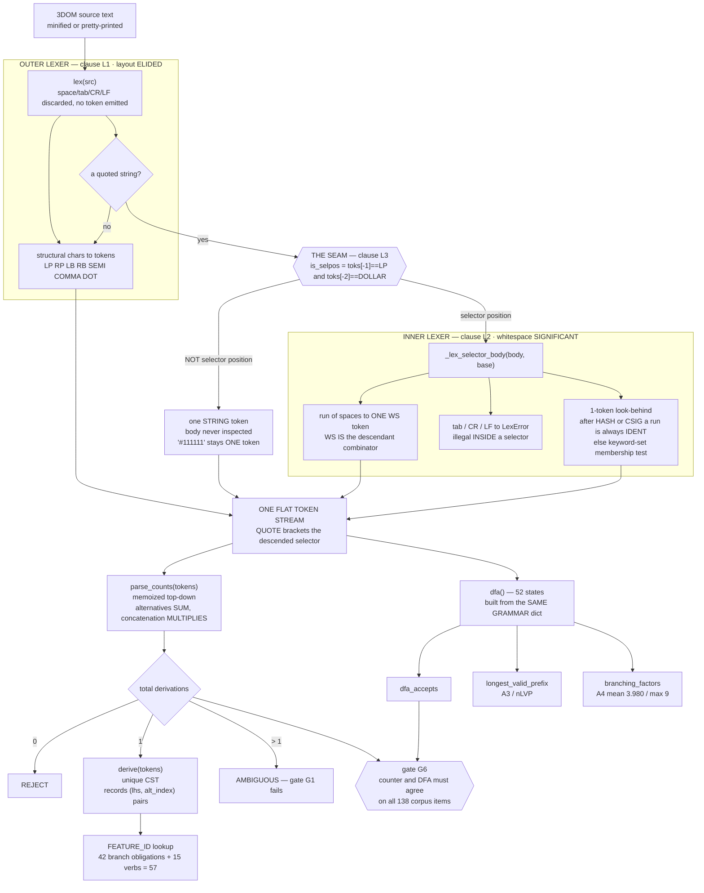
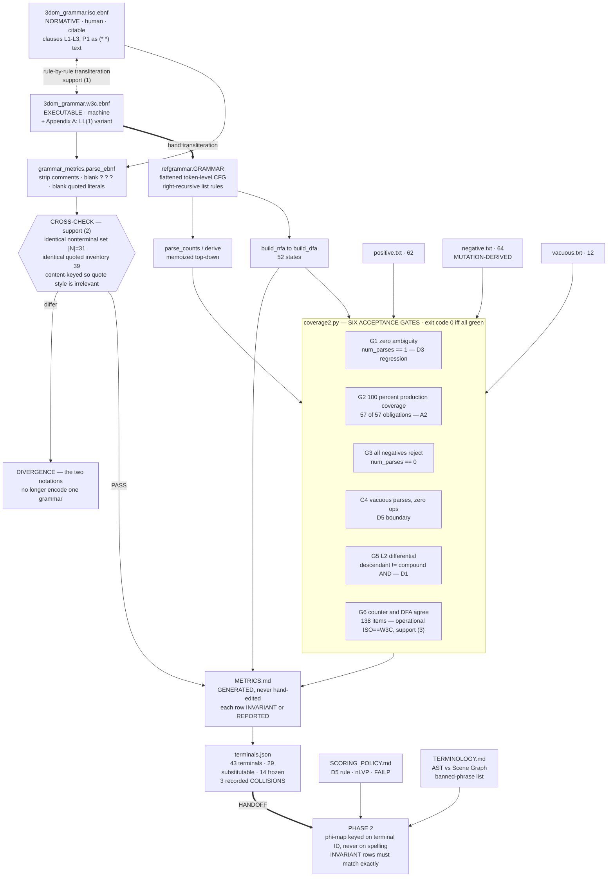

# Phase 1 — A Masterclass in the 3DOM Formalisation

> **Subject:** `grammar_and_3DOM_client/` — 3DOM formalised in ISO/IEC 14977 and
> W3C EBNF at `3dom-grammar/1.1.0`, with five repaired defects (D1–D5) and six
> new deliverables.
>
> **Environment:** Python 3.12.3 · no third-party packages required by any Phase 1 artifact.
>
> **Verification status:** every number and behavioural claim below was executed
> against the artifacts on this machine. Where I ran something, the output is
> quoted. `conformance/coverage2.py` → **all six gates green**.

---

## Conventions

- **⚑ VERIFIED** — I executed this; output shown.
- **⚠ METHODOLOGIST** — my second hat. A CHI reviewer could use this against you.
- **📖** — a named technique, with a citation precise enough to look up. Chapter
  numbers only where I am confident; otherwise the concept name and the area of
  the book, because a wrong section number wastes more of your time than none.

---

## READ THIS FIRST — five places the artifacts differ from your brief

You asked me to teach, so I am not going to teach a version of your repository
that does not exist. Five corrections, each verified, each expanded later:

| # | Your brief says | The artifacts actually say | Where |
|---|---|---|---|
| 1 | *"ISO has no character classes — hence the 52-alternative `letter` rule"* | ISO/IEC 14977 **does** have an escape hatch: the **special sequence** `? … ?`. Your file uses it: `ident_char = ? one character from A-Z a-z 0-9 or '-' or '_' ? ;`. **The 52-alternative rule was never written and never needed to be.** | §1.1 |
| 2 | *"every Python import … especially `lark`, `re`, `json`, `pathlib`, `collections`, `itertools`"* | `coverage.py` imports **`os`, `sys`** only. `grammar_metrics.py` imports **`os`, `re`, `sys`** only. `refgrammar.py` — the 690-line engine — has **zero module-level imports**. No `lark`, `json`, `pathlib`, `collections`, or `itertools` anywhere in Phase 1. | §1.4 |
| 3 | Clause P1: *"REFERENCE PARSER = EARLEY"* | `refgrammar.py` does not implement Earley. Its own comment reads: *"Exact parse counter (ambiguity detector) — **memoized top-down** over a non-left-recursive CFG."* Same language, same exact derivation count, **different algorithm**. | §1.5 |
| 4 | CHANGELOG: *"Machine-verified before release: `python3 conformance/coverage.py` → all gates green"* | ⚑ That command **crashes**: `FileNotFoundError: … conformance/negatives.txt` (the file is `negative.txt`). `coverage2.py` is the one that runs, and it does pass all six gates. | §2.6 |
| 5 | METRICS.md: *"a naive `text.count('*')` counts 82; excluding quoted literals gives 6"* | ⚑ 82 → **7** by stripping `/* … */` comment delimiters; 7 → **6** by excluding quoted literals. Quote-exclusion accounts for **1** of the 76, not 76. The stated demonstration attributes the wrong cause. | §1.6 |

None of these invalidate the grammar. Items 4 and 5 are **paper-integrity**
problems — a cited command that errors, and a demonstration that misattributes
its own effect. Fix both before submission; details in §5.

---
---

# 1. NOTATIONS, METALANGUAGES & IMPORTS

## Part A — the two metalanguages

A metalanguage is a language for describing languages. You are using two, and the
reason you need two is not redundancy — it is that **they have different
consumers**, and a notation optimised for one consumer is bad for the other.

---

### 1.1 ISO/IEC 14977 — "Information technology — Syntactic metalanguage — Extended BNF"

**What it is.** A 1996 international standard that fixes a single canonical
spelling of EBNF. Its ancestry runs Backus → Naur (ALGOL 60 report) → Wirth's EBNF
(Pascal) → the ISO committee's attempt to end the proliferation of dialects.

**Its intended consumer is a human reading a standards document.** That is the
whole design brief, and it explains every otherwise-odd choice: the explicit
concatenation comma, the mandatory terminating semicolon, the `(* … *)` comment
form. It is the notation of the *normative appendix*.

**Its real-world use** is almost entirely in standards text: ISO/IEC language
standards, some ITU-T recommendations, government specification documents. It is
conspicuously **not** the notation of working parser generators — no mainstream
tool reads ISO 14977 natively. That fact is the whole reason your project needs a
second notation.

**The "Why" for this project, specifically.** Two reasons, and only the second is
really about ISO:

1. CHI reviewers of a paper claiming *"we formalised our DSL"* expect a normative
   grammar in a citable standard notation. `3dom_grammar.iso.ebnf` is the appendix
   artifact. It exists to be **read and cited**, not run.
2. More sharply: ISO 14977 is a *different* notation with *different* operators, so
   maintaining both files and mechanically cross-checking them is a **redundancy
   check on your own transcription**. A rule you got wrong in one file is unlikely
   to be wrong identically in the other. That is the anti-drift argument (§1.7),
   and it is the real payoff.

**The complete operator set.**

| Operator | Name | Meaning | In your file |
|---|---|---|---|
| `=` | definition | binds LHS to RHS | every rule |
| `,` | **concatenation** | sequence — *explicit*, unlike every other EBNF | `"$S" , "(" , quoted_selector , ")"` |
| `;` | rule terminator | ends a production | every rule |
| `\|` | alternation | **unordered set union** | `verb = "recolor" \| "scale" \| …` |
| `{ }` | repetition | **zero or more** | `{ statement }`, `{ operation_call }` |
| `[ ]` | option | zero or one | `[ argument_list ]`, `[ sign ]` |
| `( )` | grouping | precedence only | `( "selected" \| "lasso" )` |
| `" "` / `' '` | terminal string | a literal; the two quote forms are interchangeable and exist so a literal containing one quote can be written with the other | `"$S"`, `'"'` |
| `? ?` | **special sequence** | an escape into natural language — the standard's own hook for anything EBNF cannot express | `? one decimal digit 0-9 ?` |
| `(* *)` | comment | ignored | the L1–L3 clauses |
| `-` | exception | "this except that" (set difference) | **unused here** |
| `n *` | repetition count | exactly *n* repeats | **unused here** |

**What ISO CANNOT express, and what it forces.**

- **No `+`.** There is no one-or-more operator. The idiom is `A , { A }` — "an A,
  then zero or more A". Your file uses it exactly where W3C uses `+`:
  `identifier = ident_char , { ident_char } ;` ↔ `identifier ::= ident_char+`.
- **No character ranges.** There is no `[a-z]`.

> **⚠ Correction to your brief.** You wrote that this forces "the 52-alternative
> `letter` rule." It does not, and your file does not contain one. ISO 14977
> anticipates exactly this gap and provides the **special sequence** `? … ?` as a
> deliberate escape into prose. Your file uses it four times:
>
> ```
> ident_char = ? one character from A-Z a-z 0-9 or '-' or '_' ? ;
> digit      = ? one decimal digit 0-9 ? ;
> sq_char    = ? any character except the closing single quote ? ;
> dq_char    = ? any character except the closing double quote ? ;
> ```
>
> This is the *right* call and you should defend it, not apologise for it. A
> 52-alternative `letter` rule would have been a disaster for this project
> specifically: it inflates `|N|` and `|P|`, and **`|P|` is an INVARIANT row in
> METRICS.md** — the Alien grammar would have had to reproduce the same inflated
> count, so the noise would propagate into Phase 2's matched-complexity claim.
> The special sequence keeps the character classes *out* of the production count
> and into a separate, honest row: `Lexical char-classes | 5 | INVARIANT`.
>
> The cost is real and worth stating: a special sequence is **prose**, so it is
> not machine-checkable. `grammar_metrics.py` knows this and blanks them before
> analysis (`re.sub(r"\?[^?]*\?", " SPECIAL ", text)`), then declares in its own
> docstring: *"Lexical CHARACTER-CLASS terminals are compared by prose
> correspondence … and excluded here."* That is the honest trade: five
> hand-verified correspondences, in exchange for keeping 52 phantom productions
> out of an invariant.

---

### 1.2 W3C EBNF — XML 1.0, §6 "Notation"

**What it is.** Not a standalone standard. It is the notation the XML 1.0
Recommendation defines *for itself*, in a single section, in order to write its
own grammar. It escaped that document and became the de facto notation of the web
platform: XML, XML Schema, XPath, and — most consequentially for you — it is the
notation the **railroad-diagram generators** and most modern parser-toolkit
tutorials assume.

**Its intended consumer is a machine, or a human who is about to become one.**
Its operators are the regex operators, so it transliterates into a parser
generator almost character-for-character.

**The "Why" for this project, specifically.** Your file's header states it: *"Executable
notation (`::=`, `* + ?`, `[ranges]`). Transliterate into Lark/ANTLR."* This is the
file that becomes runnable. In Phase 2 it literally does — the `.lark` template is
a transliteration of this file with `{{T_TERMINAL_ID}}` slots punched into it.

**The complete operator set.**

| Operator | Meaning | In your file |
|---|---|---|
| `::=` | definition | every rule |
| *juxtaposition* | concatenation — **implicit**, no comma | `'$S' '(' quoted_selector ')'` |
| `\|` | alternation (unordered union) | `verb ::= 'recolor' \| …` |
| `*` | Kleene star, zero or more | `statement*`, `operation_call*` |
| `+` | one or more | `simple_matcher+`, `ident_char+`, `' '+` |
| `?` | optional | `argument_list?`, `sign?`, `whitespace?` |
| `( )` | grouping | `( ',' argument )*` |
| `[a-z]` | character range | `[a-zA-Z0-9_-]`, `[0-9]` |
| `[^']` | **negated** class | `sq_char ::= [^']` |
| `#xN` | character by hex codepoint | **unused here** |
| `'…'` / `"…"` | literal | `'$S'`, `"'"` |
| `A - B` | set difference | **unused here** |
| `/* */` | comment | the L1–L3 clauses |

**What W3C CANNOT express, and what that costs you.**

- **No standardised comment syntax in the Recommendation itself** — `/* */` is
  convention, not spec. Harmless, but note that `grammar_metrics.py` has to strip
  it with a regex it chose, not one the standard defines.
- **No rule terminator.** A rule ends where the next one begins. This is why
  `parse_ebnf` splits with a **lookahead** regex rather than a delimiter:
  ```python
  parts = re.split(r"\n(?=[A-Za-z_][A-Za-z0-9_]*\s*::=)", body)
  ```
  Read that `(?= … )`: split *before* a line that looks like a new rule head,
  consuming nothing. ISO needs no such trick — it splits on `";"`. This is a
  small, concrete illustration of "human-facing notation vs machine-facing
  notation" reversing which one is easier to *machine*-process.
- **Notation-level ambiguity between operator and literal.** `*` is both the
  Kleene star and, in `wildcard ::= '*'`, a literal. ISO has the same problem
  (`sign = "+" | "-"`). This is the miscounting hazard of §1.6, and it is not a
  defect of either notation — it is the unavoidable consequence of a metalanguage
  whose object language reuses its own punctuation.

---

### 1.3 Equal generative power — the desugaring proof

**Claim.** ISO/IEC 14977 and W3C EBNF have exactly the same generative power, and
both have exactly the power of plain BNF: they generate the **context-free
languages**, no more.

**Proof strategy.** Both are *syntactic sugar*. Show that every sugared operator
has a mechanical translation into plain BNF using only concatenation, alternation,
and a fresh non-terminal — with no change to the generated string set. Since BNF
generates exactly the CFLs, and sugar adds nothing, both notations generate
exactly the CFLs. Since ISO's and W3C's operators desugar to the *same* BNF, they
are equal to each other.

> 📖 The theorem that EBNF and BNF are equivalent, with these constructions, is
> standard. Grune & Jacobs, *Parsing Techniques* (2nd ed.), covers EBNF and its
> reduction to BNF in the grammar-notation material of Ch. 2; Hopcroft, Motwani &
> Ullman treat CFGs and derivations in Ch. 5.

**Desugaring 1 — `{ A }` (ISO) ≡ `A*` (W3C), zero or more.**

Introduce a fresh non-terminal `A_star`:

```
A_star  ::=  ε  |  A A_star            (right-recursive form)
```

or equivalently, left-recursively:

```
A_star  ::=  ε  |  A_star A            (left-recursive form)
```

Both generate `{ ε, A, AA, AAA, … } = L(A)*`, the **Kleene closure**.

> 📖 Formally the closure is the **least fixed point** of `X ↦ {ε} ∪ L(A)·X` over
> the lattice of languages ordered by ⊆. This is the standard denotational reading
> of a recursive production, and it is what "the smallest set closed under the
> rule" means. See HMU's treatment of closure properties of regular languages
> (Ch. 4) and the fixed-point characterisation of recursive definitions.

**Which form you pick matters enormously here**, and your engine picks
deliberately. `refgrammar.GRAMMAR` uses the **right-recursive** form everywhere:

```python
"stmts":   [[], ["statement", "stmts"]],
"ops":     [[], ["opcall", "ops"]],
"argtail": [[], ["COMMA", "argument", "argtail"]],
"ctail":   [[], ["combinator", "compound", "ctail"]],
"matchers":[["matcher"], ["matcher", "matchers"]],
```

Two consequences, both load-bearing:

- The parse counter is a **memoized top-down** recogniser, and top-down parsing
  **cannot handle left recursion** — `A ::= A α` recurses forever before consuming
  a token. The code says so: *"No left recursion (top-down-safe)"* and
  *"memoized top-down over a non-left-recursive CFG."*
  📖 Dragon Book §4.3.3, "Elimination of Left Recursion."
- Right-recursion is what makes these rules **right-linear**, which is what carries
  the regularity proof (§3.11).

**Desugaring 2 — `[ A ]` (ISO) ≡ `A?` (W3C), optional.**

```
A_opt   ::=  ε  |  A
```

That is all. Note `[ A ]` is *not* a character class in ISO — a real source of
confusion when reading both files in one sitting, since `[a-z]` in W3C is a class
and `[ A ]` in ISO is an option. **The same bracket means opposite things in the
two notations**, and you have both files open.

**Desugaring 3 — `A , { A }` (ISO) ≡ `A+` (W3C), one or more.**

Compose the first two:

```
A_plus  ::=  A A_star
A_star  ::=  ε | A A_star
```

which flattens to the single rule

```
A_plus  ::=  A  |  A A_plus
```

— and that is *exactly* the shape your engine uses for `matchers`:

```python
"matchers": [["matcher"], ["matcher", "matchers"]],
```

So `compound_selector ::= wildcard | simple_matcher+` desugars into the two-branch
`matchers` rule, and this is why **`matchers` has two coverage obligations**, not
one: `compound:single-matcher` and `compound:multi-matcher(AND)`. **Every desugared
branch becomes a coverage obligation.** That is the mechanical link between the
notation and the 57-obligation count in gate G2, and it is worth internalising:
sugar is invisible in the `.ebnf` file and *visible* in the coverage table.

**Correspondence table — the two notations, side by side.**

| Concept | ISO/IEC 14977 | W3C EBNF | Desugars to |
|---|---|---|---|
| definition | `A = … ;` | `A ::= …` | `A → …` |
| concatenation | `X , Y` (explicit comma) | `X Y` (juxtaposition) | `X Y` |
| alternation | `X \| Y` | `X \| Y` | two productions |
| zero or more | `{ X }` | `X*` | `Xs → ε \| X Xs` |
| one or more | `X , { X }` | `X+` | `Xp → X \| X Xp` |
| optional | `[ X ]` | `X?` | `Xo → ε \| X` |
| grouping | `( … )` | `( … )` | fresh non-terminal |
| terminal | `"x"` or `'x'` | `'x'` or `"x"` | terminal |
| char class | `? prose ?` | `[a-z]`, `[^']` | alternation over the class |
| comment | `(* … *)` | `/* … */` | — |

**Every row is a notation for the same operator and changes no generated string.**
That sentence is your CHANGELOG's support (1) for language equivalence, and the
table above is its expansion.

---

### 1.4 Lark's grammar syntax — the third notation

**Why it exists.** Lark is a *tool*, and a tool's notation has to carry
information a specification does not: which rules produce tree nodes and which are
inlined (`_rule`, `?rule`), which terminals are filtered out, what to `%ignore`,
what to `%import`, terminal-vs-rule case discipline (`UPPER` = terminal, `lower` =
rule), and priorities. These are **implementation directives**, not statements
about the language. A normative grammar must not contain them, because they would
be un-implementable claims about anything but Lark.

**Why the W3C file stays normative.** Three arguments, in ascending strength:

1. **Portability.** W3C EBNF transliterates to Lark, ANTLR, or a hand-written
   recogniser. A `.lark` file is a claim about Lark.
2. **Contamination.** A `.lark` file necessarily contains `%ignore WS`, tree-shaping
   sigils, and terminal priorities. Promote it to normative and your *specification*
   now asserts things about parser internals — and, fatally for you, `%ignore` is
   exactly the directive that would destroy L2 (§5, Trap 1).
3. **The one that decides it — the isomorphism claim.** Phase 2 must argue that
   3DOM and the alien language are the **same grammar** under a renaming. That
   argument is about productions and terminals. If the normative artifact were a
   `.lark` file, the claim would have to cover `%ignore` directives and inlining
   sigils too, and a reviewer could ask whether a difference in *tree shaping*
   breaks the isomorphism. Keeping the normative layer free of implementation
   directives keeps the isomorphism claim purely grammatical.

**What prevents drift — there is exactly one mechanism, and you should be able to
name it under questioning.** It is `grammar_metrics.cross_check`:

```python
def cross_check(w, i):
    problems = []
    nw, ni = set(w["nonterminals"]), set(i["nonterminals"])
    if nw != ni:
        problems.append("nonterminal sets differ: …")
    qw = {q for q in w["quoted"] if q not in ("", "LIT", "SPECIAL")}
    qi = {q for q in i["quoted"] if q not in ("", "LIT", "SPECIAL")}
    if qw != qi:
        problems.append("quoted-terminal inventories differ: …")
    return problems
```

Two set equalities: **identical non-terminal names** (|N| = 31) and **identical
quoted-terminal contents** (39). It runs on every regeneration of METRICS.md and
its result is printed into the file:

> `PASS` — the ISO and W3C files share an identical nonterminal set (|N| = 31) and
> an identical quoted-terminal inventory (39 terminals). The two notations have not
> drifted.

**Note precisely what it does and does not catch**, because this is a
reviewer-facing limit:

- ✅ Catches: a rule added to one file only; a terminal renamed in one file only; a
  terminal deleted from one file only. That is the D2-class failure — the exact
  shape of the defect that produced D2.
- ❌ Does **not** catch: the same non-terminals and the same terminals wired
  together **differently**. `A = X , Y ;` versus `A ::= Y X` passes this check.
  Structure is compared by *inventory*, not by *shape*.

The residual risk is covered by CHANGELOG support (1) — rule-by-rule manual
transliteration — which is human, and by support (3), which is the operational
one: **gate G6** asserts the Earley-style counter and the DFA agree on all 138
corpus items. That is a *behavioural* equivalence check, and it is the strongest
of the three. If a reviewer presses on ISO/W3C equivalence, lead with G6, not with
the inventory check.

**⚠ METHODOLOGIST.** There is no third file for Lark in Phase 1 — the `.lark`
transliteration is a Phase 2 artifact (`grammar/templates/grammar.lark.template`).
So in Phase 1 the "three notations" are really two files plus a plan. When you
write this up, say so; claiming a transliteration that lives in the next phase's
directory is the kind of small imprecision that costs credibility on the details
a reviewer *can* check.

---

## Part B — every Python import, and every import that is conspicuously absent

### 1.5 The honest inventory

⚑ VERIFIED by grep across all Phase 1 Python:

| File | Module-level imports |
|---|---|
| `conformance/coverage.py` | `os`, `sys`, `refgrammar as R` |
| `conformance/coverage2.py` | `os`, `sys`, `refgrammar as R` |
| `grammar_metrics.py` | `os`, `re`, `sys`, `refgrammar as R` |
| `conformance/refgrammar.py` | **none** (one lazy `import os` inside `load_positive_programs`) |

**`lark`, `json`, `pathlib`, `collections`, `itertools` do not appear anywhere in
Phase 1.** Your brief asked me to explain them; the honest and more useful answer
is to explain the four that *are* there, and then treat the five absent ones as
**roads not taken** — because in three cases the choice not to import is a real
architectural decision worth defending.

---

#### `os` — path resolution

**What it is.** OS-level services; here, exclusively `os.path`.

**The "Why".** Every script must locate artifacts relative to **its own file**,
never relative to the shell's working directory:

```python
HERE = os.path.dirname(os.path.abspath(__file__))
sys.path.insert(0, os.path.join(HERE, "conformance"))
```

**Key components:** `os.path.dirname`, `os.path.abspath`, `os.path.join`.

**Why not `pathlib`?** `pathlib.Path` is the modern, more readable API
(`Path(__file__).resolve().parent / "conformance"`). It would be a fine choice.
Two defensible reasons for `os.path`: it is what `sys.path` wants (a list of
`str`, not `Path` — `pathlib` would need `str()` at that boundary anyway), and
`os.path` is the older, wider-compatibility idiom for a research artifact that may
be run on an unknown machine years from now. **This is a style choice with no
correctness consequence.** Do not defend it as more than that.

#### `sys` — the module path, and the exit code

**The "Why" — two distinct jobs, and the second is the important one.**

1. `sys.path.insert(0, …)` so `import refgrammar` resolves. The engine lives in
   `conformance/`; `grammar_metrics.py` lives one level up. Inserting at index
   **0** rather than appending means the local copy wins over any same-named
   module elsewhere — deliberate, for reproducibility.
2. `sys.exit(main())` — and this is the one that matters. `main()` returns `0` iff
   every gate passes. **That makes conformance a CI-checkable proposition.** The
   grammar's correctness is not a claim in a document; it is an exit code. When a
   reviewer asks "how do you know the corpus still conforms," the answer is a
   command with a testable result, not a paragraph.

`sys.stderr` is also used to separate the human report (stdout) from the
pass/fail verdict (stderr), so `python3 grammar_metrics.py > METRICS.md` would
still show you the verdict.

#### `re` — the EBNF meta-parser (in `grammar_metrics.py` only)

**What it is.** Regular expressions.

**The "Why".** `grammar_metrics.py` must read **two EBNF files in two notations**
and extract non-terminals, terminals, production counts, and operator counts. It
is a parser for a metalanguage — and it deliberately uses regex, not a parser.

**Key components and what each does:**

| Call | Job |
|---|---|
| `re.sub(r"/\*.*?\*/", " ", text, flags=re.S)` | strip W3C comments. `.*?` is **non-greedy** — with greedy `.*` this would delete everything between the *first* `/*` and the *last* `*/`, i.e. the whole file. `re.S` makes `.` match newlines. |
| `re.sub(r"\(\*.*?\*\)", " ", …)` | strip ISO comments; parens escaped. |
| `re.sub(r"\?[^?]*\?", " SPECIAL ", text)` | blank ISO special sequences so prose char-classes are not mistaken for terminals or operators. |
| `re.split(r"\n(?=[A-Za-z_][A-Za-z0-9_]*\s*::=)", body)` | split W3C into rules on a **zero-width lookahead** (§1.2). |
| `re.finditer(r"'([^']*)'\|\"([^\"]*)\"", text)` | harvest quoted-literal **contents** — see below. |
| `re.sub(r"'[^']*'\|\"[^\"]*\"", " LIT ", rhs)` | blank quoted literals before counting `\|` and operators. |

**Why regex and not a real parser for the EBNF files?** Because the task is
**lexical**, not syntactic. Every quantity extracted — rule heads, quoted
contents, top-level `|` counts, operator occurrences — is a token-level property.
Writing a parser for two EBNF dialects to count them would be a second grammar to
maintain, and *that grammar could itself drift*, which is the exact failure mode
this script exists to detect. Regex here is the smaller, more auditable tool.
📖 The lexical/syntactic boundary is Dragon Book Ch. 3 (§3.1, "The Role of the
Lexical Analyzer") — regular expressions suffice for token-level structure and
stop being appropriate the moment you need nesting.

**The one genuinely elegant line — content-keyed literal harvesting:**

```python
for m in re.finditer(r"'([^']*)'|\"([^\"]*)\"", text):
    content = m.group(1) if m.group(1) is not None else m.group(2)
    lits.add(content)
```

Two alternation branches, two capture groups; exactly one matches per hit, so the
`is not None` test picks the live one. The result set holds **contents, not
spellings**. ISO writes `"$S"` and W3C writes `'$S'`; both contribute `$S`. Without
this, the cross-check would report a 39-terminal divergence on every single
terminal, purely because the two notations prefer different quote characters.
**Content-keying is what makes the cross-check about the grammar rather than about
punctuation.**

Note `m.group(1) is not None` and *not* `if m.group(1)` — an empty literal `''`
has content `""`, which is falsy. The explicit `None` test distinguishes "this
branch did not match" from "this branch matched the empty string."

#### `refgrammar as R` — the single source of executable truth

Not a third-party import, but the most important line in both scripts. **One
encoding of the token-level language**, imported by everything. `coverage.py` and
`grammar_metrics.py` both take their automaton facts from `R`, so METRICS.md's
DFA-state count and the conformance suite's accept/reject decision cannot
disagree — they are the same object.

---

#### The five absent imports — roads not taken

**`lark` — absent, and this is the deliberate one.** Phase 1's engine is a
**hand-written recogniser with zero dependencies**. ⚑ VERIFIED: `refgrammar.py`
has no module-level imports at all.

The argument for this is strong and you should make it:

- **The normative grammar must not be defined by a tool's behaviour.** If Phase 1's
  ground truth came from Lark, then "3DOM is the language accepted by Lark 1.x with
  these flags" — and a Lark version bump becomes a change to your language.
- **Independence for cross-checking.** Phase 2 *does* use Lark's Earley
  (`transpiler.py`). Because Phase 1's engine shares no code with it, agreement
  between them is evidence. Two implementations of one specification agreeing is a
  much stronger statement than one implementation agreeing with itself.
- **Reproducibility.** A reviewer, or you in 2029, can run Phase 1 on a bare Python
  install. No pip, no lockfile, no wheel that stopped building.

The cost, stated plainly: you wrote and must maintain a lexer, a parse counter, a
derivation extractor, a Thompson NFA construction, and a subset construction —
**690 lines of parsing infrastructure that is itself unverified except by the
corpus it checks.** Gate G6 (counter ≡ DFA) is the internal consistency check, and
Phase 2's Lark agreement is the external one. That is an adequate answer, but only
if you can state it.

**`json` — absent, and this is a real gap.** `terminals.json` and `ir_schema.json`
are JSON, and **nothing in Phase 1 reads them**. ⚑ I read `terminals.json` with
`json.load` to write this document; no Phase 1 script does. So `terminals.json` —
the *handoff artifact to Phase 2* — is hand-maintained and machine-unchecked
within Phase 1. Its 43 terminals are never asserted against the 39 quoted
terminals `grammar_metrics.py` extracts from the grammar. §5, Trap 7 gives the
concrete check to add; it is about ten lines.

**`collections` — absent, and correctly so.** `collections.Counter` would tidy the
branching-factor profile aggregation, and `defaultdict(list)` would replace
`by_pos.setdefault(idx, []).append(bf)`. Both are cosmetic. `setdefault` is the
zero-import idiom for exactly this, and in a file with a no-imports policy it is
the right call. 📖 The `setdefault`-vs-`defaultdict` trade-off is Fluent Python
Ch. 3, "Handling Missing Keys."

**`itertools` — absent, correctly.** Nothing here needs lazy combinatorics. The
one plausible use is `itertools.chain` in `all_features()`, where `base |
VERB_FEATURES` (set union) is already clearer.

**`pathlib` — absent; §1.5 above. Style only.**

---

### 1.6 The operator-counting problem — why `str.count('*')` is wrong, and what the real numbers are

This is the sharpest small lesson in Phase 1, because **the number goes in your
paper**, and because ⚑ the demonstration in METRICS.md currently misattributes its
own cause.

**The hazard.** In `wildcard ::= '*'` the asterisk is a **terminal of the object
language**. In `statement*` it is an **operator of the metalanguage**. Same
character, two levels. A naive count conflates the level being described with the
level doing the describing — a **use/mention** confusion, and the metalanguage
equivalent of the AST-vs-scene-graph error in TERMINOLOGY.md.

Three literals in your grammar are also metalanguage operators:

```
wildcard ::= '*'              /* Kleene star */
sign     ::= '+' | '-'        /* one-or-more */
```

**What the script does — blank first, count second:**

```python
body_noq = re.sub(r"'[^']*'|\"[^\"]*\"", " LIT ", body)
for ch in "*+?":
    ops[ch] = body_noq.count(ch)
```

Every quoted literal is replaced by the inert placeholder ` LIT `. **It is not
deleted** — deletion could fuse neighbouring tokens; replacement by a spaced
placeholder preserves separation. Then count.

**⚑ VERIFIED — the actual decomposition:**

```
raw * count in 3dom_grammar.w3c.ebnf : 82
after stripping /* … */ comments     :  7
after blanking quoted literals       :  6
```

Now read METRICS.md's demonstration:

> *A naive `text.count('*')` over the W3C file counts 82; excluding quoted literals
> gives the true Kleene-star count **6**.*

**Both numbers are right; the causal claim is wrong.** The 82 → 7 collapse is
**comment stripping** — the file's own `/* … */` delimiters contribute 75
asterisks, plus the `═══` decoration rules. Quoted-literal exclusion accounts for
**exactly one**: the `'*'` in `wildcard`. The sentence credits quote-exclusion with
all 76.

**⚠ METHODOLOGIST.** This matters more than a typo. The paragraph is titled *"the
number that goes in the paper"* and is a **worked demonstration of methodological
care**. A reviewer who reproduces it — and this one is trivially reproducible —
finds the stated mechanism accounts for 1.3 % of the stated effect. That converts
a strength into a liability. The fix is one sentence:

> *A naive `text.count('*')` over the raw W3C file counts 82. Stripping `/* … */`
> comments leaves 7; excluding the quoted literal in `wildcard ::= '*'` leaves the
> true Kleene-star count **6**. Both exclusions are necessary; the second is the
> one that is easy to forget, because a comment is obviously not grammar while a
> quoted `'*'` looks exactly like an operator.*

Same lesson, and now it survives being checked.

**The ISO branch of the same function is worth reading too:**

```python
ops["*"] = body_noq.count("{")     # { } == zero-or-more
ops["?"] = body_noq.count("[")     # [ ] == optional
ops["+"] = 0                       # ISO has no '+' operator
```

It counts **opening brackets** as operator occurrences, having desugared the
correspondence table of §1.3 into three lines. `ops["+"] = 0` is not a stub — it is
the assertion that ISO has no one-or-more operator, which is why the file writes
`A , { A }`. And note that counting `{` is safe here **only** because
`grammar_metrics.py` blanked the ISO special sequences first; had `? … ?` prose
contained a brace, it would have been counted.

📖 The general principle — that a scanner must distinguish an operator of the
describing language from a character of the described language — is the
maximal-munch / token-classification material in Dragon Book §3.4 and §3.8.3.

---

### 1.7 Earley versus LALR — and what your engine actually is

**The claim, from clause P1:**

> *(P1) REFERENCE PARSER = EARLEY. This grammar is intentionally NOT LL(1): on
> seeing whitespace inside a selector the parser cannot choose
> descendant_combinator vs child_combinator without a second token, so k = 2.*

**Why not LALR(1) / LL(1).** The combinator rule needs two tokens (full argument in
§3.12). Concretely:

```
combinator            ::= child_combinator | descendant_combinator
descendant_combinator ::= whitespace
child_combinator      ::= whitespace? '>' whitespace?
```

`FIRST(descendant_combinator) = { whitespace }` and `FIRST(child_combinator) ⊇
{ whitespace }`. The two alternatives' FIRST sets **overlap**, which is precisely
the condition an LL(1) table cannot represent. An LALR(1) generator would report a
shift/reduce conflict.

📖 FIRST/FOLLOW and the LL(1) condition: Dragon Book §4.4.2–4.4.3. Left factoring
as the standard repair: §4.3.4. LALR conflict construction: §4.7.

**Why Earley is the right mandate.** Three reasons, and the third is the one that
actually decides it:

1. **It handles k > 1 directly**, with no grammar surgery. General CFG parsing,
   no lookahead restriction.
2. **Cost is irrelevant here.** Earley is O(n³) worst case, O(n²) for unambiguous
   grammars, O(n) for LR-ish ones; LALR is O(n). ⚑ Your longest verified program
   is 36 tokens. n³ at n = 36 is 46,656 elementary steps. This is a genuine case
   where the asymptotic argument does not apply, and P1 says so: *"inputs are short
   (parse cost is irrelevant)."*
3. **Earley reports ambiguity explicitly.** This is the decisive one. An LALR
   generator resolves a conflict silently (default: shift) and hands you a parser
   that *works* while your grammar is ambiguous. Earley returns **all** derivations,
   so "is this grammar unambiguous?" becomes a **countable, testable property** —
   which is exactly what gate G1 checks: `num_parses(p) == 1`, not `>= 1`. **D3
   would not have been detectable with an LALR front end.** It would have been
   silently resolved and shipped.

**What Earley costs you that LALR would not:** the O(n³) bound (irrelevant here);
no table-construction-time conflict report (you get per-input ambiguity counts
instead, which for this project is *better*); and no free error recovery (LR's
viable-prefix property gives good error locations — you rebuilt that yourself as
`longest_valid_prefix`, §3.13).

📖 Earley's algorithm: Grune & Jacobs, *Parsing Techniques* (2nd ed.), §7.2. The
Dragon Book does not cover Earley in its main line.

---

#### **⚠ The engine is not Earley.** ⚑ VERIFIED.

`refgrammar.py`'s parse counter is documented in its own section header as:

```python
# Exact parse counter (ambiguity detector) — memoized top-down over a
# non-left-recursive CFG. count(sym, i) -> {end: number_of_derivations}.
```

That is **memoized recursive descent** (packrat-shaped), not Earley. `coverage.py`
and the CHANGELOG both call it "the Earley engine."

**Does this matter? Split the question, because the two halves have different
answers.**

*Correctness:* **no.** For this grammar the two are equivalent, and the reason is
stated in the code: the grammar is **non-left-recursive**. Memoized top-down over a
non-left-recursive CFG is a complete recogniser, and because `count(sym, i)`
returns a map `{end_position: number_of_derivations}` and combines alternatives by
**summation** and concatenation by **multiplication**, it computes the exact
derivation count — the same count Earley's forest would yield. The memo table makes
it polynomial. Gate G1's ambiguity test is therefore sound.

*Rhetoric:* **yes.** P1 is a **normative clause**. It says a conforming
implementation MUST use Earley, and your reference implementation does not. And the
difference is not cosmetic: Earley handles left recursion, memoized top-down does
not. The grammar happens to be non-left-recursive, so the substitution is safe —
but that safety is a **property of this grammar**, not of the two algorithms.

**The fix is a rewording, not a rewrite.** Say what is true:

> *(P1) The grammar is intentionally not LL(1) (k = 2), so the reference recogniser
> must be a general CFG parser that reports ambiguity explicitly. Two are used:
> `refgrammar.parse_counts`, an exact memoized top-down derivation counter
> (sound and complete for this grammar because it is non-left-recursive), and, in
> the Phase 2 toolchain, Lark's Earley parser with `ambiguity="explicit"`. Both
> report derivation counts, which is what gates G1 and I10 test.*

That is stronger than the current claim, because **two independent recognisers
agreeing is better evidence than one named algorithm**.

---
---

# 2. HIGH-LEVEL ARCHITECTURE & DATA FLOW

Two flows. Flow A is what happens to **one program**. Flow B is what happens to
**the specification**. They are different pipelines with different failure modes,
and conflating them is how people end up unable to say what their conformance
suite actually proves.

---

## Flow A — the parse pipeline

### Step 0 — the input

A UTF-8 string. It may be minified or pretty-printed; L1 makes those the same
program.

```
(function(){ $S('.car > .wheel.front').delete(); })();
```

### Step 1 — OUTER lexing (L1): layout is elided

`refgrammar.lex(src)` walks the characters. Its opening move is the whole of L1:

```python
if c in " \t\r\n":
    i += 1
    continue
```

Space, tab, CR and LF are **discarded without emitting a token**. This is the
conventional lexer/parser separation, and it is *authorised by clause L1*:

> *(L1) Inter-token whitespace … is INSIGNIFICANT and is elided by the lexer per
> the conventional lexer/parser separation.*

📖 Dragon Book §3.1, "The Role of the Lexical Analyzer" — stripping whitespace and
comments is listed there as one of the lexer's defining jobs.

Structural characters become single tokens: `(`→`LP`, `)`→`RP`, `{`→`LB`,
`}`→`RB`, `;`→`SEMI`, `,`→`COMMA`, `.`→`DOT`.

### Step 2 — THE SEAM (L3): deciding whether a quoted string is a selector

This is the boundary you asked me to locate exactly. It is **five lines** inside
`lex`:

```python
body = src[i + 1:j]
is_selpos = (len(toks) >= 2 and toks[-1][0] == "LP" and toks[-2][0] == "DOLLAR")
if is_selpos:
    toks.append(("QUOTE", q, i))
    toks.extend(_lex_selector_body(body, i + 1))   # ← DESCEND (L2)
    toks.append(("QUOTE", q, j))
else:
    toks.append(("STRING", body, i))               # ← STAY OPAQUE
```

**The component that treats the quoted selector as one opaque terminal** is the
outer lexer, `lex` — but *only for strings not in selector position*. The
discriminator is two tokens of **look-behind**: the previous token is `LP` and the
one before it is `DOLLAR`. That is the token-level spelling of the production
`selector_call ::= '$S' '(' quoted_selector ')'`.

**The component that parses the contents with whitespace significant** is
`_lex_selector_body`, and the seam is `quoted_selector` — exactly as clause L3
declares:

> *(L3) … The `quoted_selector` production is the seam: its body is the `selector`
> non-terminal, lexed under L2; every other quoted string (`quoted_string`) is an
> opaque argument value.*

So `$S('.a .b')` descends and the space becomes a `WS` token; `recolor('#111111')`
does not descend and the whole body becomes one `STRING` token. ⚑ VERIFIED — the
`#111111` in the drill streams below is a single `STRING`, never `HASH IDENT`.

### Step 3 — INNER lexing (L2): whitespace is a grammar symbol

`_lex_selector_body` elides nothing:

```python
if c == " ":
    j = i
    while j < n and body[j] == " ":
        j += 1
    toks.append(("WS", " ", base + i))
elif c in "\t\r\n":
    raise LexError("illegal whitespace char inside selector at %d" % (base + i))
```

Two things to notice, both normative consequences:

- A **run of spaces becomes one `WS` token**. `'.a  .b'` and `'.a .b'` produce the
  same stream. This is `whitespace ::= ' '+` doing maximal munch, and it is the
  reason double-spacing a selector is harmless while *any* spacing at all changes
  the meaning.
- **Tab, CR and LF are hard errors inside a selector.** They are layout outside and
  illegal inside — not "significant", *illegal*. The comment gives the reason:
  *"Only the plain space is the descendant combinator; other layout is not
  permitted inside a selector (keeps L2 unambiguous)."* If `\t` were also a
  descendant combinator, `whitespace` would need to be `[ \t]+` and the L1/L2
  character sets would overlap on three more characters, multiplying the
  reformatter hazard in `terminals.json`'s second collision entry.

The inner lexer also carries **one token of look-behind**, and it is load-bearing:

```python
if prev in ("HASH", "CSIG"):
    tt = "IDENT"                 # name after a sigil is always a literal id
elif run in _TYPESET:
    tt = "TYPE_" + run.upper()   # bare known type keyword
elif run in _PSEUDOSET:
    tt = run.upper()
else:
    tt = "IDENT"                 # bare unknown word -> grammar rejects it
```

`#mesh` must be *an id selector for a node named "mesh"*, not the id sigil followed
by the `mesh` type keyword. The state variable `prev` is what makes the classifier
context-dependent. 📖 This is the classic **keyword-vs-identifier** problem: munch
the maximal identifier run first, *then* test membership in the keyword set —
never match keywords character-by-character. Dragon Book §3.3.2 and the
`recognizing keywords and identifiers` discussion in §3.4.

### Step 4 — one flat token stream

The two levels produce a **single flat stream**, which is the design decision that
makes everything downstream cheap:

⚑ VERIFIED:

```
(function(){ $S('.car > .wheel.front').delete(); })();
LP FUNC LP RP LB DOLLAR LP QUOTE CSIG IDENT WS GT WS CSIG IDENT CSIG IDENT QUOTE RP DOT VERB LP RP SEMI RB RP LP RP SEMI
```

29 tokens. Note `QUOTE … QUOTE` bracketing the descended selector: the quotes are
retained as tokens, so the flat grammar can still express "the selector is
delimited," and `selcall ::= DOLLAR LP QUOTE selector QUOTE RP` reconstructs the
two-level structure inside one CFG.

### Step 5 — parse counting (the CST, and how many of them there are)

`parse_counts(tokens)` runs the memoized top-down counter over `GRAMMAR`.
Return: `(total, memo)` where `total` is the **exact number of derivations** of the
whole stream and `memo[(sym, i)]` maps each end position to the number of
derivations of `sym` starting at `i`.

Alternatives **sum**; concatenation **multiplies**:

```python
for pos, c in cur.items():
    for pos2, c2 in count(s, pos).items():
        nxt[pos2] = nxt.get(pos2, 0) + c * c2
```

That is the counting semiring, and it is why the ambiguity test is `== 1` rather
than `>= 1`. A grammar that accepts is `>= 1`; a grammar that is *unambiguous on
this input* is `== 1`.

### Step 6 — derivation extraction (the CST proper)

`derive(tokens)` re-walks the memo table and reconstructs the **unique** parse
tree, recording every `(lhs, alternative_index)` pair it uses. Those pairs map
through `FEATURE_ID` to human-readable obligation names. This is the coverage
instrument, and it is why the CST is built at all — nothing in Phase 1 *evaluates*
a program, so the tree exists solely to be measured.

### Step 7 — the DFA path (parallel, not sequential)

Independently, `build_nfa()` → `build_dfa()` compiles the **same** `GRAMMAR` dict
into a 52-state DFA over the flat token alphabet. It gives recognition,
longest-valid-prefix, and branching factors. Gate G6 asserts the two paths agree.

---

## 2.1 Visual Map — Flow A



---

## Flow B — the artifact and verification pipeline

Flow A processes a program. Flow B processes **the specification itself**, and it
is the one that carries your methodological claim.

### Stage 1 — ISO normative spec (`3dom_grammar.iso.ebnf`)

The human-readable, citable artifact. Carries the L1–L3 and P1 clauses as
`(* … *)` comments that are **normative text, not commentary** — the file says so.
Nothing executes this file.

### Stage 2 — W3C executable spec (`3dom_grammar.w3c.ebnf`)

The machine-facing twin. Same rules, regex operators, real character classes.
Carries the same normative clauses plus **Appendix A**, the non-normative
left-factored LL(1) variant (§3.12).

### Stage 3 — the transliteration

⚑ In Phase 1 there is **no `.lark` file**. `refgrammar.GRAMMAR` is the
transliteration: a Python dict encoding the *flattened, token-level* grammar. The
`.lark` transliteration is Phase 2's
`alien_syntax/grammar/templates/grammar.lark.template`. Say this precisely in the
paper — see §1.4's methodologist note.

### Stage 4 — the generated recognisers

From one `GRAMMAR` dict, two independent recognisers:

- `parse_counts` / `derive` — exact derivation counting and CST extraction
- `build_nfa` → `build_dfa` — a 52-state DFA

**They share the grammar and share no algorithm.** That is what makes their
agreement (G6) informative rather than tautological.

### Stage 5 — the three corpora

⚑ VERIFIED sizes, from `coverage2.py`:

| Corpus | Items | Obligation |
|---|---|---|
| `positive.txt` | 62 | each parses to **exactly one** derivation; together cover **all 57** obligations |
| `negative.txt` | 64 | each **rejects** (`num_parses == 0`) |
| `vacuous.txt` | 12 | each **parses** with **zero** operations |

The negative corpus is **mutation-derived** — each item is a single, deliberate
defect against a positive item, which is what makes the longest-valid-prefix metric
meaningful (you know exactly where each one should die).

### Stage 6 — the six gates

| Gate | Asserts | Failing it means |
|---|---|---|
| **G1** | every positive has `num_parses == 1` | The grammar is **ambiguous**, or the corpus contains a non-program. This is the D3 regression. Ground truth is undefined — see §3.10. |
| **G2** | positives cover all 57 obligations | Some production branch is **never exercised**. An unexercised branch is one whose correctness is untested, and — worse for Phase 2 — one whose alien counterpart is untested too. |
| **G3** | every negative has `num_parses == 0` | The grammar **over-accepts**. A model emitting that malformed program would be scored as a syntax success. |
| **G4** | every vacuous item parses with zero verbs | The D5 boundary has moved. Vacuous must be *parse success, task failure* — if it stopped parsing, the two failure modes would be conflated in the results table. |
| **G5** | `$S('.car .wheel')` and `$S('.car.wheel')` derive **different** feature sets | L2 is not enforced; the descendant combinator has been silently eliminated. This is the D1 regression. |
| **G6** | counter and DFA agree on all 138 items | The two recognisers disagree, so "the language" is undefined — you would have two languages and no way to say which is 3DOM. |

⚑ VERIFIED — `python3 conformance/coverage2.py`:

```
3DOM conformance — 3dom-grammar/1.1.0
============================================================
corpus sizes: positive=62  negative=64  vacuous=12
G1 OK  — all 62 positives parse to exactly one derivation
G2 OK  — production coverage = 100% (57/57 branches)
G3 OK  — all 64 negatives rejected
G4 OK  — all 12 vacuous items parse with zero operations
G5 OK  — '.car .wheel' (descendant) != '.car.wheel' (compound AND)
G6 OK  — Earley and DFA agree on all 138 corpus items (same language)
============================================================
RESULT: PASS — all gates green
```

### Stage 7 — metrics generation

`grammar_metrics.py` does the ISO↔W3C cross-check (§1.4), pulls automaton facts
from `refgrammar`, and **writes METRICS.md**. The header says *"Generated by
`grammar_metrics.py`. Do not hand-edit."* Every row is tagged **INVARIANT** (Phase
2 must match exactly) or **REPORTED** (measured, not constrained).

### Stage 8 — `terminals.json`, the Phase 2 handoff

43 terminals, each with `id`, `spelling`, `role`, `productions`, `substitutable`,
`note` — plus a `collisions` block. ⚑ VERIFIED: 29 substitutable, 14 frozen.
This is the contract Phase 2's φ-map is keyed on, and §3.14 covers it in full.

---

## 2.2 Visual Map — Flow B



**How to read Flow B.** The left column is the **specification**, the middle is
**verification**, the right is **handoff**. The three supports for ISO≡W3C
equivalence appear as three separate edges: manual transliteration (dashed,
between the two `.ebnf` files), the mechanical inventory cross-check (`XC`), and
the operational behavioural check (`G6`). Only the third is strong; §1.4 explains
why you should lead with it.

Note the two double-line edges. `W3C ==> refgrammar.GRAMMAR` and
`terminals.json ==> Phase 2` are the two places where a **human transcribes
something by hand**, and they are therefore the two highest-risk edges in the
diagram. The first is guarded by G1–G6. ⚑ The second is guarded by **nothing in
Phase 1** — see §5, Trap 7.

---
---

# 3. THE FORMAL CONTRACT — RULE-BY-RULE

Notation used below: `L(X)` is the set of strings derivable from non-terminal `X`;
`·` is concatenation of languages; `*` is Kleene closure; `ε` is the empty string.
Terminal IDs are from `terminals.json`; **★** marks `substitutable:false` (frozen —
Phase 2's φ-map must not rename it).

---

## 3.1 `program` / `iife` / `statement` — the mandatory wrapper

```
program   ::= iife
iife      ::= '(' 'function' '(' ')' '{' statement* '}' ')' '(' ')' ';'
statement ::= chain_expression ';'
```

**The "Why".** `program` gives the grammar a single start symbol. `iife` enforces
that **every 3DOM emission is exactly one immediately-invoked function
expression** — a syntactic fence, so a model cannot emit a bare expression, a
`<script>` fragment, or prose that happens to contain a valid statement.
`statement` makes the body a `;`-terminated sequence.

**LANGUAGE.**

```
L(program) = L(iife)
L(iife)    = {"("} · {"function"} · {"("} · {")"} · {"{"} · L(statement)* · {"}"} · {")"} · {"("} · {")"} · {";"}
L(statement) = L(chain_expression) · {";"}
```

Note `L(statement)*` includes `ε`: **an empty body is legal.**
`(function(){})();` is in the language.

**SKELETON** — the shape Phase 2 must preserve exactly:

| Rule | Structure | Arity |
|---|---|---|
| `program` | single non-terminal reference | 1 |
| `iife` | sequence of 10 terminals with one `*`-repetition in position 6 | 11 symbols, one starred |
| `statement` | sequence: non-terminal, terminal | 2 |

**FORBIDS.** Nested functions (no `iife` inside `statement`). A missing trailing
`;`. A missing invocation `()`. ⚑ Your negative corpus attacks every one:
`(function(){ $S('.wheel').delete(); })()` — no trailing semicolon — and
`(function(){ $S('.wheel').delete(); });` — never invoked. Both reject.

Why the rejection is desirable: the wrapper is what makes the emission
**safely evaluable in the editor**. A fragment that is not an IIFE either does not
run or leaks bindings into the page scope. The grammar refusing it is the harness
refusing to score a program it could not have executed.

**METRICS ROLE.** `program`, `iife`, `stmts:empty`, `stmts:more`, `statement` — 5
of the 57 obligations. Contributes to `|N|` and `|P|`, both **INVARIANT**.

**TERMINALS.** `T_LPAREN★ T_RPAREN★ T_LBRACE★ T_RBRACE★ T_SEMI★` (all frozen —
generic C-family delimiters, and `terminals.json` notes they are *"not a
CSS/jQuery familiarity signal"*), plus `T_FUNCTION` (**substitutable** — `function`
is a JavaScript familiarity signal, so Phase 2 renames it; beta spells it
`mumvumfe`).

**📖 Formal deep dives.**

- `iife` wrapping `stmts` with material on both sides is the one place that *looks*
  like self-embedding. It is not: `iife` embeds a **different** non-terminal, and
  `stmts` cannot re-derive `iife`. §3.11 makes this precise — it is the single most
  probe-worthy step in the regularity proof.
- The matched `{` … `}` and `(` … `)` here are **fixed-depth**, not nested. This is
  why the language stays regular despite containing balanced brackets (§3.11).
- 📖 Start symbols and derivations: Hopcroft–Motwani–Ullman Ch. 5 (context-free
  grammars, derivations, and the language of a grammar).

---

## 3.2 `chain_expression` — the heart of the language

```
chain_expression ::= selector_call operation_call*
```

**The "Why".** One responsibility: **bind exactly one selection to an ordered,
unbounded sequence of operations.** This is the fluent-interface shape borrowed
from jQuery, and it is the single production that most carries 3DOM's "familiar"
character — which makes it the most important one for Phase 2 to preserve
structurally while renaming lexically.

**LANGUAGE.**

```
L(chain_expression) = L(selector_call) · L(operation_call)*
```

**SKELETON.** Sequence of length 2: a mandatory non-terminal followed by a
**Kleene-starred** non-terminal. Arity 2, one starred.

**FORBIDS.**
- Two selectors in one statement. ⚑ `(function(){ $S('.a') $S('.b'); })();` is in
  your negative corpus and rejects at token 12, with legal-next `{DOT, SEMI}`.
- An operation with no selector. ⚑ `(function(){ .recolor('#111111'); })();`
  rejects at token 5, legal-next `{DOLLAR, RB}`.

**The `n = 0` case is deliberate and is defect D5.** `selector_call
operation_call*` with zero operations is a **legal pure query** — `$S('.wheel');`
parses. The grammar cannot and should not forbid it; SCORING_POLICY.md instead
declares it *parse success, task failure*, and gate G4 enforces the boundary.
Full treatment in §3.15.

**METRICS ROLE.** `chain`, `ops:zero(terminate-chain)`, `ops:more(chained-op)` — 3
obligations. `ops:zero` is the obligation that the **vacuous** corpus and every
chain-terminating positive both exercise.

**TERMINALS.** None directly — it is pure structure. That is worth noticing: *the
most characteristic production in the language introduces no terminal at all*, so
Phase 2 preserves it by preserving shape, with nothing to rename.

**📖 Formal deep dives.**

- The `*` here is the **Kleene closure**, the least fixed point of
  `X ↦ {ε} ∪ L(operation_call)·X`. Desugared (§1.3) to `ops → ε | opcall ops`, it
  is **right-linear**, which is what keeps the language regular. Chaining is
  unbounded but never *nested*: `.a().b()` is iteration, not recursion.
- 📖 Kleene closure and its fixed-point reading: HMU Ch. 3–4 (regular expressions
  and closure properties).

---

## 3.3 `selector_call` / `quoted_selector` — the seam

```
selector_call   ::= '$S' '(' quoted_selector ')'
quoted_selector ::= "'" selector "'" | '"' selector '"'
```

**The "Why".** `selector_call` is the **sole entry point** to selection — one
spelling, so the harness can locate it and the grammar can pin selector position.
`quoted_selector` is the **L3 seam**: the production at which the outer language
hands control to the inner one.

**LANGUAGE.**

```
L(selector_call)   = {"$S"} · {"("} · L(quoted_selector) · {")"}
L(quoted_selector) = ({"'"} · L(selector) · {"'"}) ∪ ({"\""} · L(selector) · {"\""})
```

**Read that union carefully — it is the whole of repair D2.** The set is a union of
two *complete bracketings*. There is no derivation whose opening delimiter comes
from one branch and whose closing delimiter comes from the other, because a
derivation must choose **one alternative** and that alternative fixes both. Quote
agreement is therefore a **structural** property, not a side condition checked
after parsing.

**SKELETON.** `selector_call`: sequence of 4 (terminal, terminal, non-terminal,
terminal). `quoted_selector`: alternation of **2 branches**, each a sequence of 3.
Arity 2 — and this matters, because a naive fix (`quote selector quote` with
`quote ::= "'" | '"'`) would be arity 1 with a nested alternation, would generate
`'…"`, and would have the same non-terminal count. **Phase 2 must preserve the
two-branch shape, not merely the terminal inventory.**

**FORBIDS.** Mismatched quotes — `$S('.wheel")` is **not derivable**. Also forbids
an empty selector: `L(selector)` has no `ε` alternative, so `$S('')` fails.

Why desirable: with no escape mechanism in the grammar (`sq_char ::= [^']`), a
mismatched-quote program has no coherent reading. Making it underivable means the
recogniser rejects it rather than a downstream stage guessing.

**METRICS ROLE.** `selector_call` — 1 obligation. `quoted_selector` is folded into
`selcall` in the flat grammar (`selcall ::= DOLLAR LP QUOTE selector QUOTE RP`), so
it contributes to `|P|` in the `.ebnf` files but has no separate flat obligation.
**⚠ A small honest note:** this means the *two-branch* structure of
`quoted_selector` — the D2 repair itself — has **no dedicated coverage
obligation**. G2 would still read 57/57 if someone collapsed it. What guards D2 is
G3 (the mismatched-quote negatives reject) and the ISO/W3C inventory cross-check,
not G2.

**TERMINALS.** `T_SELECTOR_ENTRY` (`$S`, **substitutable** — a jQuery familiarity
signal, and the most conspicuous one in the language), `T_LPAREN★ T_RPAREN★`,
`T_QUOTE_S★ T_QUOTE_D★`.

**Why the quotes are frozen.** `terminals.json` marks both quote terminals
`substitutable:false`. The reason is exactly the D2 repair: the two quote
characters are a **symmetric delimiter pair** that carries the agreement
constraint. Rename them to an *asymmetric* pair — say `«` and `»` — and the
constraint changes character: agreement becomes trivially enforced by the shape of
the brackets rather than by the two-branch alternation, and the alien language
becomes *easier* to lex than 3DOM. That is an unmatched complexity change, and it
is why Phase 2's φ validator (`V7/I8`) refuses to substitute them.

**📖 Formal deep dives.**

- The two-branch alternation is a small instance of **avoiding an over-general
  grammar by refusing to factor**. Factoring `"'" | '"'` into a `quote`
  non-terminal is the "obvious" simplification and is exactly the bug D2 repaired.
  📖 Dragon Book §4.3 ("Writing a Grammar") on grammars that accept too much.
- `selector_call` is where the parser's **two-token look-behind** in the lexer gets
  its justification; §2 Step 2.

---

## 3.4 `operation_call` — one chain link

```
operation_call ::= '.' verb '(' argument_list? ')'
```

**The "Why".** One responsibility: **apply one verb, with its arguments, to the
current selection.** The leading `.` is the fluent chain operator.

**LANGUAGE.**

```
L(operation_call) = {"."} · L(verb) · {"("} · (L(argument_list) ∪ {ε}) · {")"}
```

**SKELETON.** Sequence of 5 with an **optional** (`?`) non-terminal in position 4.
Arity 5, one optional.

**FORBIDS.** A verb outside the closed set — ⚑ `.flurb()` rejects with LVP 13/22
and legal-next exactly `{VERB}`. Also forbids omitting the parentheses
(`.delete` alone), and a trailing comma (`argument_list` cannot end in `,`).

**METRICS ROLE.** `operation_call`, `operation_call:no-args`,
`operation_call:with-args` — 3 obligations. **The `?` splits into two
obligations**, which is the coverage-relevant consequence of desugaring (§1.3):
the corpus must contain both `.delete()` and `.scale(2)`.

**TERMINALS.** `T_CHAIN_OP` (`.`, **substitutable**) and `T_LPAREN★ T_RPAREN★`.

**⚠ `T_CHAIN_OP` is half of the `.` overload.** Its spelling is shared with
`T_CLASS_SIGIL`. This is the first entry in `terminals.json`'s `collisions` block
and is the single most important thing Phase 1 hands to Phase 2. §3.14 and §5
Trap 2.

**📖 Formal deep dives.**

- `argument_list?` desugars to `optargs → ε | arglist`. The `ε` branch is what
  makes `.delete()` legal, and it is a real production that must be covered.
- Nullary verbs having **mandatory empty parens** is a deliberate rejection of an
  optional-parens design. Optional parens would make `.delete` and `.delete()`
  both legal — two spellings of one operation, which is a **canonicalisation
  burden** pushed downstream. The grammar refusing it is the cheapest possible fix.

---

## 3.5 The selector subset — `complex_selector`, `combinator`, `compound_selector`, `simple_matcher`

```
complex_selector      ::= compound_selector ( combinator compound_selector )*
combinator            ::= child_combinator | descendant_combinator
descendant_combinator ::= whitespace
child_combinator      ::= whitespace? '>' whitespace?
compound_selector     ::= wildcard | simple_matcher+
simple_matcher        ::= id_selector | class_selector | type_selector
id_selector           ::= '#' identifier
class_selector        ::= '.' identifier
type_selector         ::= 'mesh' | 'group' | 'light' | 'camera'
wildcard              ::= '*'
```

**The "Why".** This is the CSS subset, and it encodes **one distinction the whole
paper rests on**: *juxtaposition means AND, separation means traversal.*

- `.wheel.front` — one compound, two matchers → **conjunction** ("has both classes")
- `.car .wheel` — two compounds, descendant combinator → **traversal** ("a wheel
  somewhere under a car")

Those are different queries over different node sets, and the **only** thing
distinguishing them in the surface text is a space. That is clause L2, and it is
why the space cannot be layout.

**LANGUAGE.**

```
L(complex_selector) = L(compound_selector) · ( L(combinator) · L(compound_selector) )*
L(combinator)       = L(child_combinator) ∪ L(descendant_combinator)
L(descendant_combinator) = { " ", "  ", "   ", … }              (one or more spaces)
L(child_combinator) = ({" "}* ∪ {ε}) · {">"} · ({" "}* ∪ {ε})   — 4 spacing branches
L(compound_selector)= L(wildcard) ∪ L(simple_matcher)⁺
L(simple_matcher)   = L(id_selector) ∪ L(class_selector) ∪ L(type_selector)
```

**SKELETON — the exact shapes Phase 2 must reproduce:**

| Rule | Structure | Arity |
|---|---|---|
| `complex_selector` | non-terminal, then `*`-repetition of a **2-sequence** | 1 + starred(2) |
| `combinator` | alternation | 2 branches |
| `descendant_combinator` | single non-terminal | 1 |
| `child_combinator` | optional, terminal, optional | 3, two optional |
| `compound_selector` | alternation: non-terminal \| `+`-repetition | 2 branches |
| `simple_matcher` | alternation | 3 branches |
| `type_selector` | alternation of terminals | **4** branches (closed) |

**The flat grammar expands `child_combinator`'s two optionals into four explicit
branches** — and this is worth studying, because it is where an optional becomes a
coverage obligation:

```python
"child_comb": [["WS", "GT", "WS"], ["WS", "GT"], ["GT", "WS"], ["GT"]],
```

⚑ Those are four separate obligations in `FEATURE_ID`:

```
("child_comb", 0): "child_combinator: WS>WS"
("child_comb", 1): "child_combinator: WS>"
("child_comb", 2): "child_combinator: >WS"
("child_comb", 3): "child_combinator: >"
```

**Two optionals in one production = 2² = 4 coverage obligations**, and G2 requires
the positive corpus to contain a selector of each spacing. That is the mechanical
cost of writing `whitespace? '>' whitespace?` instead of normalising, and it is
paid honestly rather than hidden.

**FORBIDS.**
- A bare unknown word as a type. `$S('wheel')` — no sigil — rejects, because the
  inner lexer classes an unmatched bare run as `IDENT`, and **no production
  accepts a bare `IDENT`**. The ISO comment states the semantic reason: *"An
  unknown bare word matches nothing (not every node), so it is not a type."*
  Rejecting is the right behaviour: a selector that silently matches nothing is
  indistinguishable from a typo, and would score as a task failure with no
  diagnostic.
- A wildcard combined with matchers. `compound_selector ::= wildcard |
  simple_matcher+` is an **exclusive** alternation, so `*.wheel` is not derivable.
  Desirable because `*` already means "every node in scope"; `*.wheel` would be
  either redundant or a different, unstated semantics.
- Leading/trailing space inside a selector. `L(selector)` has no leading-`WS`
  branch, so `$S(' .a')` rejects.

**METRICS ROLE.** 17 of the 57 obligations live here — the largest cluster:
`complex_selector`, `complex:single-compound`, `complex:combined-compound`,
`combinator:descendant`, `combinator:child`, `descendant_combinator`, the 4
`child_combinator` spacings, `compound:wildcard`, `compound:matchers`, `wildcard`,
`compound:single-matcher`, `compound:multi-matcher(AND)`, `matcher:id`,
`matcher:class`, and 4 `type_selector:*`.

**Also:** `type_selector set | 4 | INVARIANT` and `pseudo_selector set | 2 |
INVARIANT` in METRICS.md. These are *cardinality* invariants — Phase 2 may rename
`mesh`, but there must still be exactly four.

**TERMINALS.**

| Terminal | Spelling | Status |
|---|---|---|
| `T_CHILD` | `>` | substitutable |
| `T_WS★` | `' '+` | **frozen** |
| `T_CLASS_SIGIL` | `.` | substitutable — **overloaded with `T_CHAIN_OP`** |
| `T_ID_SIGIL` | `#` | substitutable |
| `T_WILDCARD` | `*` | substitutable |
| `T_IDENT★` | `[a-zA-Z0-9_-]+` | **frozen** |
| `T_TYPE_MESH/GROUP/LIGHT/CAMERA` | keywords | substitutable |

**Why `T_WS` is frozen** — this is the deepest freeze in the table.
`terminals.json` gives it the role *"descendant combinator / significant
whitespace."* Renaming it to a visible glyph (say `~`) would **delete the two-level
parsing requirement entirely**: with no invisible-but-significant character, the
inner and outer lexers could share one whitespace policy, `%ignore` would become
safe, and the alien language would be strictly easier to parse than 3DOM. Phase
2's validator enforces this as `V7/I9` and says so in those words.

**Why `T_IDENT` is frozen.** Identifier *values* (`wheel`, `dump-bed`) are copied
verbatim into the shared IR. They are an **infinite value class**, not a lexicon
choice — there is no "alien spelling of `wheel`" because `wheel` is data, not
syntax.

**📖 Formal deep dives.**

- `combinator`'s two alternatives have **overlapping FIRST sets** on `whitespace`.
  This is the k = 2 property, defect D4, and §3.12 treats it in full.
  📖 FIRST sets and the LL(1) condition: Dragon Book §4.4.2.
- `compound_selector ::= wildcard | simple_matcher+` — the `+` desugars to
  `matchers → matcher | matcher matchers`, **right-recursive**, hence right-linear,
  hence non-self-embedding (§3.11).
- The `matchers` rule is **unambiguous** despite looking like it could be
  ambiguous, because the recursion is on the right and each branch consumes a
  distinct number of matchers. Contrast the classic `E → E E` shape, which is
  ambiguous. 📖 Dragon Book §4.3.2, "Eliminating Ambiguity."
- `type_selector` is a **closed alternation of keywords drawn from the identifier
  charset**, which creates a maximal-munch obligation: the lexer must munch the
  whole identifier run and *then* test set membership. §5 Trap 3.
  📖 Dragon Book §3.8.3 on the longest-match rule and its interaction with
  keywords.

---

## 3.6 `pseudo_selector` — the escape hatch

```
pseudo_selector ::= ':' ( 'selected' | 'lasso' )
selector        ::= pseudo_selector | complex_selector
```

**The "Why".** `:selected` and `:lasso` are resolved **off the editor's live
state**, not by traversing the scene graph. They are a different *kind* of
selection, and the grammar marks that by putting them at the top of `selector` as
a sibling of `complex_selector` rather than folding them in as another matcher.

**LANGUAGE.** `L(pseudo_selector) = {":"} · {"selected", "lasso"}` — exactly two
strings.

**SKELETON.** Sequence of 2, the second a 2-branch alternation. In the flat
grammar it is expanded to two explicit alternatives:
`"pseudo": [["COLON","SELECTED"], ["COLON","LASSO"]]`.

**FORBIDS.** Combining a pseudo with anything. Because `selector ::=
pseudo_selector | complex_selector` is an **exclusive** alternation at the top,
`:selected .wheel` is not derivable. A pseudo is a **whole selector or nothing**.

Why desirable: `:selected` is not a predicate over nodes the way `.wheel` is — it
is a snapshot of editor state. Allowing `.wheel:selected` would require defining
an intersection semantics between a live UI set and a graph query, which is a real
design question you have deliberately declined to answer in v1.1.0. The grammar
records that decision.

**METRICS ROLE.** `selector:pseudo`, `selector:complex`, `pseudo:selected`,
`pseudo:lasso` — 4 obligations. Plus `pseudo_selector set | 2 | INVARIANT`.

**TERMINALS.** `T_PSEUDO_SIGIL` (`:`), `T_PSEUDO_SELECTED`, `T_PSEUDO_LASSO` — all
substitutable.

**📖 Formal deep dive.** Placing the alternation at the *top* of `selector` rather
than inside `simple_matcher` is a deliberate **grammar-shaping** decision that
encodes a semantic distinction structurally. The two designs generate different
languages; this one generates the smaller, and the smaller one is the one whose
semantics you can state.

---

## 3.7 `verb` — the closed set

```
verb ::= 'recolor' | 'scale' | 'move' | 'rotate' | 'delete' | 'spin'
       | 'duplicate' | 'setMaterial' | 'setOpacity' | 'setVisible'
       | 'wireframe' | 'metalness' | 'roughness' | 'castShadow' | 'receiveShadow'
```

**The "Why".** Fifteen alternatives, no extension point. **An unknown verb is a
grammar error, not a runtime guess.** That single decision is what lets you score
a model's output as a *syntax* failure rather than a semantics failure, and it is
what makes `nLVP` locate the failure at the verb.

**LANGUAGE.** A finite set of exactly 15 strings.

**SKELETON.** Flat alternation of 15 terminals. Arity 15.

**FORBIDS.** Everything else. ⚑ `.flurb()` → the lexer emits `BADWORD`, a sentinel
that appears in **no production**, guaranteeing rejection while letting the DFA
walk consume the valid prefix first. LVP = 13/22, legal-next = `{VERB}` — the
diagnostic points exactly at the verb slot.

**That `BADWORD` design is worth pausing on.** Raising a `LexError` on an unknown
word would have been the naive choice, and it would have made
`longest_valid_prefix` return `(0, 0, set())` — "invalid from character zero." By
emitting an unconsumable token instead, the failure is **deferred so it can be
located**. This is the mechanism the nLVP scorer depends on.

**METRICS ROLE.** `Closed verb set | 15 | INVARIANT` — described in
`refgrammar.py` as a hard invariant with a module-level `assert`. All 15 spellings
are **separate coverage obligations** (`VERB_FEATURES`), because the flat grammar
folds them into one `VERB` terminal and would otherwise let a corpus using only
`delete` claim full coverage. ⚑ 42 branch obligations + 15 verbs = 57.

**TERMINALS.** `T_VERB_RECOLOR` … `T_VERB_RECEIVESHADOW` — 15, **all
substitutable**. These are the largest block of renameable terminals and carry most
of the English-language familiarity signal.

**📖 Formal deep dives.**

- ⚑ VERIFIED: **no verb is a proper prefix of another**, and no keyword in the full
  set `VERBS ∪ TYPES ∪ PSEUDO` is a proper prefix of another. So maximal munch is
  safe *for 3DOM*. §5 Trap 3 explains why this is a **property you got for free
  and Phase 2 must not lose**.
- Folding 15 spellings into one terminal in the flat grammar, then tracking them
  separately for coverage, is a nice illustration that **the grammar's notion of a
  branch and the experiment's notion of an obligation are not the same thing**.

---

## 3.8 `argument` / `argument_list` — after D3

```
argument_list ::= argument ( ',' argument )*
argument      ::= number | quoted_string
```

**The "Why".** `argument_list` gives comma-separated arity; `argument` gives the
**two** value forms. Post-D3 there are exactly two, and value *typing* (is this a
hex colour? an axis? an enum?) lives in the IR builder's per-verb table, not here.

**LANGUAGE.**

```
L(argument_list) = L(argument) · ( {","} · L(argument) )*
L(argument)      = L(number) ∪ L(quoted_string)
```

**SKELETON.** `argument_list`: non-terminal then `*`-repetition of a 2-sequence.
`argument`: 2-branch alternation. **Arity 2 is a post-D3 fact** — pre-D3 it was 3,
and the third branch is what made it ambiguous.

**FORBIDS.** Trailing commas; empty argument slots (`move(1,,3)`); bare unquoted
words as arguments.

**METRICS ROLE.** `argument_list`, `argument_list:one`,
`argument_list:comma-more`, `argument:number`, `argument:string` — 5 obligations.

**TERMINALS.** `T_COMMA★`, `T_NUMBER★`, `T_STRING_BODY★`, `T_QUOTE_S★`,
`T_QUOTE_D★` — **all frozen**. `argument`'s whole terminal inventory is
non-substitutable, because numbers and string bodies are infinite value classes
copied into the IR, and the comma and quotes are structural.

**📖 Formal deep dive — why the repaired rule is unambiguous.** The two branches
have **disjoint FIRST sets**: `FIRST(number) = {+, -, 0…9}` and
`FIRST(quoted_string) = {', "}`. Disjoint FIRST sets on an alternation is exactly
the LL(1) condition for that production, and it is a *sufficient* condition for
that alternation to be unambiguous. The CHANGELOG states this explicitly, and it is
the correct form of argument. §3.10 is the full D3 treatment.
📖 Dragon Book §4.4.2 (FIRST/FOLLOW and the LL(1) condition).

---

## 3.9 The lexical primitives

```
number     ::= sign? digit+ ( '.' digit+ )?
sign       ::= '+' | '-'
identifier ::= ident_char+
ident_char ::= [a-zA-Z0-9_-]
digit      ::= [0-9]
whitespace ::= ' '+
sq_char    ::= [^']
dq_char    ::= [^"]
```

**The "Why".** Everything the parser treats as an atom. In the flat grammar these
collapse to single tokens (`NUMBER`, `IDENT`, `STRING`, `WS`) — **the lexer, not
the parser, recognises them**, which is why `METRICS.md` reports them as a separate
row, `Lexical char-classes | 5 | INVARIANT`, rather than as productions.

**LANGUAGE.**

```
L(number)     = ({"+","-"} ∪ {ε}) · D⁺ · ( {"."}·D⁺ ∪ {ε} )        where D = {0..9}
L(identifier) = C⁺                    where C = {a-z, A-Z, 0-9, _, -}
L(whitespace) = {" "}⁺
L(sq_char)    = Σ \ {"'"}
L(dq_char)    = Σ \ {"\""}
```

**FORBIDS.** `number` forbids a bare `.5` (an integer part is mandatory) and a
trailing `1.` (`digit+` after the dot is mandatory). ⚑ The Phase-2 lexer raises
`"malformed float"` on exactly these. Desirable: one syntactic form per numeric
value, which is what makes canonicalisation possible downstream.

**TERMINALS.** `T_NUMBER★ T_IDENT★ T_WS★ T_STRING_BODY★ T_SIGN_PLUS★
T_SIGN_MINUS★` — **all frozen**.

**⚠ `T_SIGN_MINUS` is the third recorded collision.** `-` is both the numeric sign
**and a legal `ident_char`** (it is what permits kebab-case `dump-bed`). The
`terminals.json` hazard note is precise: *"A rename of the sign must not touch the
identifier character class."* Disambiguation is positional: leading a numeric
argument → `T_SIGN_MINUS`; inside an identifier run → part of `T_IDENT`.

**📖 Formal deep dives.**

- `sq_char ::= [^']` is a **negated character class** and is the reason the grammar
  has **no escape mechanism**. A string body simply cannot contain its own
  delimiter. This is a real language limitation, deliberately accepted, and it is
  why Phase 2's canonicaliser *raises* on a body containing both quote characters
  rather than inventing an escape.
- ISO expresses these with special sequences (`? … ?`), W3C with ranges. This is
  the one row of the correspondence table (§1.3) that is **prose-checked rather
  than machine-checked**, and `grammar_metrics.py` documents the exclusion.
- 📖 Character classes, maximal munch, and the lexer/parser boundary: Dragon Book
  Ch. 3, especially §3.3 (specification of tokens) and §3.8.3 (longest match).

---

# 3 (continued) — THE FOUR DEEP DIVES

---

## 3.10 D1 — the whitespace convention

### What was broken

Read `iife ::= '(' 'function' '(' ')' '{' statement* '}' ')' '(' ')' ';'`
**strictly, as a formal grammar**. Juxtaposition is concatenation. There is no
symbol between `'('` and `'function'`. Therefore `( function` — with a space — is
**not** derivable, and neither is:

```
(function () {
  $S( '.wheel' ).scale( 2 );
})();
```

which is precisely the form an LLM emits, because that is the form JavaScript is
written in throughout its pretraining data.

### Why a normative prose clause plus two-level parsing is the correct fix

The repair adds **clauses L1–L3 as normative text** and changes **no production**.

**Argument 1 — it is the conventional and expected reading.** Every real language
specification separates lexical from syntactic analysis and states layout handling
in prose, precisely because threading it through productions is unreadable. L1
does what the C, Java, and JavaScript standards do.
📖 Dragon Book §3.1: eliminating whitespace and comments is named there as a
defining responsibility of the lexical analyzer, *distinct* from the parser.

**Argument 2 — readability, concretely.** The alternative is a `layout`
non-terminal between every pair of terminals:

```
iife ::= '(' layout 'function' layout '(' layout ')' layout '{' layout
         statement* layout '}' layout ')' layout '(' layout ')' layout ';'
```

That is one rule. Now do it for all 31. The grammar becomes unreadable *as an
appendix artifact*, which defeats the purpose of having an ISO file at all.

**Argument 3 — and this is the one that actually decides it — production-count
inflation propagating into Phase 2.**

`|P| = 58` is an **INVARIANT** row in METRICS.md. Phase 2's alien grammar must
match it exactly, because "equal formal complexity" is the claim that makes the
familiar-vs-alien comparison fair.

Now count what a `layout` non-terminal costs. `layout ::= ws?` needs its own rule
(+1 non-terminal, +2 productions for the optional). Every insertion point adds a
symbol to a production; `iife` alone has 10 terminals and therefore 9 interior
insertion points. Across the grammar you are adding **dozens of symbol positions
and at least one new optional branch per insertion**, and — because §1.3 showed
that *every desugared branch becomes a coverage obligation* — **each optional
layout slot becomes a G2 obligation the positive corpus must exercise in both the
present and absent form**.

So the cost compounds three ways:

1. `|N|` and `|P|` inflate, and both are INVARIANT rows Phase 2 must reproduce.
2. The 57 coverage obligations balloon into hundreds, most of them testing
   *whitespace placement* rather than language features.
3. Phase 2's alien grammar inherits every one of them, so the "matched complexity"
   table becomes a table dominated by layout bookkeeping — and a reviewer would
   rightly ask what the complexity numbers are actually measuring.

**The prose clause keeps layout entirely out of the production count.** That is not
a shortcut; it is what makes the invariant mean something.

**Argument 4 — the two-level structure is *forced*, not chosen.** L1 alone would be
wrong, because a space inside a selector is the descendant combinator. You need
L1 **and** L2 to be simultaneously true, and they contradict each other unless you
say *where* each applies. L3 is that statement. So the two-level parse is not an
implementation convenience — it is the only way both clauses can hold.

⚑ VERIFIED, the whole point of L1 in one line:

```
pretty-printed form parses: 1  | 23 tokens
minified form parses      : 1  | 23 tokens
identical token streams   : True
```

Same program. That is L1 working.

### What would have happened to your results table without this fix

Concretely, and this is the sentence to put in the paper:

**Every model output that was formatted the way JavaScript is normally formatted
would have been scored as a syntax failure.** That means:

- `(function () { … })();` — one space after `function` — **rejected**.
- `$S( '.wheel' )` — padded call parens — **rejected**.
- Any multi-line emission — **rejected**. Which is essentially all of them, because
  models trained on real JavaScript emit real JavaScript formatting.

**The direction of the bias, which is the part that would have been fatal.** This
does not fail symmetrically. Pretty-printing is a **pretraining-frequency
behaviour**: a model emits multi-line, space-padded JavaScript *because it has seen
enormous quantities of it*. The stronger that prior, the more the model
pretty-prints.

In the **familiar (3DOM)** arm the syntax is CSS/jQuery-shaped, the prior fires
hard, and the model pretty-prints. In the **alien** arm the surface is unfamiliar,
the JavaScript-formatting prior has less to attach to, and output is more likely to
track the exemplar's literal spacing.

So a whitespace-strict grammar would have penalised **the familiar condition more
than the alien one** — and it would have done so *in proportion to how strongly the
familiarity prior fired*, which is the exact quantity the paper is trying to
measure. The confound would have been **anti-correlated with your hypothesis**:
it would systematically *understate* the familiarity advantage, and any residual
effect you did measure would be a lower bound of unknown looseness.

That is worth stating in the paper. "We repaired a defect that would have biased
against our own hypothesis" is a strong methodological sentence, and it is true.

### The resolution note — read this before a reviewer does

Your CHANGELOG documents a **requirement-vs-requirement conflict** and resolves it
without inventing a rule: A2's illustrative mutation list put `.wheel .front` in
the *negative* corpus, while D1/L2 makes it a **valid** descendant selector. Both
could not hold. It was moved to gate G5 — the differential test — which is exactly
the contrast the example was demonstrating.

⚑ VERIFIED, G5's differential in feature terms:

```
'.car .wheel' uses, and '.car.wheel' does not:
    combinator:descendant · complex:combined-compound · descendant_combinator
'.car.wheel'  uses, and '.car .wheel' does not:
    compound:multi-matcher(AND)
```

Different feature sets, different derivations, both valid. **Showing this
resolution in the paper is a strength**, not an admission: it demonstrates that
when two requirements collided you derived the answer from the governing clauses
rather than picking one.

---

## 3.11 D3 — the ambiguity removal

### The two parse trees for `'#f00'`

The v1.0 rule was:

```
argument ::= hex_color | number | string
```

with `hex_color ::= "'" '#' hex_body "'"` (roughly) and
`string ::= "'" [^']* "'"`.

Now take the input `'#f00'`.

**Derivation A — via `hex_color`:**

```
argument
└── hex_color
    ├── "'"
    ├── "#"
    ├── hex_body
    │   └── hex_pair hex_digit …   →  f 0 0
    └── "'"
```

**Derivation B — via `string`:**

```
argument
└── string
    ├── "'"
    ├── sq_char*        →  '#' 'f' '0' '0'
    │                      (because sq_char ::= [^'] , and '#' ≠ ''')
    └── "'"
```

**Both derivations exist. Both are valid. The grammar generates this string in two
ways.** That is the textbook definition of an ambiguous grammar: a string with more
than one leftmost derivation / more than one parse tree.

📖 Ambiguity, its definition and its removal: Dragon Book §4.3.2, "Eliminating
Ambiguity"; Hopcroft–Motwani–Ullman Ch. 5 on ambiguous grammars and inherent
ambiguity.

**The root cause in one line:** `L(hex_color) ⊂ L(string)`. Every hex colour is
also a string, because `[^']*` places no restriction on `#`. When one alternative's
language is a **subset** of another's, the alternation is ambiguous on the whole
subset — not on an edge case, on *every* hex colour in the corpus.

### The formalism error — PEG ordered choice vs CFG set union

The v1.0 annotation said the alternatives were *"ordered: hex → number → string."*

**That describes a different formalism.** Name both precisely:

| | **CFG alternation** (`|` in ISO 14977 and W3C EBNF) | **PEG ordered choice** (`/` in a Parsing Expression Grammar) |
|---|---|---|
| Semantics | **unordered set union**: `L(A \| B) = L(A) ∪ L(B)` | **ordered, committed choice**: try `A`; only if it fails, try `B` |
| Order significant? | **No.** `A \| B` and `B \| A` denote the same language. | **Yes.** `A / B` and `B / A` can accept different languages. |
| Can it be ambiguous? | **Yes** — that is what D3 was. | **No, by construction** — a PEG always yields at most one parse. |
| Backtracking | not applicable; the language is a set | local backtracking within a choice |
| Formal power | context-free languages | incomparable to CFLs; recognises some non-context-free languages |

📖 PEGs: Bryan Ford, *"Parsing Expression Grammars: A Recognition-Based Syntactic
Foundation"* (POPL 2004). Grune & Jacobs covers PEG/packrat in its material on
non-Chomsky and recursive-descent methods.

**So the v1.0 file had a comment describing a PEG attached to a notation defining a
CFG.** The comment was not wrong about the *intent*; it was wrong about what the
file said. And because the file is the normative artifact, the file wins. Your
CHANGELOG puts it exactly right: *"The comment described a PEG while the notation
defined a CFG. This is fixed, not annotated around."*

**Why "fixed, not annotated around" is the right instinct.** You could have adopted
PEG semantics — declared the reference parser a packrat parser and the `|` ordered.
That would have *removed the ambiguity*. It would also have: changed the
metalanguage of your normative appendix away from the ISO standard you cite; made
the ISO file's `|` mean something ISO 14977 does not say it means; and — decisively
— made Phase 2's isomorphism claim harder, since ordered choice means **alternative
order is semantically load-bearing** and the alien grammar would have to preserve
it. Deleting the ambiguity is strictly cheaper.

### What "ambiguous grammar" means OPERATIONALLY for an experiment

This is the part that matters for CHI, and it is where the formal-language point
becomes a methods point.

**Ground truth becomes undefined.** Your scorer compares a model's output against a
gold parse (or the IR derived from it). If a program has two parse trees, then:

1. **"The" parse tree does not exist.** `derive()` cannot be written — ⚑ and in
   fact `refgrammar.derive` *refuses*: `features_of` asserts
   `total == 1` and raises `"features_of requires an unambiguous parse (got %d)"`.
   The coverage instrument is undefined on an ambiguous input.
2. **Coverage becomes non-deterministic.** Which productions did `'#f00'` exercise —
   `argument:hex` or `argument:string`? Both, neither, whichever the parser picked
   this run. G2's "100% production coverage" would depend on parser internals
   rather than on the corpus.
3. **The IR becomes parser-dependent.** Two trees lower to two different IRs
   (`{"color": "#f00"}` vs `{"color": "'#f00'"}` as an opaque string). Two runs of
   the same scorer could disagree about whether a model was correct.
4. **The failure is silent.** An LALR generator resolves the conflict and ships. A
   PEG commits to the first alternative and ships. **You would never see an error
   message.** You would see a small, inexplicable inconsistency in your accuracy
   numbers, and you would probably attribute it to the model.
5. **Phase 2 inherits it, unequally.** If ambiguity resolution depends on parser
   internals, and the two languages are parsed by two parser instances, the two
   arms could resolve differently — and the difference would be scored as a
   familiarity effect.

**This is why gate G1 checks `num_parses(p) == 1` and not `>= 1`.** Acceptance is
`>= 1`. *Well-definedness of ground truth* is `== 1`. The gate tests the second,
which is the stronger and more relevant property. Testing only acceptance would
have let D3 through.

### Why moving hex classification into the IR beat restricting `string`

The rejected alternative (option (a) in your CHANGELOG):

```
string ::= "'" ( [^'#] [^']* )? "'" | '"' ( [^"#] [^"]* )? '"'
```

— i.e. forbid a leading `#` in a plain string, and keep `hex_color`.

**Three reasons it loses, and the third is the Phase-2 one:**

1. **It changes the language to dodge the ambiguity.** `'#label'` as an ordinary
   string argument becomes underivable. You would be shrinking `L(3DOM)` to fix a
   grammar-writing mistake. Fixing a specification defect should not remove
   legitimate programs.
2. **It is brittle.** Any future value form — `0x…`, `rgb(…)`, `hsl(…)` — reopens
   exactly the same overlap, and each one needs another negated-character hack.
3. **The decisive one: it puts *shared* knowledge in a *per-language* artifact.**

Frame it as your CHANGELOG does, in terms of what is shared and what is per-language:

| | Shared between 3DOM and Alien | Per-language |
|---|---|---|
| **What** | the IR, the verb signatures, argument **typing** (is arg 0 of `recolor` a hex colour?), scoring | terminal **spellings**, the surface grammar |
| **Encoded where** | the IR builder's per-verb table — **once** | the `.ebnf` files and the φ-map — **twice** |

Value typing is *semantics*. Semantics is shared by construction — that is the
entire premise of the isomorphism. Encoding "argument 0 of `recolor` is a hex
colour" **in the grammar** means encoding it **twice, in two syntaxes**, and then
maintaining the two encodings in agreement forever. Encoding it in the IR builder
encodes it **once**, and both languages read the same table.

You can see this decision paying off in Phase 2: `canonicalize.SIGNATURES` is a
single per-verb table keyed on the *canonical* verb name, and both arms use it
unchanged. Had typing lived in the grammar, that table would have been two tables.

**And the repair is strictly simpler:** four productions (`hex_color`, `hex_body`,
`hex_pair`, `hex_digit`) **deleted**, ambiguity removed at the root rather than
masked, and the resulting `argument ::= number | quoted_string` is unambiguous for
a *provable* reason — disjoint FIRST sets, `[+-0-9]` vs `['"]` (§3.8).

---

## 3.12 The regularity argument, reconstructed

### The definition

A context-free grammar is **self-embedding** iff some non-terminal `A` admits a
derivation

```
A  ⇒*  α A β        with  α ≠ ε  AND  β ≠ ε
```

— that is, `A` can re-derive itself with **non-empty material on both sides**.

**Theorem (Chomsky 1959).** A CFG that is **not** self-embedding generates a
**regular** language.

The intuition: self-embedding is what forces unbounded *nesting*, and unbounded
nesting is what requires a stack. Without it, all recursion is iteration, and
iteration is what a finite automaton does. `aⁿbⁿ` needs `S ⇒ aSb` — material on
both sides — and is the canonical non-regular CFL.

📖 Chomsky, *"On certain formal properties of grammars"*, Information and Control
2(2), 1959. Self-embedding and the regular/context-free boundary appear in
Hopcroft–Motwani–Ullman's CFG material (Ch. 5) and in the pumping-lemma treatment
of Ch. 4; Grune & Jacobs discuss it under grammar classification.

### Walking the non-terminal dependency graph

Enumerate **every recursive non-terminal** in the flattened grammar
(`refgrammar.GRAMMAR`) — these are the only places a cycle can occur:

| Non-terminal | Production | Recursive occurrence | `β` |
|---|---|---|---|
| `stmts` | `stmts → ε \| statement stmts` | **rightmost** | `ε` |
| `ops` | `ops → ε \| opcall ops` | **rightmost** | `ε` |
| `argtail` | `argtail → ε \| COMMA argument argtail` | **rightmost** | `ε` |
| `ctail` | `ctail → ε \| combinator compound ctail` | **rightmost** | `ε` |
| `matchers` | `matchers → matcher \| matcher matchers` | **rightmost** | `ε` |

**In every case the recursive occurrence is the last symbol on the right-hand
side.** Therefore `β = ε` in every candidate `A ⇒* α A β`, and the self-embedding
condition — which requires `α ≠ ε` **and** `β ≠ ε` — is **never satisfied**.

Every other non-terminal (`program`, `iife`, `statement`, `chain`, `selcall`,
`opcall`, `optargs`, `arglist`, `argument`, `selector`, `pseudo`, `complex`,
`combinator`, `desc_comb`, `child_comb`, `compound`, `wildcard`, `matcher`) is
**non-recursive**: its right-hand sides contain only terminals and non-terminals
strictly lower in the dependency order. There is no cycle through them at all.

### The one step a reviewer will probe

```
iife → LP FUNC LP RP LB stmts RB RP LP RP SEMI
```

Here `stmts` sits with **non-empty material on both sides** — `LB` before, `RB`
after. That is exactly the shape of self-embedding, and it is the step to be able
to defend.

**It is not self-embedding, for a precise reason.** The definition requires
`A ⇒* α A β` — **the same non-terminal on both ends of the derivation**. Here `iife`
embeds `stmts`, a *different* non-terminal. It would only be self-embedding if
`stmts` could re-derive `iife`, closing the cycle:

```
iife ⇒ LB stmts RB … ,  and  stmts ⇒* … iife …    ← would close the cycle
```

⚑ It cannot. Trace the reachability from `stmts` in the grammar dict:

```
stmts → statement → chain → { selcall, ops }
selcall → { DOLLAR, LP, QUOTE, selector, RP }
selector → { pseudo, complex } → … → { matcher, wildcard, combinator } → terminals
ops → opcall → { DOT, VERB, LP, optargs, RP } → arglist → argument → terminals
```

**Neither `program` nor `iife` is reachable from `stmts`.** The wrapper is
`{`…`}` at **exactly one level, always** — depth is fixed at 1 by the grammar,
not bounded by a pumping argument. So the cycle never closes and the definition is
never met.

Your CHANGELOG states this correctly, and it is the sentence to quote under
questioning: *"`iife` wraps `stmts` with material on both sides, but that is `iife`
embedding a different non-terminal; `stmts` does not derive `iife`, so no cycle
`A ⇒* α A β` passes through it."*

### Why the desugared star and plus rules are right-linear

§1.3 showed `{ A }` desugars to either `A_star → ε | A A_star` (right-recursive) or
`A_star → ε | A_star A` (left-recursive). **Your grammar chose right-recursive
everywhere**, and that choice is doing double duty:

- **Right-recursive ⇒ right-linear** (the recursive non-terminal is the final
  symbol) ⇒ the rule alone generates a regular language, and composing right-linear
  rules with non-recursive ones preserves regularity.
- **Right-recursive ⇒ top-down-parseable**, which is what makes the memoized
  descent counter work at all (§1.7).

A *left*-recursive desugaring would have been equally regular (left-linear grammars
also generate regular languages) but would have **broken the parse counter**.
So the choice is over-determined: either linearity gives regularity, and only right
recursion gives you the recogniser you built.

📖 Right-linear and left-linear grammars ≡ regular languages: HMU Ch. 5 (and the
equivalence with finite automata in Ch. 2–3).

### Why the matched parentheses do NOT make the language context-free

This is the second thing a reviewer probes, because "balanced brackets" is the
folk-signal for "context-free."

**The folk-signal is about *unbounded* nesting.** `L = { (ⁿ )ⁿ : n ≥ 0 }` is
non-regular because *n* is unbounded and the automaton would need to count
arbitrarily deep.

**3DOM's brackets are at fixed, bounded depth.** Count them:

- `iife` contributes `(`, `(`, `)`, `{`, `}`, `)`, `(`, `)` — **a fixed string of
  brackets, always the same, exactly once per program.**
- `selector_call` contributes `(` `)` around one selector — **depth 1, never
  nested**, because `selector` derives no parenthesis.
- `operation_call` contributes `(` `)` around an argument list — **depth 1, never
  nested**, because `argument` derives `number | quoted_string`, and **neither can
  contain a parenthesis that the parser sees** (a `(` inside a quoted string is part
  of `sq_char*`, an opaque body, not a bracket token).

**Maximum bracket nesting depth in any 3DOM program is a constant.** A finite
automaton counts to a constant with finitely many states — that is the whole
content of "regular." The brackets are *decoration at fixed depth*, not a
counting problem.

**And the decisive evidence is constructive, not argumentative.** ⚑ VERIFIED:
`refgrammar.build_dfa()` returns a **52-state DFA** that accepts the language, and
gate G6 confirms it agrees with the derivation counter on all 138 corpus items.
A DFA exists **iff** the language is regular. You do not have to win the argument;
you can **exhibit the automaton**.

### The three consequences

#### (a) Grammar-constrained decoding is SOUND **and COMPLETE**, not approximate

This is the consequence that carries your 0.5B claim, so state it carefully.

At each decoding step, constrained decoding masks the model's logits to the tokens
that could continue a valid program. The quality of that mask depends entirely on
what the constraint engine knows:

| Language class | What the engine can maintain | Mask quality |
|---|---|---|
| **Regular** (3DOM) | the **exact DFA state** | **exact**: mask = `d["trans"][state].keys()` |
| Context-free | a stack; needs incremental parsing, often approximated | typically over-approximate |
| Beyond CF | — | heuristic |

Define the two properties precisely, because the distinction is the argument:

- **SOUND** — the mask never permits a token that cannot begin a valid
  continuation. *No invalid program can be produced.*
- **COMPLETE** — the mask never forbids a token that could begin a valid
  continuation. *No valid program is made unreachable.*

An **over-approximating** mask (typical for CFGs) is complete but not sound: it
permits dead ends, and the model can still emit garbage. An **under-approximating**
mask is sound but not complete, and this is the one that would quietly destroy your
experiment: **it removes valid programs from the model's reach**, so a failure to
produce the right answer might be the *decoder's* failure, not the model's. You
could not tell those apart.

Because 3DOM is regular, you get both. The legal next-token set at any prefix is
literally `set(d["trans"].get(state, {}).keys())` — ⚑ the same expression
`longest_valid_prefix` returns as its third element:

```
(function(){ $S('.wheel').flurb(); })();  →  legal next: ['VERB']
(function(){ .recolor('#111111'); })();   →  legal next: ['DOLLAR', 'RB']
```

**Exactly** the legal continuations. Not a superset, not a subset.

**Why this matters for the 0.5B claim.** Your hypothesis is that constrained
decoding lifts the small model because the model has the *task* competence but not
the *syntactic* reliability to express it. That inference is only available if the
constraint is exact:

- If the mask **over**-approximates, residual syntax errors survive, and a
  measured lift is partly "the constraint caught some errors" — a weaker, muddier
  claim.
- If the mask **under**-approximates, the constraint has *removed* correct answers,
  and any measured lift is against a corrupted ceiling. Worse, the corruption would
  fall unequally on the two arms if the two constraint engines approximated
  differently — a familiarity-shaped artifact.
- Because it is **exact in both directions**, the mask changes *nothing* about which
  programs are reachable and *everything* about which token sequences are
  reachable. Any lift is therefore attributable to syntactic scaffolding alone.
  **That is a clean causal claim, and regularity is what buys it.**

#### (b) The branching-factor invariant is computable from that DFA

"How many choices does the decoder face per step?" is only well-defined if there is
a canonical state to ask about. The DFA supplies it:

```python
def branching_factors():
    d = dfa()
    return [len(d["trans"].get(s, {})) for s in range(d["nstates"])]
```

⚑ VERIFIED: **52 states, mean branching 3.980, max 9.** Both marked **INVARIANT** —
Phase 2's alien grammar must reproduce them, which is the operational meaning of
"the two languages present the decoder with the same difficulty."

And the positional profile (`branching_profile_over_corpus`) shows *where* the
difficulty is: ⚑ positions 0–7 are almost entirely forced (branching 1.00 — the
IIFE wrapper), then position 8 jumps to **7.89** and position 10 to **7.39**. That
is the selector body: the wrapper is free, the selector is where the decoder
actually chooses. A useful figure for the paper — it shows the syntactic burden is
concentrated, not uniform.

#### (c) What Phase 2 must therefore never do

**Phase 2 must never introduce self-embedding.** Concretely, the alien grammar must
not:

- add a production `A ⇒* α A β` with both sides non-empty — e.g. allowing a nested
  IIFE, or a parenthesised sub-selector `(.a .b)`, or grouping in arguments;
- change a right-recursive list rule to a *centre*-recursive one;
- give a substituted terminal a spelling that makes bracket depth unbounded.

Because if it does, **the alien language stops being regular**, and then:

- no exact DFA exists, so constrained decoding for the alien arm becomes
  approximate while 3DOM's stays exact — a **methodologically fatal asymmetry**,
  since the paper's headline comparison would confound "alien lexicon" with
  "weaker decoding constraint";
- the branching-factor INVARIANTs become incomparable (one side computed from a
  DFA, the other estimated);
- the "equal formal complexity" claim fails outright — the two languages would be
  in **different Chomsky classes**.

Phase 2 protects this structurally: φ renames **terminal spellings only**, keyed on
terminal ID, and the production set `P` is frozen (invariants I1–I4). A renaming
cannot change the shape of a production, so it cannot introduce self-embedding.
**Regularity is preserved by construction, not by checking** — which is the right
kind of guarantee.

---

## 3.13 D4 — lookahead as a recorded property, not a bug

### Why one token of lookahead is insufficient

```
combinator            ::= child_combinator | descendant_combinator
descendant_combinator ::= whitespace
child_combinator      ::= whitespace? '>' whitespace?
```

Compute the FIRST sets:

```
FIRST(descendant_combinator) = { whitespace }
FIRST(child_combinator)      = { whitespace, '>' }      ← includes whitespace,
                                                          via the whitespace? branch
```

They **overlap on `whitespace`**. An LL(1) parser at `combinator` seeing a
`whitespace` token has no basis to choose:

```
$S('.car .wheel')       WS  →  then CSIG      ⇒ it was a DESCENDANT combinator
$S('.car > .wheel')     WS  →  then GT        ⇒ it was a CHILD combinator
```

**The first token is identical. The decision lives in the second.** Hence `k = 2`.

📖 FIRST sets and the LL(1) condition (`FIRST(α) ∩ FIRST(β) = ∅` for alternatives
`A → α | β`): Dragon Book §4.4.2. LALR conflict construction: §4.7.

### Why it is a RECORDED PROPERTY rather than a bug

`k = 2` is an **INVARIANT** row in METRICS.md, and Appendix A of the W3C file gives
a left-factored LL(1) variant explicitly marked **non-normative**:

```
combinator_lf ::= whitespace ( '>' whitespace? )? | '>' whitespace?
```

📖 Left factoring: Dragon Book §4.3.4. The transformation `A → αβ₁ | αβ₂`
⟹ `A → αA'`, `A' → β₁ | β₂` — factor the common prefix, defer the decision.

**Three reasons k = 2 is kept.**

1. **The language is unchanged either way.** ⚑ Appendix A states it accepts exactly
   the same strings. `k` is a property of *how you wrote the grammar*, not of the
   language. Left-factoring is a presentational choice.
2. **The unfactored form is more readable and more honest.**
   `child_combinator ::= whitespace? '>' whitespace?` says what a child combinator
   *is*. `combinator_lf` says how to parse one without backtracking. The normative
   appendix should state the first.
3. **The decisive one — measurability.** Lookahead depth is a **complexity
   measure**. Left-factoring reduces `k` from 2 to 1 *without changing the
   language*, i.e. it changes a measured quantity while holding the object of
   measurement fixed. If `k` is going in your matched-complexity table — and it is —
   then it must be measured on the grammar you actually ship, and the same
   grammar-writing conventions must apply to both languages.

### Why left-factoring one grammar and not the other is an unmeasured confound

This is the methodologist's point, and it is the whole reason D4 was handled this
way rather than "fixed."

Suppose you left-factor the alien grammar (perhaps because you reached for a
different parser toolchain for it) and leave 3DOM unfactored. Then:

| | 3DOM | Alien |
|---|---|---|
| Language | `L` | `φ(L)` — isomorphic |
| Lookahead `k` | 2 | 1 |
| Parser class | needs Earley/GLR | LL(1)/LALR suffices |
| Per-step decoder decision | must consider a 2-token window at combinators | resolves in one token |

**The two languages are still isomorphic and are no longer of equal parsing
difficulty.** The alien arm would be *easier* at exactly the combinator — the one
construct L2 makes subtle. And you would have no row in any table recording it,
because you never measured the difference: it would sit inside "we used a different
parser generator."

Any measured advantage for the alien condition at selector construction would then
be partly **"the alien grammar was easier to parse"** — which is a confound in *the
very comparison the paper is about*. The paper's claim is that the two languages
differ **only** in lexical familiarity. A `k` difference is a **structural**
difference, and it would be invisible.

**The repair is the discipline, not a code change.** Appendix A's own warning is
exactly right and worth quoting in the methods section:

> *IMPORTANT: if this variant is ever ADOPTED as normative, the "Alien Syntax"
> grammar MUST be left-factored IDENTICALLY — the isomorphism holds over the FINAL
> grammars, not over drafts.*

**"The isomorphism holds over the final grammars, not over drafts"** is the
sentence. Every presentational choice — factoring, inlining, rule splitting — must
be applied to both or neither, because each one moves a measured quantity while
leaving the language fixed. Recording `k = 2` as an INVARIANT is what makes that
discipline **checkable** rather than merely intended.

---

## 3.14 D5 and `terminals.json` — the two handoffs

### D5 — the valid-but-vacuous chain

`chain_expression ::= selector_call operation_call*` permits `n = 0`, so
`$S('.wheel');` parses. The grammar **cannot** forbid this without forbidding the
`*`, and the `*` is the unbounded-chaining rule — the heart of the language.

So the boundary moves out of the grammar and into SCORING_POLICY.md:

- A vacuous chain is a **PARSE SUCCESS**.
- A vacuous chain is a **TASK FAILURE** on any task whose target IR contains ≥ 1
  operation.
- Vacuous programs are a **third corpus category** (`vacuous.txt`, 12 items).
- Reported in a dedicated `%vacuous` cell.

**Why the third category is the right design.** Without it, vacuous outputs land in
one of two wrong buckets: counted as syntax failures (false — they parse), or
silently counted as task failures indistinguishable from wrong-answer failures
(true but uninformative). A model that emits `$S('.wheel');` has **succeeded at
syntax and selection and stopped before the operation** — a specific, diagnosable
behaviour. The separate cell is what lets you say that. ⚑ Gate G4 enforces the
definition mechanically: `num_parses == 1` **and** `verb_count == 0`.

### `terminals.json` — the contract with Phase 2

⚑ VERIFIED: **43 terminals · 29 substitutable · 14 frozen · 3 recorded
collisions.** Each entry carries `id`, `spelling`, `role`, `productions`,
`substitutable`, `note`.

**The central design decision, in the file's own words:**

> *Structural isomorphism holds BY CONSTRUCTION: apply φ keyed on `'id'`, emit.*

Keying on **ID, never on spelling**, is what makes the `.` overload survivable, and
it is the single most important thing this file does.

**The frozen 14 fall into exactly three justification classes** — worth being able
to recite:

| Class | Terminals | Why frozen |
|---|---|---|
| **Generic structural delimiters** | `T_LPAREN` `T_RPAREN` `T_LBRACE` `T_RBRACE` `T_SEMI` `T_COMMA` | *"shared by all C-family langs; not a CSS/jQuery familiarity signal."* Renaming them would add alienness **without** removing a familiarity cue — it would change the manipulation into something broader than the hypothesis. |
| **Constraint-carrying delimiters** | `T_QUOTE_S` `T_QUOTE_D` | symmetric pair carrying the D2 agreement constraint (§3.3). |
| **Infinite value classes / structure-bearing** | `T_IDENT` `T_NUMBER` `T_STRING_BODY` `T_SIGN_PLUS` `T_SIGN_MINUS` `T_WS` | values copied verbatim into the shared IR; and `T_WS`, whose renaming would delete the two-level parsing requirement (§3.5). |

**The three collisions** — all three, not just the `.`:

| Spelling | Roles | Disambiguated by |
|---|---|---|
| `.` | `T_CHAIN_OP` + `T_CLASS_SIGIL` | **lexical level**: chain in the outer stream; class sigil only inside a quoted selector |
| `' '` | `<layout>` + `T_WS` | **level**: elided outside quotes (L1); combinator inside (L2) |
| `-` | `T_SIGN_MINUS` + `T_IDENT` member char | **position**: leading a numeric argument vs inside an identifier run |

Recording all three, with a `hazard` and a `disambiguation` field each, is the
deliverable. §5 covers what Phase 2 must do with them.

---

# 4. DERIVATION & COMMENT-DRIVEN RETYPING GUIDE

Derivations below use **`refgrammar.GRAMMAR`** — the *flattened, token-level*
grammar — not the `.ebnf` rules directly. That is deliberate: the flat grammar is
what the parse counter, the DFA, the coverage instrument and the nLVP scorer all
run on, so deriving in it is deriving in the thing that actually decides your
gates. The mapping back to `.ebnf` names is `FEATURE_ID`.

All derivations are **leftmost**. `ε` marks an empty production.

---

## Part A — hand-derivation drills

### The flat grammar, for reference while you work

```
program   → iife
iife      → LP FUNC LP RP LB stmts RB RP LP RP SEMI
stmts     → ε | statement stmts
statement → chain SEMI
chain     → selcall ops
ops       → ε | opcall ops
selcall   → DOLLAR LP QUOTE selector QUOTE RP
opcall    → DOT VERB LP optargs RP
optargs   → ε | arglist
arglist   → argument argtail
argtail   → ε | COMMA argument argtail
argument  → NUMBER | STRING
selector  → pseudo | complex
pseudo    → COLON SELECTED | COLON LASSO
complex   → compound ctail
ctail     → ε | combinator compound ctail
combinator→ desc_comb | child_comb
desc_comb → WS
child_comb→ WS GT WS | WS GT | GT WS | GT
compound  → wildcard | matchers
wildcard  → STAR
matchers  → matcher | matcher matchers
matcher   → HASH IDENT | CSIG IDENT | TYPE_MESH | TYPE_GROUP | TYPE_LIGHT | TYPE_CAMERA
```

---

### DRILL 1 — a bare query, zero operations

**Input**

```
(function(){ $S('.wheel'); })();
```

**Token stream** (⚑ VERIFIED, 18 tokens)

```
LP FUNC LP RP LB DOLLAR LP QUOTE CSIG IDENT QUOTE RP SEMI RB RP LP RP SEMI
```

**Skeleton — fill in the sentential form after each step.**

| # | Production applied | Sentential form |
|---|---|---|
| 1 | `program → iife` | `_______________________________________` |
| 2 | `iife → LP FUNC LP RP LB stmts RB RP LP RP SEMI` | `_______________________________________` |
| 3 | `stmts → statement stmts` | `_______________________________________` |
| 4 | `statement → chain SEMI` | `_______________________________________` |
| 5 | `chain → selcall ops` | `_______________________________________` |
| 6 | `selcall → DOLLAR LP QUOTE selector QUOTE RP` | `_______________________________________` |
| 7 | `selector → complex` | `_______________________________________` |
| 8 | `complex → compound ctail` | `_______________________________________` |
| 9 | `compound → matchers` | `_______________________________________` |
| 10 | `matchers → matcher` | `_______________________________________` |
| 11 | `matcher → CSIG IDENT` | `_______________________________________` |
| 12 | `ctail → ε` | `_______________________________________` |
| 13 | `ops → ε` | `_______________________________________` |
| 14 | `stmts → ε` | `_______________________________________` |

**Then answer, before checking:** which two obligations does step 13 alone
discharge, and why is `ops → ε` a *coverage obligation* at all rather than merely
"the chain ended"?

---

### DRILL 2 — a three-operation chain

**Input**

```
(function(){ $S('.wheel').scale(2).move(1,0,0).delete(); })();
```

**Token stream** (⚑ VERIFIED, 36 tokens)

```
LP FUNC LP RP LB DOLLAR LP QUOTE CSIG IDENT QUOTE RP
DOT VERB LP NUMBER RP
DOT VERB LP NUMBER COMMA NUMBER COMMA NUMBER RP
DOT VERB LP RP
SEMI RB RP LP RP SEMI
```

**Skeleton.** Steps 1–11 are identical to Drill 1 (the selector is the same);
resume at the `ctail → ε` step and work through the chain.

| # | Production applied | Sentential form |
|---|---|---|
| 12 | `ctail → ε` | `_______________________________________` |
| 13 | `ops → opcall ops` | `_______________________________________` |
| 14 | `opcall → DOT VERB LP optargs RP` | `_______________________________________` |
| 15 | `optargs → arglist` | `_______________________________________` |
| 16 | `arglist → argument argtail` | `_______________________________________` |
| 17 | `argument → NUMBER` | `_______________________________________` |
| 18 | `argtail → ε` | `_______________________________________` |
| 19 | `ops → opcall ops` | `_______________________________________` |
| 20 | `opcall → DOT VERB LP optargs RP` | `_______________________________________` |
| 21 | `optargs → arglist` | `_______________________________________` |
| 22 | `arglist → argument argtail` | `_______________________________________` |
| 23 | `argument → NUMBER` | `_______________________________________` |
| 24 | `argtail → COMMA argument argtail` | `_______________________________________` |
| 25 | `argument → NUMBER` | `_______________________________________` |
| 26 | `argtail → COMMA argument argtail` | `_______________________________________` |
| 27 | `argument → NUMBER` | `_______________________________________` |
| 28 | `argtail → ε` | `_______________________________________` |
| 29 | `ops → opcall ops` | `_______________________________________` |
| 30 | `opcall → DOT VERB LP optargs RP` | `_______________________________________` |
| 31 | `optargs → ε` | `_______________________________________` |
| 32 | `ops → ε` | `_______________________________________` |
| 33 | `stmts → ε` | `_______________________________________` |

**Then answer:** `ops → opcall ops` is applied three times and `ops → ε` once.
Explain, in terms of §3.11, why this is *iteration and not nesting* — and what the
derivation would have to look like instead for the language to be non-regular.

---

### DRILL 3 — a compound selector joined by a child combinator

**Input**

```
(function(){ $S('.car > .wheel.front').delete(); })();
```

**Token stream** (⚑ VERIFIED, 29 tokens)

```
LP FUNC LP RP LB DOLLAR LP QUOTE
CSIG IDENT  WS GT WS  CSIG IDENT  CSIG IDENT
QUOTE RP DOT VERB LP RP SEMI RB RP LP RP SEMI
```

**Skeleton.** Steps 1–8 as before; resume inside the selector.

| # | Production applied | Sentential form |
|---|---|---|
| 9 | `compound → matchers` | `_______________________________________` |
| 10 | `matchers → matcher` | `_______________________________________` |
| 11 | `matcher → CSIG IDENT` *(`.car`)* | `_______________________________________` |
| 12 | `ctail → combinator compound ctail` | `_______________________________________` |
| 13 | `combinator → child_comb` | `_______________________________________` |
| 14 | `child_comb → WS GT WS` | `_______________________________________` |
| 15 | `compound → matchers` | `_______________________________________` |
| 16 | `matchers → matcher matchers` | `_______________________________________` |
| 17 | `matcher → CSIG IDENT` *(`.wheel`)* | `_______________________________________` |
| 18 | `matchers → matcher` | `_______________________________________` |
| 19 | `matcher → CSIG IDENT` *(`.front`)* | `_______________________________________` |
| 20 | `ctail → ε` | `_______________________________________` |
| 21 | `ops → opcall ops` | `_______________________________________` |
| 22 | `opcall → DOT VERB LP optargs RP` | `_______________________________________` |
| 23 | `optargs → ε` | `_______________________________________` |
| 24 | `ops → ε` | `_______________________________________` |
| 25 | `stmts → ε` | `_______________________________________` |

**Then answer, and this is the one that matters:** steps 16–19 build
`.wheel.front` and step 12 introduces a *combinator*. Point at the exact step where
"AND" is expressed and the exact step where "traversal" is expressed, and say which
single token would have to be deleted to turn one into the other.

---

### THE FAILED DERIVATION — where a negative dies, and why nLVP is that number

**Input** (from `negative.txt`)

```
(function(){ .recolor('#111111'); })();
```

**Token stream** (⚑ VERIFIED, 16 tokens)

```
 0    1     2   3   4   5    6     7   8       9   10    11  12  13  14  15
 LP  FUNC   LP  RP  LB  DOT  VERB  LP  STRING  RP  SEMI  RB  RP  LP  RP  SEMI
```

**How far the derivation gets:**

| # | Production | Consumes | Position after |
|---|---|---|---|
| 1 | `program → iife` | — | 0 |
| 2 | `iife → LP FUNC LP RP LB stmts RB RP LP RP SEMI` | `LP FUNC LP RP LB` | **5** |
| 3 | now `stmts` must derive from position 5, where the next token is `DOT` | — | 5 |

At position 5 there are exactly **two** productions available:

- `stmts → ε` — requires the *next* token to be `RB` (the closing brace of the
  IIFE body). We have `DOT`. **Fails.**
- `stmts → statement stmts` → `statement → chain SEMI` → `chain → selcall ops` →
  `selcall → DOLLAR LP QUOTE selector QUOTE RP` — requires the next token to be
  `DOLLAR`. We have `DOT`. **Fails.**

**The derivation dies at `selcall` — specifically at its first symbol, `DOLLAR`.**
Both available continuations are exhausted, so no derivation exists.

⚑ VERIFIED — and this is exactly what the DFA reports:

```
parses = 0   LVP = 5/16   nLVP = 0.312   legal next: ['DOLLAR', 'RB']
```

**`{DOLLAR, RB}` is precisely the union of the two options above.** The DFA's
transition table at the state reached after 5 tokens is *the same set* the
hand-derivation just enumerated. That is not a coincidence — it is §3.12(a) made
concrete: the automaton's out-edges are exactly the legal continuations, no more
and no less.

**The connection to the nLVP scorer, stated precisely.** `longest_valid_prefix`
walks the DFA token by token and stops at the first missing transition:

```python
nxt = d["trans"].get(st, {}).get(tt)
if nxt is None:
    return consumed, len(tokens), set(d["trans"].get(st, {}).keys())
```

`consumed` = 5. That is **the same 5** the hand-derivation reached. **The nLVP
metric is a mechanised hand-derivation that stops at the first failure and reports
how far it got.** The metric is not a heuristic proxy for "how close was the model" —
it is the exact length of the longest derivable prefix.

Compare the three ⚑ VERIFIED negatives to see the metric discriminating:

| Program | LVP | nLVP | Dies at | Legal next |
|---|---|---|---|---|
| `(function(){ .recolor('#111111'); })();` | 5/16 | **0.312** | `selcall` — no selector at all | `DOLLAR, RB` |
| `(function(){ $S('.a') $S('.b'); })();` | 12/25 | **0.480** | after a complete `selcall`; a second selector is not a continuation | `DOT, SEMI` |
| `(function(){ $S('.wheel').flurb(); })();` | 13/22 | **0.591** | `opcall` — the verb slot; `flurb` lexed to `BADWORD` | `VERB` |

Read the ordering. All three are binary failures — `num_parses == 0` for each — and
a binary metric would score them identically at 0. nLVP separates them: the model
that got the wrapper, the selector *and* the chain operator right and then invented
a verb (0.591) was **nearly correct**; the one that omitted the selector entirely
(0.312) was not. **That gradation is the entire argument for A3**, and this drill is
where you can see it is exact rather than approximate.

Note also that all three legal-next sets are small and specific. Those sets are
what a constrained decoder would have masked to — so each of these three failures
is a failure that constrained decoding would have made **impossible**, not merely
unlikely.

---

## Part A (answers) — check yourself only after attempting the above

### DRILL 1 — completed

```
 1  program                                                          program
 2  → iife                                                           iife
 3  → LP FUNC LP RP LB stmts RB RP LP RP SEMI
 4  → LP FUNC LP RP LB statement stmts RB RP LP RP SEMI
 5  → LP FUNC LP RP LB chain SEMI stmts RB RP LP RP SEMI
 6  → LP FUNC LP RP LB selcall ops SEMI stmts RB RP LP RP SEMI
 7  → LP FUNC LP RP LB DOLLAR LP QUOTE selector QUOTE RP ops SEMI stmts RB RP LP RP SEMI
 8  → LP FUNC LP RP LB DOLLAR LP QUOTE complex QUOTE RP ops SEMI stmts RB RP LP RP SEMI
 9  → LP FUNC LP RP LB DOLLAR LP QUOTE compound ctail QUOTE RP ops SEMI stmts RB RP LP RP SEMI
10  → LP FUNC LP RP LB DOLLAR LP QUOTE matchers ctail QUOTE RP ops SEMI stmts RB RP LP RP SEMI
11  → LP FUNC LP RP LB DOLLAR LP QUOTE matcher ctail QUOTE RP ops SEMI stmts RB RP LP RP SEMI
12  → LP FUNC LP RP LB DOLLAR LP QUOTE CSIG IDENT ctail QUOTE RP ops SEMI stmts RB RP LP RP SEMI
13  → LP FUNC LP RP LB DOLLAR LP QUOTE CSIG IDENT QUOTE RP ops SEMI stmts RB RP LP RP SEMI      (ctail → ε)
14  → LP FUNC LP RP LB DOLLAR LP QUOTE CSIG IDENT QUOTE RP SEMI stmts RB RP LP RP SEMI          (ops → ε)
15  → LP FUNC LP RP LB DOLLAR LP QUOTE CSIG IDENT QUOTE RP SEMI RB RP LP RP SEMI                (stmts → ε)
```

18 terminals. ✅ Matches the verified token stream.

**Answer to the question.** `ops → ε` discharges `ops:zero(terminate-chain)`, and
`ctail → ε` discharges `complex:single-compound`. It is a coverage obligation
because it is a **real production** — the ε-branch of a desugared Kleene star
(§1.3). A corpus in which every chain had at least one operation would never
exercise it, and G2 would fail at 56/57. That is exactly what the **vacuous
corpus** guarantees: 12 items whose only job is to make `ops → ε` reachable with
zero verbs, which is also the D5 boundary (§3.14).

### DRILL 2 — completed (chain portion; steps 1–11 as Drill 1)

```
12  … CSIG IDENT QUOTE RP ops SEMI stmts …                      (ctail → ε)
13  … RP opcall ops SEMI stmts …                                (ops → opcall ops)
14  … RP DOT VERB LP optargs RP ops SEMI stmts …
15  … DOT VERB LP arglist RP ops …                              (optargs → arglist)
16  … DOT VERB LP argument argtail RP ops …
17  … DOT VERB LP NUMBER argtail RP ops …
18  … DOT VERB LP NUMBER RP ops …                               (argtail → ε)        .scale(2) DONE
19  … DOT VERB LP NUMBER RP opcall ops …                        (ops → opcall ops)
20  … opcall → DOT VERB LP optargs RP
21  … optargs → arglist
22  … arglist → argument argtail
23  … argument → NUMBER
24  … argtail → COMMA argument argtail
25  … argument → NUMBER
26  … argtail → COMMA argument argtail
27  … argument → NUMBER
28  … argtail → ε                                                                     .move(1,0,0) DONE
29  … ops → opcall ops
30  … opcall → DOT VERB LP optargs RP
31  … optargs → ε                                                                     .delete() DONE
32  … ops → ε
33  … stmts → ε
```

36 terminals. ✅

**Answer.** Each `ops → opcall ops` places the recursive `ops` as the **rightmost**
symbol, so the sentential form never grows to the *left* of the recursion —
`β = ε` at every step (§3.12). Nothing is ever "wrapped": the chain grows by
appending, which is **iteration**. For the language to be non-regular you would
need a production like `ops → LP ops RP` — recursive with non-empty material on
**both** sides — which would make bracket depth unbounded and require a stack. No
such production exists, and Phase 2 is forbidden from adding one.

### DRILL 3 — completed (selector portion)

```
 9  … QUOTE matchers ctail QUOTE …                              (compound → matchers)
10  … QUOTE matcher ctail QUOTE …                               (matchers → matcher)
11  … QUOTE CSIG IDENT ctail QUOTE …                            .car
12  … CSIG IDENT combinator compound ctail QUOTE …              (ctail → combinator compound ctail)
13  … CSIG IDENT child_comb compound ctail QUOTE …              (combinator → child_comb)
14  … CSIG IDENT WS GT WS compound ctail QUOTE …                (child_comb → WS GT WS)
15  … WS GT WS matchers ctail QUOTE …                           (compound → matchers)
16  … WS GT WS matcher matchers ctail QUOTE …                   (matchers → matcher matchers)  ← AND
17  … WS GT WS CSIG IDENT matchers ctail QUOTE …                .wheel
18  … CSIG IDENT matcher ctail QUOTE …                          (matchers → matcher)
19  … CSIG IDENT CSIG IDENT ctail QUOTE …                       .front
20  … CSIG IDENT CSIG IDENT QUOTE …                             (ctail → ε)
21–25  chain: ops → opcall ops ; opcall → DOT VERB LP optargs RP ; optargs → ε ; ops → ε ; stmts → ε
```

29 terminals. ✅

**Answer — the one that matters.**

- **Traversal is expressed at step 12**, `ctail → combinator compound ctail`. That
  production is the *only* place a combinator can be introduced, so it is the
  syntactic home of "walk the scene graph."
- **AND is expressed at step 16**, `matchers → matcher matchers`. Two matchers
  inside **one** compound, no combinator between them.

**Delete the `WS GT WS` at step 14** — i.e. remove the tokens `WS GT WS` from the
input, giving `$S('.car.wheel.front')` — and step 12 becomes unreachable: with no
combinator token there is no `ctail → combinator …` branch to take, so the whole
selector collapses into a single compound of three matchers. One query becomes a
different query.

More sharply, and this is the L2 point: **delete only the `GT`**, leaving
`$S('.car  .wheel.front')`. ⚑ The two `WS` tokens collapse to one under
`whitespace ::= ' '+`, step 14 becomes `child_comb → …` no longer applicable and
step 13 becomes `combinator → desc_comb`, `desc_comb → WS`. **Still two compounds,
still traversal — but *descendant* instead of *child*.** A single character changes
the query's depth semantics. That is why `T_WS` is frozen and why `%ignore` must
never reach the inner grammar.

---

## Part B — comment-driven Python scaffolds

Paste each block into a blank `.py` file and write the implementation underneath
each comment. One comment per logical step, in execution order, no code.

**⚠ Before you start on `coverage.py`:** the committed `coverage.py` **does not
run** (§5, Trap 8). Write the scaffold below as the corrected version — it is what
`coverage2.py` does, and what the CHANGELOG claims.

### B.1 — `coverage.py`

```python
# ── CONFORMANCE CI for 3dom-grammar/1.1.0 ──────────────────────────────────
# Exit code 0 iff every gate passes. This is the file that turns "the grammar
# is correct" from a claim in a document into a testable proposition.

# Locate this script's own directory and put it at the FRONT of the module
# search path, so the reference engine imported below is the one sitting next
# to this file and not a same-named module from somewhere else on the machine.

# Import the reference engine under a short alias. It is the single source of
# executable truth: the lexer, the parse counter, the derivation extractor and
# the DFA all come from it, so no two gates can disagree about the language.

# ── READER 1: multi-line-aware program reader ──────────────────────────────
# Take a filename relative to this script's directory. Return a list of whole
# programs, where a program may span several physical lines.
#   Keep a buffer that accumulates raw lines.
#   Skip blank lines and comment lines ONLY while the buffer is empty; once a
#   program has started, a blank line is part of it.
#   After appending each line, ask the engine whether the buffer now parses.
#   If it does, the program is complete: emit it and clear the buffer.
#   At end of file, if the buffer still holds text, emit it ANYWAY rather than
#   discarding it. It will not parse, so gate G1 will report it. Silently
#   dropping a trailing non-parsing block would hide a corpus defect.

# ── READER 2: one-item-per-line reader ─────────────────────────────────────
# Used for the negative corpus, where every item is exactly one line and by
# construction none of them parse — so the parse-driven reader above cannot
# be used to find item boundaries.
#   Skip blank lines and comment lines unconditionally.
#   Emit each remaining line, stripped of its trailing newline only.

# ── HELPER: count operations in a program ──────────────────────────────────
# Lex the source and count the tokens whose type is the verb token type.
# This is the operation count used by the vacuous gate. Count TOKENS, not
# occurrences of "." — the chain operator is overloaded with the class sigil,
# so a textual count would also count class selectors inside the selector.

# ── ORCHESTRATOR ───────────────────────────────────────────────────────────
# Start an empty list of failure descriptions. Every gate appends to it rather
# than returning early, so one run reports every problem.

# Print a banner carrying the GRAMMAR VERSION read from the engine, never a
# hard-coded string. A report that cannot name its own grammar version is not
# evidence of anything.

# Load the three corpora: positives and vacuous with the program reader, the
# negative corpus with the line reader. Print all three sizes.

# GATE G1 — zero ambiguity.
#   For every positive, compute the number of derivations.
#   Collect every item whose count is not EXACTLY one.
#   Test for == 1, not >= 1. Acceptance is >= 1; well-definedness of ground
#   truth is == 1, and only the second is what the scorer needs. This is the
#   D3 regression test.
#   On failure, print the offending count and a truncated program.

# GATE G2 — 100 percent production coverage.
#   Start an empty set of covered feature ids.
#   For every positive that parses UNAMBIGUOUSLY, extract its unique derivation
#   and union in the feature ids it exercised, verbs included.
#   Skip ambiguous items here: the derivation extractor is undefined on them,
#   and G1 has already reported them.
#   Ask the engine for the full obligation set and subtract the covered set.
#   Any remainder is an untested production branch. Print each missing id by
#   name so the gap is actionable, not just a number.

# GATE G3 — every negative rejects.
#   Collect every negative whose derivation count is not zero.
#   A non-zero count means the grammar OVER-ACCEPTS: a malformed program the
#   harness would have scored as a syntax success.

# GATE G4 — vacuous items parse with zero operations.
#   For each vacuous item, require BOTH that it parses exactly once AND that
#   its operation count is zero.
#   Both halves are needed. Parsing alone would not distinguish a vacuous chain
#   from a working one; zero operations alone would not distinguish it from a
#   parse failure. The D5 rule is the conjunction.

# GATE G5 — the D1/L2 differential.
#   Build two programs by hand that differ ONLY by one space inside the
#   selector: a descendant form and a compound form.
#   Extract the feature set of each.
#   Require that the descendant form uses the descendant-combinator branch,
#   that the compound form uses the multi-matcher branch, AND that the two
#   feature sets are not equal.
#   All three conditions. The first two check that each structure is present;
#   the third checks they are actually DIFFERENT, which is the claim L2 makes.

# GATE G6 — the two recognisers agree.
#   For every item in ALL THREE corpora, compare the derivation counter's
#   accept/reject verdict against the DFA's.
#   Any disagreement means "the language" is undefined — you would have two
#   languages and no way to say which one is the specification.
#   Note this gate must run over negatives and vacuous items too, not just
#   positives: agreement on acceptance is cheap, agreement on REJECTION is
#   where two recognisers actually diverge.

# ── REPORT ─────────────────────────────────────────────────────────────────
# If the failure list is non-empty, print each entry and return a non-zero
# status. Otherwise print a pass line and return zero.
# Return the status from the module entry point so the shell, and therefore CI,
# sees it.
```

### B.2 — `grammar_metrics.py`

```python
# ── METRICS GENERATOR — regenerates METRICS.md ─────────────────────────────
# The matched-complexity table is GENERATED, never hand-maintained, because
# Phase 2 must match its INVARIANT rows exactly and a hand-edited number is a
# number nobody can reproduce.

# Resolve this script's directory; add the conformance subdirectory to the
# front of the module search path; import the reference engine.
# The automaton figures MUST come from the same engine the conformance suite
# uses, or METRICS.md could report a DFA that no gate ever tested.

# Build absolute paths to both grammar files.

# ── STEP 1: strip comments, per notation ───────────────────────────────────
# Take the file text and a notation tag.
#   For the machine notation, delete every slash-star ... star-slash block.
#   For the standard notation, delete every paren-star ... star-paren block.
#   Use a NON-GREEDY body in both cases. A greedy match would delete
#   everything between the first opener and the last closer — the whole file.
#   Enable the flag that lets the wildcard match newlines; comments here span
#   many lines.
#   For the standard notation ONLY, additionally blank every special sequence
#   (the ? ... ? form) and replace it with an inert placeholder word. Special
#   sequences are prose descriptions of character classes; left in place they
#   would be mistaken for terminals or for operators.

# ── STEP 2: harvest quoted-literal CONTENTS ────────────────────────────────
# Scan for single-quoted and double-quoted literals in one pass, with one
# capture group per quote style.
#   Exactly one group matches per hit; select the one that is not None.
#   Test explicitly for None rather than for truthiness: an empty literal has
#   empty content, which is falsy but is a real match.
#   Collect CONTENTS, not spellings. One file writes a terminal with double
#   quotes and the other with single quotes; keying on content makes the
#   cross-check a statement about the grammar rather than about punctuation.
#   Return a set.

# ── STEP 3: parse one grammar file into its inventory ──────────────────────
# Read the file and strip its comments.
#   For the machine notation, split into rules on a ZERO-WIDTH LOOKAHEAD for a
#   line that begins a new rule head. That notation has no rule terminator, so
#   a rule ends where the next one begins and nothing may be consumed by the
#   split.
#   For the standard notation, split on the rule terminator character instead.
#   Match each part against a rule-head pattern; skip parts that do not match
#   (headers, stray text). Record the left-hand-side name and the right-hand
#   side for each rule that does match.

# Harvest quoted-literal contents over the whole comment-stripped body.

# Count PRODUCTIONS as the sum, over rules, of the number of top-level
# alternatives in each right-hand side.
#   Before splitting a right-hand side on the alternation bar, replace every
#   quoted literal with an inert placeholder, so a literal bar could never be
#   mistaken for an alternation separator.

# Count the repetition operators, and this is the step that must be right
# because the number goes in the paper.
#   First blank every quoted literal, for the same reason as above.
#   For the machine notation, count the star, plus and question-mark
#   characters in what remains.
#   For the standard notation, translate: the opening brace is the
#   zero-or-more operator, the opening bracket is the optional operator, and
#   there is no one-or-more operator at all, so its count is zero by
#   definition, not by measurement.
#   Two exclusions are necessary and only one is obvious. Comment delimiters
#   in the machine notation contain stars and are removed by step 1. The
#   quoted star in the wildcard rule and the quoted plus in the sign rule are
#   removed here. Forgetting either yields a wrong number; forgetting the
#   second is the easy mistake, because a comment is obviously not grammar
#   while a quoted star looks exactly like an operator.

# Return the rule names, the distinct rule count, the production count, the
# quoted-literal contents, and the operator counts.

# ── STEP 4: cross-check the two files ──────────────────────────────────────
# Compare the two rule-name sets for equality; on mismatch report which names
# are unique to each file.
# Compare the two quoted-content sets for equality, after removing the inert
# placeholders introduced by earlier steps; on mismatch report both directions
# of the difference.
# Note what this does and does not catch: it compares INVENTORIES, not wiring.
# Two files with identical rule names and identical terminals, connected
# differently, pass. The behavioural gate in the conformance suite is what
# covers the residual risk.

# ── STEP 5: assemble the table ─────────────────────────────────────────────
# Parse both files. Run the cross-check.
# Pull the automaton figures from the engine: the branching factors over
# reachable states, discarding dead states with no outgoing edges; the mean
# and maximum of what remains; the DFA state count; and the positional
# branching profile over the positive corpus.
# Accumulate output lines in a list and join once at the end rather than
# concatenating strings in a loop.
# Stamp the GRAMMAR VERSION from the engine into the header.
# Print the cross-check verdict INTO the generated file, so the document
# carries its own evidence rather than pointing at a console session.
# Emit one table row per metric, each tagged INVARIANT if Phase 2 must match
# it exactly, or REPORTED if it is measured rather than constrained.
# Emit the operator-exclusion demonstration, showing the raw count, the count
# after comment stripping, and the count after literal exclusion — all three,
# so the reader can see which exclusion did what.
# Emit the positional branching profile, truncated, with a pointer to the
# function that produces the full one.

# ── STEP 6: write and report ───────────────────────────────────────────────
# Write the assembled text to METRICS.md, overwriting it.
# Print the same text to standard output.
# Print the cross-check verdict to STANDARD ERROR, so redirecting stdout into
# the markdown file still shows the verdict on the terminal.
# Return non-zero if the cross-check failed, so this script is CI-checkable in
# the same way the conformance suite is.
```

---

# 5. LEARNING REVIEW & INTERACTIVE CHECK

---

## The Traps

### Trap 1 — `%ignore WS` leaking into the selector grammar

**The hazard.** The two-level boundary (§2, clause L3) exists because the space
character has **two incompatible meanings**. Outside quotes it is layout, elided by
L1. Inside a quoted selector it is the **descendant combinator**, a grammar symbol.

A Lark-style `%ignore WS` directive is *correct* for the outer grammar and
*catastrophic* for the inner one. And the failure is **silent**.

⚑ VERIFIED — here is exactly what breaks:

```
with L2 (correct):
  '.car .wheel' → … QUOTE CSIG IDENT WS CSIG IDENT QUOTE …
  '.car.wheel'  → … QUOTE CSIG IDENT    CSIG IDENT QUOTE …
  streams differ: True

if WS were %ignore-d in the inner grammar:
  '.car .wheel' → … QUOTE CSIG IDENT CSIG IDENT QUOTE …
  '.car.wheel'  → … QUOTE CSIG IDENT CSIG IDENT QUOTE …
  streams differ: False    ← the descendant combinator is ANNIHILATED
```

**Both selectors still parse.** Both produce a valid IR. No error is raised
anywhere. The only symptom is that **`.car .wheel` now means `.car.wheel`** — a
descendant query silently becomes a conjunction query. The two derivations
collapse: `ctail → combinator compound ctail` (Drill 3 step 12) becomes
unreachable, and `matchers → matcher matchers` (step 16) takes its place.

**What it does to your results.** Every task whose gold answer uses a descendant
combinator would be scored against a model output that is *semantically different
but syntactically indistinguishable*. Worse, the corruption is **not random**: it
only affects multi-compound selectors, which are the harder tasks — so it would
depress accuracy specifically on the items that discriminate between models.

**What catches it.** Gate **G5**, and only G5. It is the sole test that asserts the
two forms derive **different** feature sets. Note it does *not* merely check that
both parse — it checks `fa != fb` plus the presence of each specific branch. That
three-part condition is what makes it a real differential rather than a smoke test.

**Where the risk actually lives.** Not in Phase 1 — `refgrammar` has no `%ignore`
concept at all, because it is hand-written. The risk is in **Phase 2**, where the
grammar template is split on a marker line into two Lark grammars and only the
outer one carries `%ignore LAYOUT`. Keep G5's equivalent running there.

### Trap 2 — the `.` overload: one spelling, two grammatical roles

**The hazard.** `.` is:

- `T_CHAIN_OP` — the fluent chain operator in `$S('.a').scale(2)`
- `T_CLASS_SIGIL` — the class matcher in `.wheel`

Both **substitutable**, both spelled `.`, and they live at different lexical
levels (chain outside quotes, class sigil inside).

**What goes wrong.** A φ-map keyed on the **surface character** would find `.` and
rename it once. Whichever role that rename targeted, the other breaks — and,
because both are legal in their own level, it breaks by producing a *different
valid program* rather than an error.

**What `terminals.json` must record — and does.** ⚑ VERIFIED, the `collisions`
block:

```json
{ "spelling": ".",
  "terminals": ["T_CHAIN_OP", "T_CLASS_SIGIL"],
  "hazard": "A φ-map that renames \".\" once will break whichever role it does
             not target. Alien generation MUST key substitution on the terminal
             ID, not the surface character: T_CHAIN_OP and T_CLASS_SIGIL get
             INDEPENDENT alien spellings.",
  "disambiguation": "lexical level: T_CHAIN_OP occurs in the outer stream (after
             a selector_call); T_CLASS_SIGIL occurs only inside a quoted
             selector (before an identifier)." }
```

Four things this entry gets right, and all four are load-bearing:

1. It records the **spelling**, so the collision is discoverable by grepping.
2. It records **both terminal IDs**, so a φ-map author knows there are two
   entries to fill, not one.
3. The `hazard` field states the **required mechanism** — key on ID, never on
   character. That is the instruction, not a warning.
4. The `disambiguation` field records **how a lexer tells them apart**, which is
   what any reimplementation needs.

**⚠ The one thing this entry does not settle**, and you should decide it before
Phase 2's write-up: it says the two roles get *"INDEPENDENT alien spellings."*
Read literally, that means de-overloading — `~` for chain and `%` for class.
But de-overloading makes the alien language **strictly easier to lex than 3DOM**,
because 3DOM's lexer needs level-context to disambiguate `.` and the alien one
would not. That is an **unmatched complexity change** of exactly the kind §3.13
warns about.

Phase 2 resolved this the other way — its invariant **I7** requires the two IDs to
receive the **same** spelling (beta gives both `~`), preserving the overload and
therefore the lexing difficulty. That is the right call, but it **contradicts the
plain reading of this `hazard` field**. Reword the field to say *"two independent
map ENTRIES, which under I7 carry the same VALUE"* — otherwise Phase 1 and Phase 2
disagree in writing, on the record, about the central design decision of the
handoff.

**The other two collisions matter too**, and are easy to forget because the `.` one
is famous: `' '` (layout vs `T_WS`) and `-` (numeric sign vs `ident_char` member).
Both are recorded. The `-` one is the sneakiest: renaming `T_SIGN_MINUS` while
leaving the identifier class alone is correct, but the two are the same character
and a careless substitution would break kebab-case identifiers like `dump-bed`.

### Trap 3 — maximal munch in the verb terminal

**The hazard.** `verb` is a closed alternation of 15 keywords drawn from the
identifier character set. A lexer that matched keywords greedily character-by-
character rather than munching the full identifier run first would mis-lex.

**Your specific question: is any verb a proper prefix of another?**

⚑ VERIFIED — **no.**

```
verb proper-prefix pairs : NONE
any keyword prefix pairs : NONE     (over VERBS ∪ TYPES ∪ PSEUDO)
```

No verb prefixes another verb; and across the full keyword set of 21 (15 verbs +
4 types + 2 pseudos) there is no proper-prefix pair either. `set` prefixes nothing
because `setMaterial`, `setOpacity`, `setVisible` all extend it and `set` itself
is not a verb. `castShadow` / `receiveShadow` share a *suffix*, which is harmless.

**Why this matters even though it is currently clean.**

`refgrammar` lexes correctly regardless, because it munches the maximal identifier
run and *then* tests set membership:

```python
run = body[i:j]                       # maximal munch first
if run in _TYPESET:   tt = "TYPE_" + run.upper()
elif run in _PSEUDOSET: tt = run.upper()
else: tt = "IDENT"
```

This is the correct discipline and it makes prefix relationships **irrelevant** —
`meshy` munches to `meshy` and tests as `IDENT`, never as `TYPE_MESH` + `IDENT("y")`.
📖 Dragon Book §3.8.3, the longest-match rule, and §3.3.2 on recognising keywords
by table lookup after munching.

**But Phase 2 can lose the property.** φ renames all 15 verbs. Nothing in the
φ-validator's V1–V8 checks prefix-freeness among the *new* spellings. If an alien
lexicon assigned `flert` and `flertum` to two different verbs, then:

- a **munch-then-lookup** lexer still works (`flertum` munches whole, looks up whole);
- a **longest-match-over-a-symbol-table** lexer — which is what the alien symbol
  tables use for non-word terminals, sorted by descending length — could mis-lex if
  the spellings were not word-class.

So the property to preserve is not "no prefixes" but **"word-class terminals stay
word-class."** A verb spelled from the identifier charset is munched then looked
up and is safe at any length; a verb spelled with a glyph is matched by longest-
match against a table and *is* prefix-sensitive. Phase 2's `measure/collisions.py`
check (a) tests exactly this, as a separate tool run under CONSTRAINT 2 — **not**
as part of φ validation. Run both; a φ-map can be V1–V8 valid and lexically
hazardous.

### Trap 4 — `wildcard ::= '*'` miscounted as a Kleene star

Covered in full at §1.6, including the correction to METRICS.md's demonstration.
The one-line summary:

⚑ `82 → 7` by comment stripping; `7 → 6` by quoted-literal exclusion. The
committed prose credits quote-exclusion with the whole 76-count drop; it accounts
for **one**. Both exclusions are necessary; only the second is easy to forget.

The general form of the trap is a **use/mention confusion**: `*` is *mentioned* in
`wildcard ::= '*'` (it is data) and *used* in `statement*` (it is an operator). The
same error class as Trap 5.

### Trap 5 — conflating AST nodes with scene nodes

**The banned sentence**, from TERMINOLOGY.md:

> *"the `>` symbol selects the AST node's children."*

**Why it is a reviewer-facing error, stated precisely.** It is not sloppy phrasing;
it is a **category error across two different trees**:

| | AST (SYNTAX) | Scene Graph (SEMANTICS) |
|---|---|---|
| what `>` is | a **terminal** — a leaf with **zero children** | not a node at all — an **edge-walk instruction** |
| produced by | the parser, from text | the 3D engine, from geometry |
| count determined by | the length of the string | the contents of the scene |
| exists with an empty scene? | **yes** — `$S('.wheel')` parses regardless | **no** — nothing to resolve against |
| lifetime | transient, during parse | persistent, while in the scene |

In the derivation tree, `>` is the token `GT`, introduced at Drill 3 step 14 by
`child_comb → WS GT WS`. It is a leaf. It has no children. The *meaning* "walk one
level down from `Car` to `Wheel`" is assigned later, by the IR builder, in the
scene graph. **The syntax has a leaf; the semantics has an edge.**

Two reasons a reviewer punishes this hard:

1. It signals the author does not distinguish syntax from semantics — which is the
   single distinction the whole formalisation rests on, and the distinction that
   makes the Phase 2 isomorphism claim coherent (*syntax* differs, *semantics* is
   shared).
2. It is checkable in two seconds against your own grammar file.

The mitigation is already in place and is good practice: the warning is **annotated
in the grammar itself**, in a box on `child_combinator`, not only in a separate
document. It sits where someone editing the rule will read it.

**The Phase 2 stakes.** This distinction is exactly what licenses the isomorphism:
φ renames terminals (syntax) and the IR is unchanged (semantics). If the paper's
own prose blurs the two trees, a reviewer can reasonably ask whether the
isomorphism claim is about syntax at all.

### Trap 6 — drift between the ISO and W3C files

**The hazard.** Two files, one grammar. Edit one, forget the other, and the
normative appendix no longer describes the executable spec. Every downstream number
becomes ambiguous — measured on which file?

**The single mechanism that prevents it:** `grammar_metrics.cross_check`. Two set
equalities — identical **non-terminal names** and identical **quoted-terminal
contents**, content-keyed so quote-style differences vanish — run on every
regeneration and printed into METRICS.md as a `PASS` line.

**Its limit, restated because it is the honest answer to a follow-up question:**
it compares **inventories, not wiring**. `A = X , Y ;` versus `A ::= Y X` passes.
So the *complete* answer to "what prevents drift" is three supports, of ascending
strength:

1. rule-by-rule manual transliteration (human);
2. the mechanical inventory cross-check (catches the D2 class: present in one file
   only);
3. ⚑ **gate G6** — the derivation counter and the DFA agree on all 138 corpus
   items, which is a **behavioural** equivalence check.

**Lead with G6.** It is the only one that tests what the grammars *do* rather than
what they *contain*.

### Trap 7 — `terminals.json` is machine-unchecked ⚠

⚑ VERIFIED: **nothing in Phase 1 reads `terminals.json`.** There is no `json`
import anywhere (§1.5). Yet it is the **handoff artifact** — the contract Phase 2's
entire φ-map is keyed on.

Two numbers that nothing reconciles:

- `terminals.json` declares **43 terminals**, of which **39** have concrete quoted
  spellings (`counts.distinct_quoted_spellings: 39`).
- `grammar_metrics.py` extracts **39 quoted terminals** from the grammar files.

Those agree — ⚑ and they agree **by hand**, checked by nobody. If someone adds a
verb to the `.ebnf` files and forgets `terminals.json`, `|Σq|` becomes 40 while
`terminals.json` still says 39, both files are internally consistent, and **no gate
fires**. Phase 2 then builds a φ-map missing one terminal, and the failure surfaces
as a mysterious parse error in the alien arm.

**The fix is about ten lines** and belongs in `grammar_metrics.py`, where the
extracted inventory already exists:

> Load `terminals.json`. Assert that the set of `spelling` values for terminals
> with concrete spellings equals the quoted-terminal set extracted from the W3C
> file. Assert `counts.total_terminals` equals `len(terminals)`, and that the
> substitutable/frozen counts match. Report divergence the same way `cross_check`
> does.

Add it before Phase 2's write-up. It closes the one unguarded edge in Flow B
(§2.2), and it is the kind of check a reviewer will assume you already have.

### Trap 8 — the committed `coverage.py` does not run ⚠

⚑ VERIFIED:

```
$ python3 conformance/coverage.py
FileNotFoundError: … /conformance/negatives.txt
```

The file is `negative.txt`; line 90 asks for `negatives.txt`. Two further defects
in the same file:

- **G4's success branch prints G5's message** — a copy-paste error, so a passing
  vacuous gate reports `"G5 OK — '.car .wheel' (descendant) != '.car.wheel'"`.
- **G6's success message is unreachable.** The `print` sits in a `for … else`
  *inside* the `if disagree:` branch, so it can only run when there **were**
  disagreements. When G6 passes, nothing prints at all.

`coverage2.py` is the working script and ⚑ passes all six gates.

**Why this is a methodology problem and not a housekeeping note.** Your CHANGELOG
states:

> *Machine-verified before release: `python3 conformance/coverage.py` → all gates
> green …*

**That command errors.** The claim is true of `coverage2.py` and false as written.
A reviewer who reproduces your artifact runs the command in the CHANGELOG first.
Three-line fix, and it should happen before anything else in this list:

1. Delete `coverage.py` or repair the filename and the two message bugs.
2. If you keep one script, name it `coverage.py` — the name the CHANGELOG,
   clause L2, and both `.ebnf` files all cite (*"the conformance suite asserts
   this (coverage.py, gate G5)"*).
3. Re-run and re-quote the output.

Having two near-identical conformance scripts where the one the documentation
names is the broken one is the single most likely thing in this repository to be
noticed by someone checking your work.

---

## Summary — the fix list, in priority order

| # | Fix | Why now |
|---|---|---|
| 1 | Repair or delete `coverage.py`; make the CHANGELOG's cited command actually run | A cited command that errors is the first thing an artifact reviewer finds |
| 2 | Correct METRICS.md's operator-exclusion prose (82 → 7 → 6) | It is presented as a demonstration of rigour and is trivially reproducible |
| 3 | Reword clause P1 to describe both recognisers honestly | "Two independent recognisers agree" is a **stronger** claim than the current one |
| 4 | Add the `terminals.json` ↔ grammar consistency check | Closes the only unguarded edge in the artifact pipeline |
| 5 | Reword the `.` collision `hazard` field to match Phase 2's I7 | Phase 1 and Phase 2 currently disagree in writing about the central handoff decision |
| 6 | State that the `.lark` transliteration is a Phase 2 artifact | Small precision; free to fix |

None of these touch the grammar. The formalisation is sound: ⚑ 62 positives parse
uniquely, 57/57 obligations covered, 64 negatives reject, 12 vacuous items behave,
the L2 differential holds, and both recognisers agree on all 138 items. What needs
work is the **paper-facing surface** of the artifacts, not their content.

---

## The Test

One question. It is a defect-repair decision, and answering it requires holding two
different counting regimes in your head at once — which is the thing I most want to
check you can do before Phase 2's matched-complexity table is written.

> **Setup.** Two numbers, both ⚑ verified, both currently correct:
>
> - `METRICS.md` reports `Productions |P| | 58 | INVARIANT`, and its own note says
>   this is *"top-level `|` alternatives (W3C)"* — i.e. counted from
>   `3dom_grammar.w3c.ebnf`, across its 31 rules.
> - Gate G2 reports `production coverage = 100% (57/57 branches)`. Those 57 are
>   `len(FEATURE_ID)` **+** `len(VERB_FEATURES)` = **42 + 15**, where the 42 are the
>   alternatives of `refgrammar.GRAMMAR` — a **23-rule** flattened grammar, in 1:1
>   correspondence with `FEATURE_ID` (I verified no flat alternative lacks an id).
>
> So the project uses the word **"production"** for two different counts —
> **58** and **42** — measured on two different artifacts.
>
> **Now suppose you adopt Appendix A**, the non-normative left-factored LL(1)
> variant of D4, replacing the three rules `combinator`, `descendant_combinator`,
> `child_combinator` with the single rule
>
> ```
> combinator_lf ::= whitespace ( '>' whitespace? )? | '>' whitespace?
> ```
>
> **Question, in four parts:**
>
> **(a)** What are the new values of `|N|` and `|P|` as `grammar_metrics.parse_ebnf`
> would compute them from the W3C file? Give both numbers and show the arithmetic.
>
> **(b)** What happens to the **57**? Work out how many alternatives the
> left-factored rule needs in the *flat* grammar — remember the flat grammar
> expands optionals into explicit branches, which is why `child_comb` currently has
> **four** — and give the new obligation count.
>
> **(c)** **Which of the six gates fires?** Name it, or say "none," and justify the
> answer from what each gate actually asserts. If none fires, say what *would* have
> to change for one to fire.
>
> **(d)** Appendix A warns: *"if this variant is ever ADOPTED as normative, the
> Alien Syntax grammar MUST be left-factored IDENTICALLY — the isomorphism holds
> over the FINAL grammars, not over drafts."* Given your answers to (a)–(c),
> explain **why that warning has to be a written discipline rather than a gate** —
> and identify the one thing you could add to Phase 1 that *would* turn it into a
> mechanical check.
>
> **What the question is really testing.** Every INVARIANT in METRICS.md is
> regenerated from whatever grammar happens to be present. A regenerated invariant
> cannot detect a change to the grammar it is regenerated from — it can only detect
> a change to **one of two things that must agree**. Part (d) is where that
> becomes actionable for Phase 2.

Take your time. I will wait for your answer before going further.
