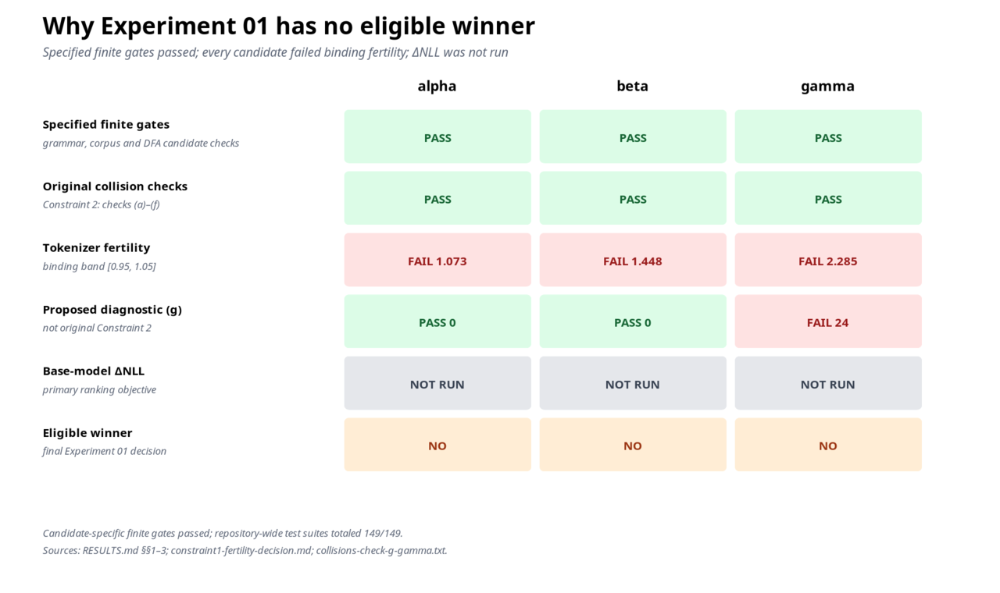
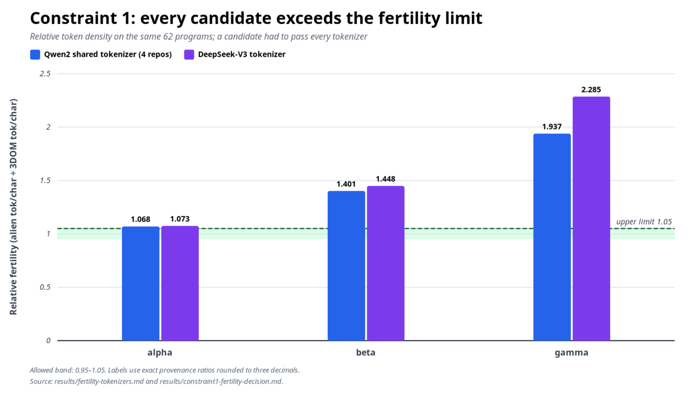
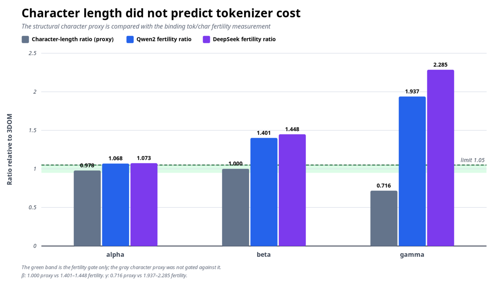
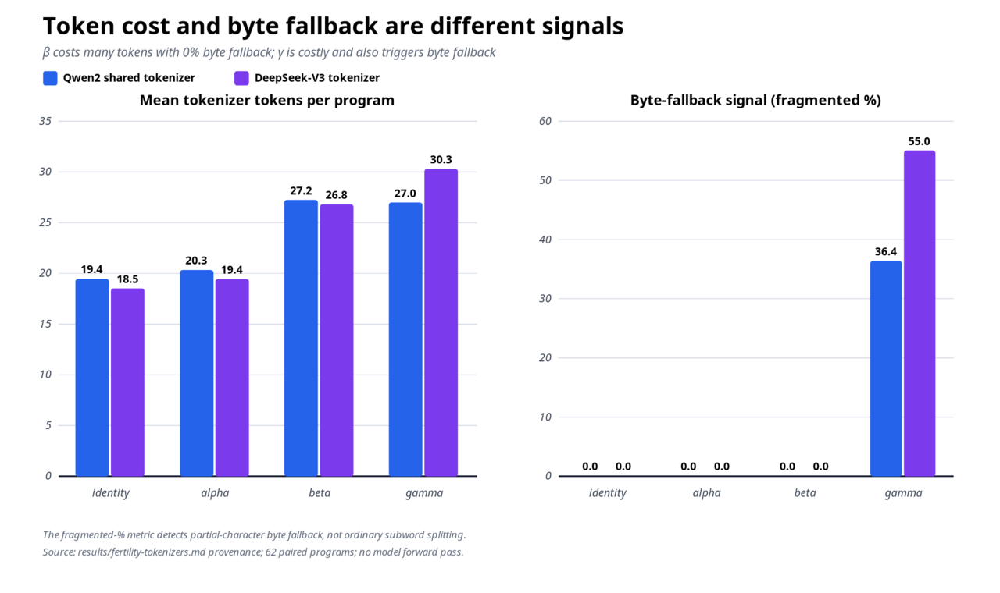
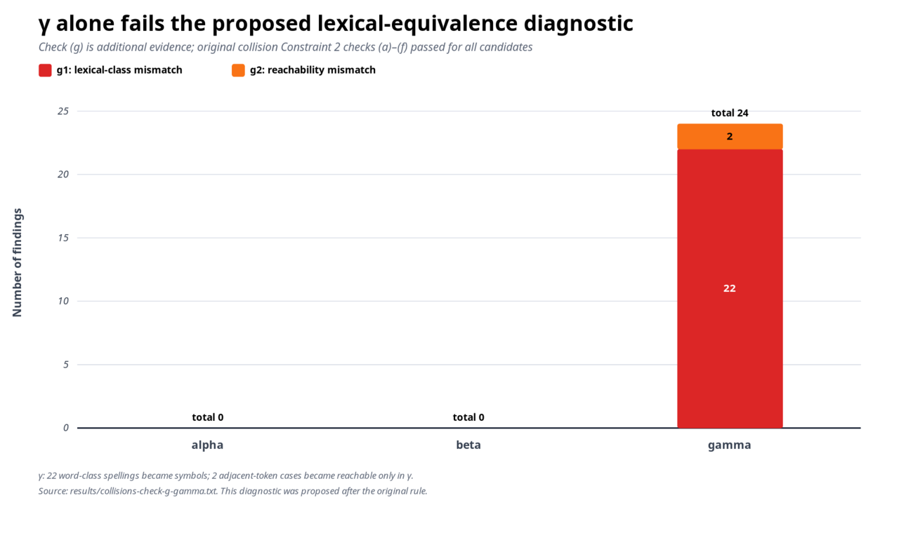

# Why Experiment 01 had no winner

| Field | Value |
|---|---|
| Experiment | `run/experiments/20260901-233702` |
| Grammar | `3dom-grammar/1.1.0` |
| Decision | **No eligible winner** |
| Summary created | 2026-09-10 from the archived Experiment 01 results |

This is a post-experiment explanation and plotting layer. It does not replace or
alter any raw log, result, artifact, or checksum from Experiment 01.

## Short answer

The compiler and grammar machinery did **not** fail. The structural pipeline,
round trips, DFA comparison, and all **149/149 tests passed**. The experiment had
no winner because every candidate—`alpha`, `beta`, and `gamma`—failed the
mandatory tokenizer-fertility constraint. The primary ranking measurement,
base-model ΔNLL, was also never run. `gamma` had an additional lexical-language
problem found by a proposed diagnostic.



Plot files: [SVG](05_decision_matrix/decision_matrix.svg) ·
[exact plotted data](05_decision_matrix/data.csv)

The matrix separates three outcomes that should not be mixed together:

- **PASS:** the implementation behaved correctly on its structural tests.
- **FAIL:** a measured candidate result violated a pre-committed requirement.
- **NOT RUN:** no empirical value exists; this is not a zero and not a failed
  measurement.

## What passed before candidate selection

The experiment first checked whether all surface syntaxes still represented the
same intended compiler structure. These checks were successful:

| Test | What it checked | Result |
|---|---|---|
| Phase 1 contract G1–G6 | Valid, invalid, and vacuous programs; grammar coverage; parser agreement | **PASS**: 62 positives, 64 negatives, 12 vacuous; 57/57 branches |
| φ validation V1–V8 | Candidate spelling maps were internally well formed | **PASS** for identity, alpha, beta, and gamma |
| Grammar reconstruction | Templates and generated grammars reproduced the reference | **PASS**, byte-identical |
| Corpus gates A1–A7 | Unique parsing, 57-branch coverage, negative rejection, zero-op vacuous cases, syntax differential, parser parity, and inverse/IR agreement | **PASS** for all candidates |
| Original collision checks (a)–(f) | Prefix, identifier, overload, frozen-token, delimiter, and argument hazards | **PASS** for all candidates |
| DFA parity | Matched parser-state and branching complexity | **PASS**: 52 states, mean branching 3.980, maximum 9, 26.92 DSL tokens/program |
| Test suites | Nine independently reported suites | **PASS: 149/149** |
| End-to-end trace | Same role-token stream, canonical IR, digest, and idempotent emission | **PASS** for all four lexicons |

The end-to-end digest was
`c2fd72263892a4b034de4ef09a367b8e9970233329d108b5c4c0a5dbe13341a4`
for every lexicon. This shows that this one tested example produced the same
role-token stream and canonical meaning. It does not prove identical internal
execution or global raw-language equivalence, and it does not guarantee that a
candidate meets the separate tokenizer-cost requirement. In particular, this
finite trace does not override `gamma`'s later reachability counterexample.

## The binding test that excluded every candidate

Constraint 1 measured tokenizer fertility: how many tokenizer tokens were
needed per Unicode code-point character, relative to ordinary 3DOM.

```text
candidate fertility = total candidate tokens / total candidate characters
3DOM fertility      = total 3DOM tokens      / total 3DOM characters
relative fertility  = candidate fertility / 3DOM fertility
```

The calculation used corpus totals, not an average of per-program ratios. It used
the same 62 positive programs in each lexicon, with
`add_special_tokens=False`. The parallel corpus SHA-256 was
`38bbbac1a335d2541594f4a3f11157daadd6c724350ebd0ffba88142da33339d`.

The rule was written before measurement: every candidate had to remain in
**[0.95, 1.05] on every study tokenizer**. A value of `1.000` matches 3DOM. A
value of `1.448` means 44.8% more tokenizer tokens per character than 3DOM.



Plot files: [SVG](01_constraint1_fertility/fertility_ratio.svg) ·
[exact plotted data](01_constraint1_fertility/data.csv)

| Candidate | Qwen2 shared tokenizer | DeepSeek-V3 tokenizer | Worst value | Verdict |
|---|---:|---:|---:|---|
| `alpha` | 1.068 | 1.073 | **1.073** | **FAIL** |
| `beta` | 1.401 | 1.448 | **1.448** | **FAIL** |
| `gamma` | 1.937 | 2.285 | **2.285** | **FAIL** |

All six candidate/distinct-tokenizer-design combinations—and all 15 recorded
candidate/repository rows—exceeded the `1.05` upper limit. Because the rule
required success everywhere, none remained eligible.

## Why the character proxy gave the wrong answer

Before tokenizer measurement, character length was used only as a structural
proxy. That proxy made `beta` look ideal because it had exactly the same total
character count as 3DOM. It made `gamma` look inexpensive because it used fewer
visible code points. The tokenizer results reversed both impressions.



Plot files: [SVG](02_proxy_vs_actual/proxy_vs_actual.svg) ·
[exact plotted data](02_proxy_vs_actual/data.csv)

| Candidate | Character-length ratio | Qwen2 fertility | DeepSeek fertility |
|---|---:|---:|---:|
| `alpha` | 0.978 | 1.068 | 1.073 |
| `beta` | **1.000** | **1.401** | **1.448** |
| `gamma` | **0.716** | **1.937** | **2.285** |

Character count measures the number of Unicode code points, which is only a
rough proxy for visible length. Tokenizer fertility measures how densely a
specific tokenizer divides that text. They are not interchangeable.

## Token cost and byte fallback are also different

The mean token counts per program show the practical sequence-length increase.
The fragmented percentage is a narrower diagnostic: it detects token pieces
whose individual decoding contains the Unicode replacement character, a sign of
partial-character or byte fallback. It does **not** detect all subword splitting.



Plot files: [SVG](03_token_cost_and_fragmentation/token_cost_and_fragmentation.svg) ·
[exact plotted data](03_token_cost_and_fragmentation/data.csv)

| Lexicon | Qwen tokens/program | DeepSeek tokens/program | Qwen fragmented % | DeepSeek fragmented % |
|---|---:|---:|---:|---:|
| `identity` | 19.435 | 18.500 | 0.000 | 0.000 |
| `alpha` | 20.306 | 19.419 | 0.000 | 0.000 |
| `beta` | 27.226 | 26.790 | **0.000** | **0.000** |
| `gamma` | 26.968 | 30.274 | **36.364** | **55.035** |

`beta` therefore demonstrates why fragmented percentage cannot replace the
fertility test: it incurred a large ordinary subword cost while its byte-fallback
signal remained zero.

## What tokenizer repositories were used

No neural model forward pass was performed for the results above. Experiment 01
loaded tokenizers associated with five model repositories through
`transformers.AutoTokenizer`; it did not load or score with their model weights.

| Repository | Resolved revision | What was used |
|---|---|---|
| `Qwen/Qwen2.5-Coder-0.5B` | `8123ea2e9354afb7ffcc6c8641d1b2f5ecf18301` | Tokenizer only |
| `Qwen/Qwen2.5-Coder-1.5B` | `df3ce67c0e24480f20468b6ef2894622d69eb73b` | Tokenizer only |
| `Qwen/Qwen2.5-Coder-3B` | `09d9bc5d376b0cfa0100a0694ea7de7232525803` | Tokenizer only |
| `Qwen/Qwen2.5-Coder-7B` | `0396a76181e127dfc13e5c5ec48a8cee09938b02` | Tokenizer only |
| `deepseek-ai/DeepSeek-V3` | `e815299b0bcbac849fa540c768ef21845365c9eb` | Tokenizer only |

The four Qwen repositories used the same `Qwen2Tokenizer` and produced identical
rows. Consequently, this is evidence from **two distinct tokenizers**—Qwen2 and
DeepSeek-V3—not five independent tokenizer designs. DeepSeek-V3 was used only in
the fertility test. The software versions were `transformers 5.16.1`,
`tokenizers 0.23.1`, and `huggingface_hub 1.29.0`; the GPU was unused.

Vocabulary-size numbers are intentionally omitted here because the archived
documents mix base-vocabulary size and total-tokenizer-length conventions. That
documentation discrepancy does not affect any recorded token count or ratio.

## Candidate-by-candidate explanation

### Alpha: close, but outside the pre-committed limit

`alpha` was the interference condition. It reused familiar 3DOM spellings but
permuted them into different grammatical roles. Its structural checks and both
the original and proposed collision checks passed.

**Test and result:** Its relative fertility was `1.068` with Qwen2 and `1.073`
with DeepSeek. Both are above the maximum allowed value of `1.05`, so its worst
result was a mandatory **FAIL**.

**Reason:** The reshuffled spellings produced slightly denser tokenization per
character on this nonuniform corpus. The experiment measured that result; it did
not perform a token-by-token causal decomposition beyond it.

**Analogy:** If an airline publishes a strict 10.5 kg bag limit, a 10.73 kg bag
is close, but it is still ineligible. The limit cannot fairly be widened after
the bag has been weighed.

### Beta: equal character length, many more tokenizer pieces

`beta` was the absence condition. It replaced familiar words with pronounceable
ASCII pseudo-words and deliberately matched the original character lengths and
camelCase shapes. All structural and collision checks, including proposed check
`(g)`, passed.

**Test and result:** The character proxy was exactly `1.000`, which caused the
earlier provisional preference for `beta`. The binding fertility test was very
different: `1.401` on Qwen2 and `1.448` on DeepSeek, a mandatory **FAIL**.

**Reason:** Its invented words were not convenient whole vocabulary units and
were divided into more ordinary subword pieces. Because those pieces were valid
ASCII rather than partial Unicode bytes, fragmented percentage stayed at
`0.000`.

**Analogy:** Two labels can occupy the same strip of paper, but a scanner may read
a familiar word as one barcode and an invented word syllable by syllable. Equal
physical length does not mean equal scanning cost.

### Gamma: tokenizer cost plus a lexical-language mismatch

`gamma` was the glyph or surface-distance condition. It substituted compact
non-ASCII symbols. The fixed corpus, DFA, round-trip, and original collision
checks `(a)`–`(f)` passed.

**Test and result:** Despite containing only `0.716` times as many code points,
its fertility was `1.937` with Qwen2 and `2.285` with DeepSeek, a mandatory
**FAIL**.

**Reason:** The tokenizers handled many of its symbols inefficiently, with
byte-fallback signals of `36.364%` and `55.035%` respectively.

`gamma` also produced 24 findings under the later proposed check `(g)`:

- 22 `g1` findings: word-class spellings from 3DOM became symbols, changing how
  keywords are distinguished from identifiers.
- 2 `g2` findings: token sequences became reachable in `gamma` that no 3DOM text
  can produce.



Plot files: [SVG](04_gamma_lexical_diagnostic/gamma_lexical_diagnostic.svg) ·
[exact plotted data](04_gamma_lexical_diagnostic/data.csv)

For example, `meshmesh` is one identifier in 3DOM, while `⍇⍇` can remain two
`gamma` type tokens. Therefore, `gamma` accepts a token sequence unreachable
from the source language. Check `(g)` was proposed after the original rule, so
it is additional diagnostic evidence—not a retroactive failure of the original
Constraint 2.

**Analogy:** Pictograms look shorter to a person, but an older scanner may need
several codes for each picture. Two adjacent pictures may also remain two signs
in a place where joined letters become one label.

## Why ΔNLL did not select a winner

The intended primary objective was base-model ΔNLL per character: a measure of
how much more surprising each syntax was to a model than 3DOM. The planned
scoring repositories were the four Qwen2.5-Coder base checkpoints listed above.

That measurement was not run because `torch` and the model weights were absent.
There are no NLL/token, NLL/character, ΔNLL, or confidence-interval values for
Experiment 01. The arithmetic and bootstrap code passed tests against
deterministic fake data, but those tests are not model measurements.

**Analogy:** The stopwatch was checked and shown to work, but the race never took
place. There is no finishing-time ranking to report.

Even if ΔNLL were run later, it could not make these unchanged candidates
eligible under Experiment 01's rule: all three already failed the mandatory
fertility gate.

## Overall conclusion

The accurate conclusion is not “Phase 1 and Phase 2 failed.” It is:

1. The shared grammar, translation, parsing, canonicalization, and measurement
   infrastructure worked and exposed the candidate problems.
2. `alpha`, `beta`, and `gamma` all failed the pre-committed tokenizer-fertility
   requirement on the measured corpus and two distinct tokenizer designs.
3. `gamma` additionally ceased to be a clean isomorphic control under the
   stronger lexical/reachability analysis.
4. ΔNLL was unmeasured, so no primary-objective ranking exists.
5. The provisional `beta` choice was correctly withdrawn.

The next candidate-design attempt should optimize actual tokenizer counts and
retain the original `[0.95, 1.05]` eligibility band. The current candidates may
still be scored with ΔNLL as a diagnostic that informs redesign, but ΔNLL cannot
rescue their Experiment 01 eligibility. Selecting a winner requires at least one
candidate that clears the binding fertility constraint.

## Sources and reproducibility

- [Final Experiment 01 results](../RESULTS.md)
- [Detailed audit](../AUDIT.md)
- [Pre-measurement selection rule](../metadata/candidate-selection-precommit.md)
- [Constraint 1 decision](../results/constraint1-fertility-decision.md)
- [Tokenizer results and provenance](../results/fertility-tokenizers.md)
- [Structural proxy](../results/fertility-structural-proxy.md)
- [Collision summary](../results/collisions.md)
- [Detailed gamma findings](../results/collisions-check-g-gamma.txt)
- [DFA parity](../results/dfa-parity.md)
- [End-to-end trace](../results/trace-end-to-end.txt)

The plots and CSV files are regenerated by
[`generate_plots.py`](generate_plots.py). SVG generation uses only Python's
standard library; PNG copies are rendered with ImageMagick when available. The
script parses the archived provenance JSON and collision output, verifies that
all four Qwen result rows are identical, and refuses unexpected collision
counts. Chart labels are rounded for readability; the accompanying CSV files
retain twelve decimal places.
